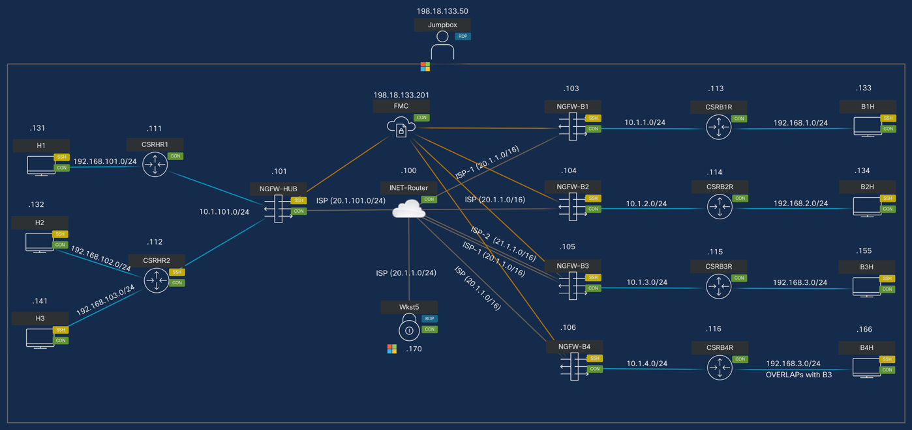
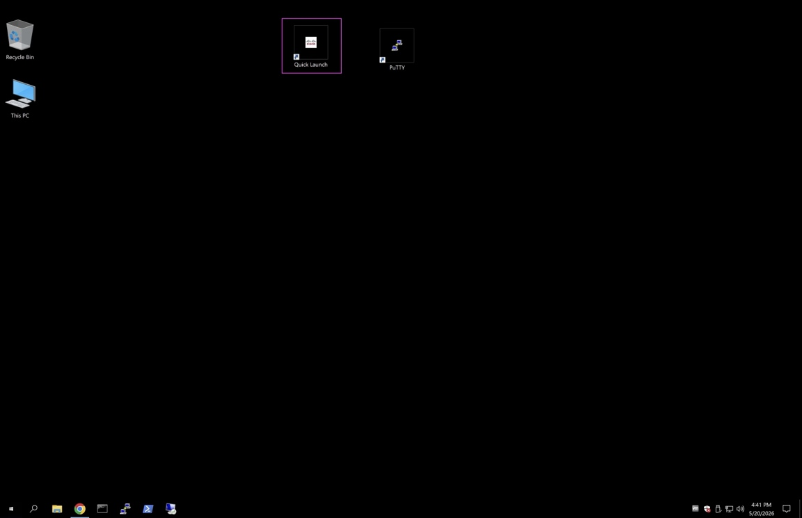
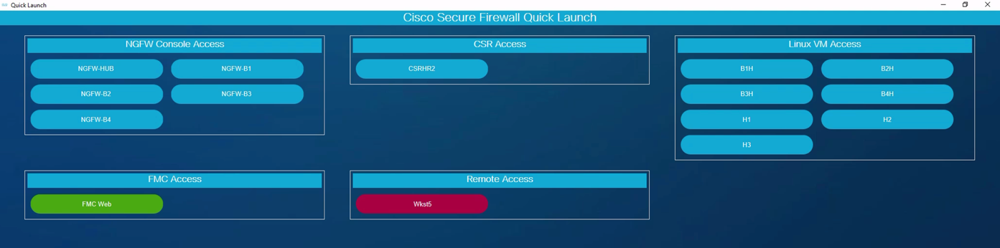
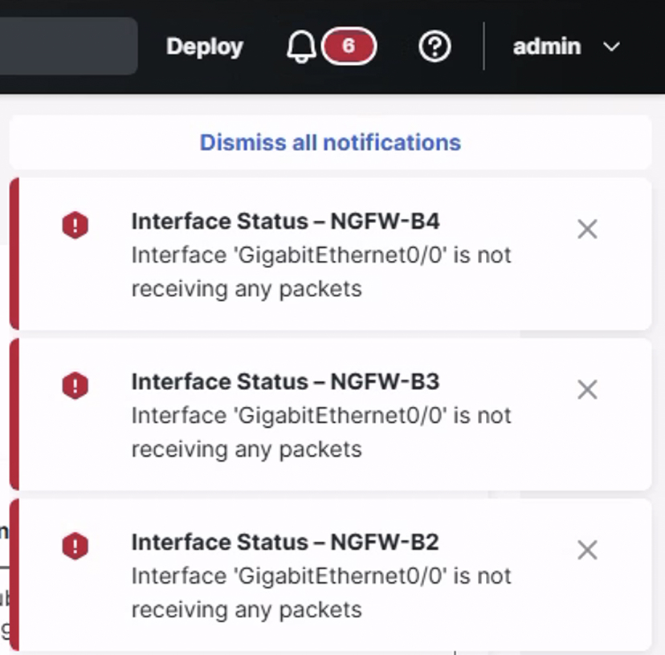
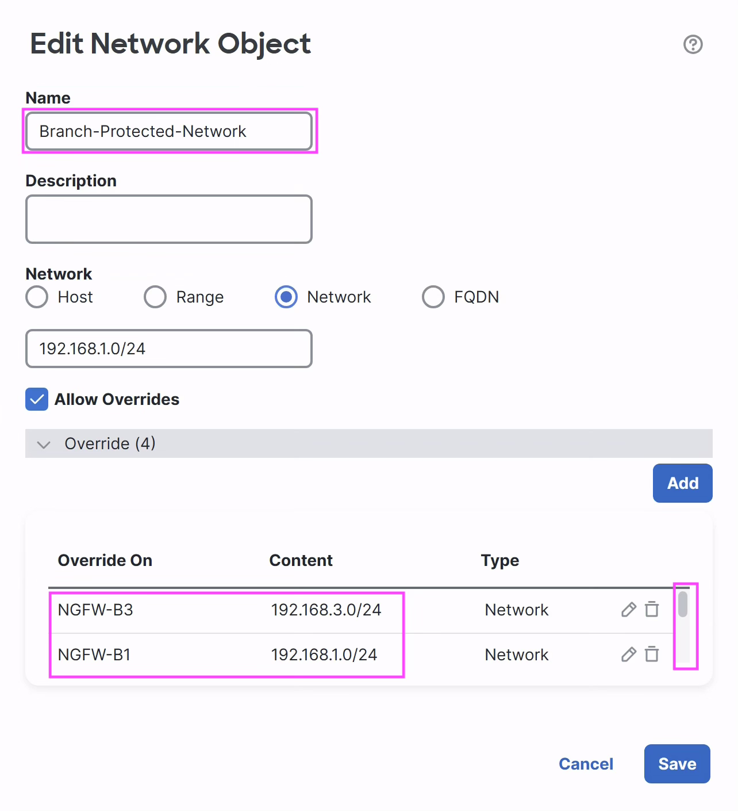
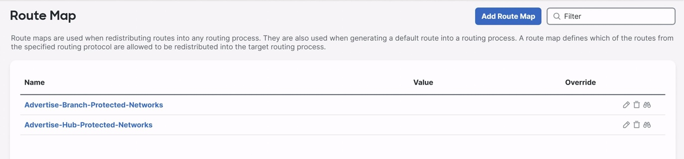
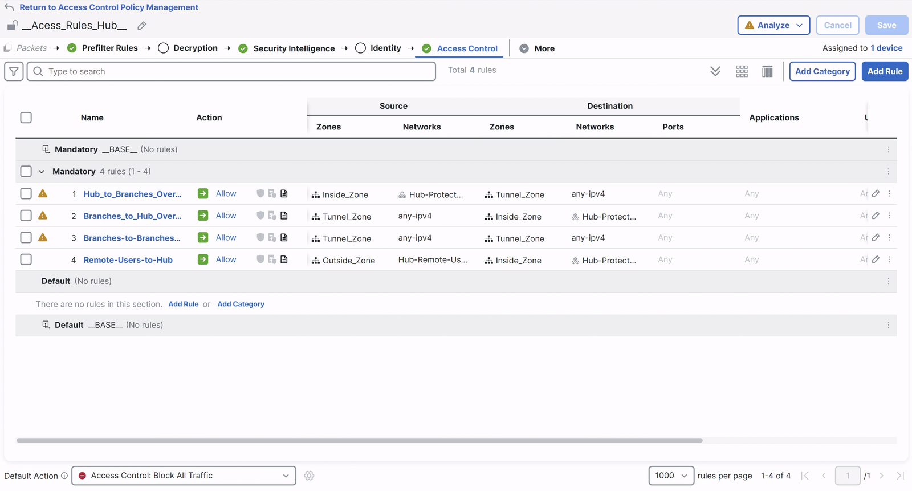
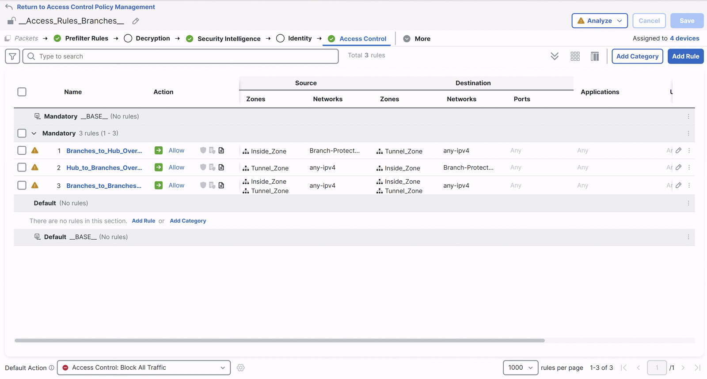

# Overview

!!! tip "Theme preference"
    Use the light/dark mode toggle in the top bar to pick whichever is
    easier on your eyes &mdash; the setting persists across pages.

**Cisco Secure Firewall SD-WAN &mdash; Hands-on Lab (LTRSEC-2241)**

Welcome to the Cisco Secure Firewall SD-WAN hands-on lab. Across the six
scenarios in this guide you will design, deploy and validate an
SD-WAN topology between a Hub and multiple Branches using the SD-WAN
Wizard in the Firewall Management Center (FMC), then extend the design
to handle network growth, dual-ISP branches, overlapping addressing and
Remote Access VPN with geolocation controls.

!!! info "Speakers"

    - **Prema Chand Alugu** &mdash; Engineering Technical Leader
    - **Raghu Ram** &mdash; Principal Software Engineer
    - **Jesus Medina** &mdash; Escalation Engineer

## Learning Objectives

Upon completion of this lab you will be able to:

1. **Bring up a hub-and-spoke SD-WAN deployment** &mdash; Configure end-to-end
   secure connectivity between a Branch and Hub Secure Firewall using the
   **SD-WAN Topology** wizard. You will:
    - Simplify **single hub with multiple spokes** configuration using SD-WAN Topology
    - Auto-generate **static Virtual Tunnel Interfaces (VTI)** on spoke devices
    - Add multiple spokes using the **Bulk Spoke** feature
    - **Automate BGP** neighbour configuration and **redistribute IGP / Static routes** via BGP
    - Automatically add the generated VTIs to the Security Zone for Access Control Policy

2. **Expand the Hub network** &mdash; Add a new protected network behind the Hub and
   redistribute it through BGP.

3. **Expand branches** &mdash; Add new branches to an existing SD-WAN deployment using
   the **Add Spoke** option and redistribute their protected networks through BGP.

4. **Add a secondary ISP link to a branch** &mdash; Configure dual-ISP spokes with
   SD-WAN Topology and apply Equal-Cost Multi-Path (**ECMP**) zones for load
   balancing.

5. **Acquire a branch with overlapping addressing (optional)** &mdash; Resolve overlapping
   networks using **Pre-encryption NAT** and redistribute the NAT network via BGP.

6. **Control Remote Access VPN by geolocation (optional)** &mdash; Configure Service
   Access policies to define allowed regions and verify access is denied for
   restricted geolocations.

## Disclaimer

Although the lab design and configuration examples can be used as a reference,
for design-related questions please contact your Cisco representative or a
Cisco partner.

## Accessing Devices

This section walks you through the devices used in this lab and how to access
them. Please reach out to the lab proctor if you have any issue accessing the
devices.

All NGFW devices run **Cisco Secure Firewall release 10.0**. The lab uses the
following devices:

- **FMC** &mdash; Firewall Management Center
- **NGFW-HUB** &mdash; Hub device
- **NGFW-B1**, **NGFW-B2**, **NGFW-B3**, **NGFW-B4** &mdash; Branch devices
- **B1H**, **B2H** &mdash; workstations behind NGFW-B1 / NGFW-B2
- **B3H**, **B4H** &mdash; workstations behind NGFW-B3 / NGFW-B4
- **H1**, **H2**, **H3** &mdash; workstations behind NGFW-HUB
- **Wkst5** &mdash; Secure Client user

<figure markdown style="max-width:16.0cm;">
  { loading=lazy }
</figure>

### Lab credentials

| **Device**    | **URL / IP**              | **Username**  | **Password** |
| ------------- | ------------------------- | ------------- | ------------ |
| Jumpbox (RDP) | 198.18.133.50             | Administrator | C1sco12345   |
| FMC (UI)      | <https://198.18.133.201/> | admin         | dCloud123!   |
| B1H           | 198.18.133.133            | root          | C1sco12345   |
| B2H           | 198.18.133.134            | admin         | C1sco12345   |
| B3H           | 198.18.133.155            | admin         | C1sco12345   |
| B4H           | 198.18.133.166            | admin         | C1sco12345   |
| Wkst5 (RDP)   | 198.18.133.170            | admin         | C1sco12345   |

!!! warning "Credential handling"

    These credentials are valid only for this isolated lab environment. Never
    reuse them in a production deployment.

### Jumpbox

The Jumpbox (RDP `198.18.133.50`) can be used to access all the lab devices
from a single user interface. A **Quick Launch** icon is placed on the desktop.

<figure markdown style="max-width:12.0cm;">
  { loading=lazy }
</figure>

Clicking the **Quick Launch** icon launches the Cisco Secure Firewall Quick
Launch application from which all the devices can be opened and accessed.

<figure markdown style="max-width:16.0cm;">
  { loading=lazy }
</figure>

## Lab Tips

A few conventions you will see throughout the scenarios &mdash; please keep
them in mind so the steps go smoothly:

!!! tip "Host key prompt &mdash; SSH"
    Whenever you SSH to a host for the first time you will see
    **_"Are you sure you want to continue connecting...?"_** &mdash;
    type **`yes`** and press Enter.

!!! tip "Browser certificate warning &mdash; FMC"
    If the FMC web page shows **"Your connection is not private"**, click
    **Advanced** and select **Proceed to 198.18.133.201 (unsafe)** to
    continue. This is expected in the lab environment.

!!! tip "Device access starts from the Jumpbox"
    All device access in the lab starts from the **Cisco Secure Firewall
    Quick Launch** app on the Jumpbox desktop. Devices are grouped by role
    (FMC, NGFW CLI, Linux VM Access, etc.).

!!! tip "Dismiss FMC notifications"
    Internal traffic and health checks in the lab pod can trigger FMC
    notifications similar to the one shown below. These are **not**
    related to the steps you are running &mdash; click the **X** on each
    notification to dismiss them, or click **Dismiss All** if FMC offers
    it. They will not affect any verification later in the lab.

<figure markdown style="max-width:12.0cm;">
  { loading=lazy }
</figure>

## You're All Set &mdash; Let's Begin

The lab environment is ready and the supporting objects are in place. From
here, head into the scenarios &mdash; each one builds on the previous, so
working through them in order will give you the best picture of how the
SD-WAN Wizard fits together end-to-end. Scenarios 5 and 6 are optional
and can be tackled if time permits.

If anything is unclear, a screenshot doesn't match what you see, or a step
behaves differently in your pod, please flag it. Your feedback &mdash; even
the small details &mdash; goes directly back into the next revision of this
guide.

==Please proceed to **Scenario 1** and have fun labbing!==

---

## Reference: Pre-configured Objects and Access Control Rules

The following objects and Access Control rules are pre-configured on the
FMC and the Hub device so the protected networks can communicate over
the SD-WAN tunnels. You don't need to configure them &mdash; this section
is here for reference whenever a scenario points back to it.

An object **Branch-Protected-Network** is defined with the override option to
hold the protected networks. Scroll down on the object to see all the values
configured behind each NGFW.

<figure markdown style="max-width:8.0cm;">
  { loading=lazy }
</figure>

This object is in turn used in the pre-configured route map
**Advertise-Branch-Protected-Networks**. The Hub uses an equivalent route map
**Advertise-Hub-Protected-Networks**. Both can be found under **Objects &rarr; Route
Map**. The route maps are used when configuring propagation of protected
network routes to SD-WAN peers.

<figure markdown style="max-width:16.0cm;">
  { loading=lazy }
</figure>

The Access Control rules pre-configured at the **Hub** are:

- **Rule 1** &mdash; Permit outbound traffic from networks behind Hub to any Spokes through tunnel
- **Rule 2** &mdash; Permit inbound traffic from any Spokes to networks behind Hub through tunnel
- **Rule 3** &mdash; Permit any traffic between Spokes
- **Rule 4** &mdash; Remote access users' traffic accessing networks behind Hub

<figure markdown style="max-width:16.0cm;">
  { loading=lazy }
</figure>

The Access Control rules pre-configured at the **Spokes** are:

- **Rule 1** &mdash; Permit outbound traffic from networks behind Spokes to any through tunnel
- **Rule 2** &mdash; Permit inbound traffic from any to networks behind Spokes through tunnel
- **Rule 3** &mdash; Permit any traffic between Spokes

<figure markdown style="max-width:16.0cm;">
  { loading=lazy }
</figure>
