# Scenario 1: Simplifying Branch to Hub Communication

Secure Firewall release 7.6 introduced SD-WAN wizard on FMC that
provides admins the ability to configure the complete SD-WAN Topology,
automating the VPN and Overlay routing configuration using minimal
clicks and automated inputs.

SD-WAN Topology provides:

1.  Simplified wizard to create Route-Based Hub & Spoke Topology

2.  Auto-generation of static virtual tunnel interfaces on spokes

3.  Bulk Spoke Addition

4.  Simplification and automation of overlay routing with BGP

5.  Redistribution of connected routes through BGP

For redistribution of Static and IGP dynamic routes (EIGRP/OSPF),
route-maps are pre-configured in the lab and will be used in device
specific BGP configuration.

## Network Diagram

<figure markdown style="max-width:16.0cm;">
  { loading=lazy }
</figure>

## 1.1 Configuring SD-WAN Topology between Branches (Spokes) and Headquarters (Hub) using DVTI on Hub

In this lab task, you will learn how to create an IPSec VPN Tunnel
between Branch and Hub Secure Firewall using SD-WAN Wizard in FMC
(<https://198.18.133.201/>).

Launch FMC by clicking **FMC Web** icon in Cisco Secure Firewall Quick
Launch window.

<figure markdown style="max-width:10.0cm;">
  { loading=lazy }
</figure>

!!! warning "Certificate warning"
    When you click **FMC Web**, if the browser displays
    **"Your connection is not private"**, click **Advanced** and select
    **Proceed to 198.18.133.201 (unsafe)** to continue.

!!! info "FMC credentials"
    Sign in with:

    - **Username:** `admin`
    - **Password:** `dCloud123!`

### 1.1.1 Create SD-WAN Topology

To configure a new SD-WAN Topology, go to **Secure Connections \>
Site-to-Site VPN & SD-WAN**.

<figure markdown style="max-width:12.0cm;">
  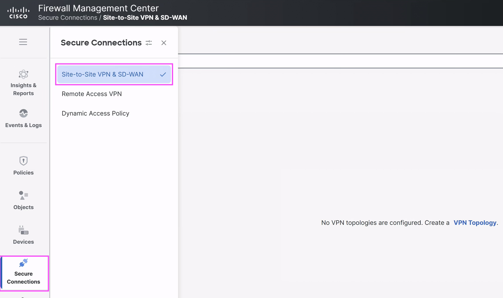{ loading=lazy }
</figure>

Click **+ Add**.

<figure markdown style="max-width:16.0cm;">
  { loading=lazy }
</figure>

There are prerequisites to SD-WAN Topology. Click or hover on
**Prerequisites** in the **Create VPN Topology** dialog to review them.

<figure markdown style="max-width:16.0cm;">
  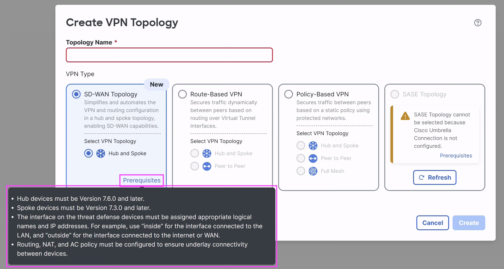{ loading=lazy }
</figure>

Enter the following details in the **Create VPN Topology** pop-up:

1.  **Topology Name**: name the VPN topology as **Corp-SD-WAN-1**.

2.  Ensure the following are selected:

    1.  **VPN Type**: SD-WAN Topology
    2.  **VPN Topology**: Hub and Spoke

3.  Click **Create**.

<figure markdown style="max-width:16.0cm;">
  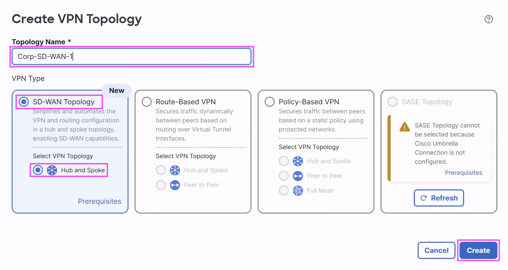{ loading=lazy }
</figure>

### 1.1.2 SD-WAN Topology &mdash; Hub Configuration

This opens the SD-WAN Wizard page.  
Click **Add Hub** on the right in **Hubs** section to add the Hub
device.

<figure markdown style="max-width:16.0cm;">
  { loading=lazy }
</figure>

Enter the following details in the **Add Hub** dialog:

1.  **Device**: click the drop-down and select the FTD **NGFW-HUB**.

    <figure markdown style="max-width:10.0cm;">
      { loading=lazy }
    </figure>

2.  **Dynamic Virtual Tunnel Interface (DVTI)**: ==click the **+** icon
    adjacent to the drop-down== to create a DVTI. The **Add Virtual Tunnel
    Interface** dialog opens.

    !!! tip "Fields you actually configure"
        Most fields in this dialog are auto-populated. You only need to set:

        - **Security Zone** (item d) &mdash; choose `Tunnel_Zone`
        - **IP Address &rarr; Borrow IP** (item h) &mdash; create a Loopback

        The rest can be left at their defaults.

    1.  **Tunnel Type**: pre-selected to **Dynamic**, greyed out
        &mdash; *no change*.
    2.  **Name**: pre-filled as `outside_dynamic_vti_1` &mdash;
        *keep the default*.
    3.  **Enabled**: enabled by default &mdash; *leave as-is*.
    4.  **Security Zone**: select **Tunnel_Zone** from the drop-down.
    5.  **Template ID**: a unique ID, pre-filled by FMC &mdash;
        *no change*.
    6.  **Tunnel Source**: defaults to **outside**. If not, pick
        **outside** from the drop-down. Set the **Tunnel Source IP
        Address** to `20.1.101.101`.

    <figure markdown style="max-width:10.0cm;">
      { loading=lazy }
    </figure>

    !!! info "Scroll down"
        Scroll down in the **Add Virtual Tunnel Interface** dialog to
        see the remaining fields below.

    7.  **IPsec Tunnel Mode**: defaults to **IPv4** &mdash;
        *leave as-is*.
    8.  **IP Address**: DVTI is a template interface and can't have a
        static IP &mdash; it must **Borrow IP (IP unnumbered)** from
        another interface (Cisco recommends a **Loopback**). ==Click the
        **+** icon next to the **Select Interface** drop-down== to
        create one &mdash; the **Add Loopback Interface** dialog opens:

        <figure markdown style="max-width:10.0cm;">
          { loading=lazy }
        </figure>

        1.  In the **General** tab:

            1.  **Name**: `Hub_Tunnel_IP_1`
            2.  **Loopback ID**: `1`

            <figure markdown style="max-width:10.0cm;">
              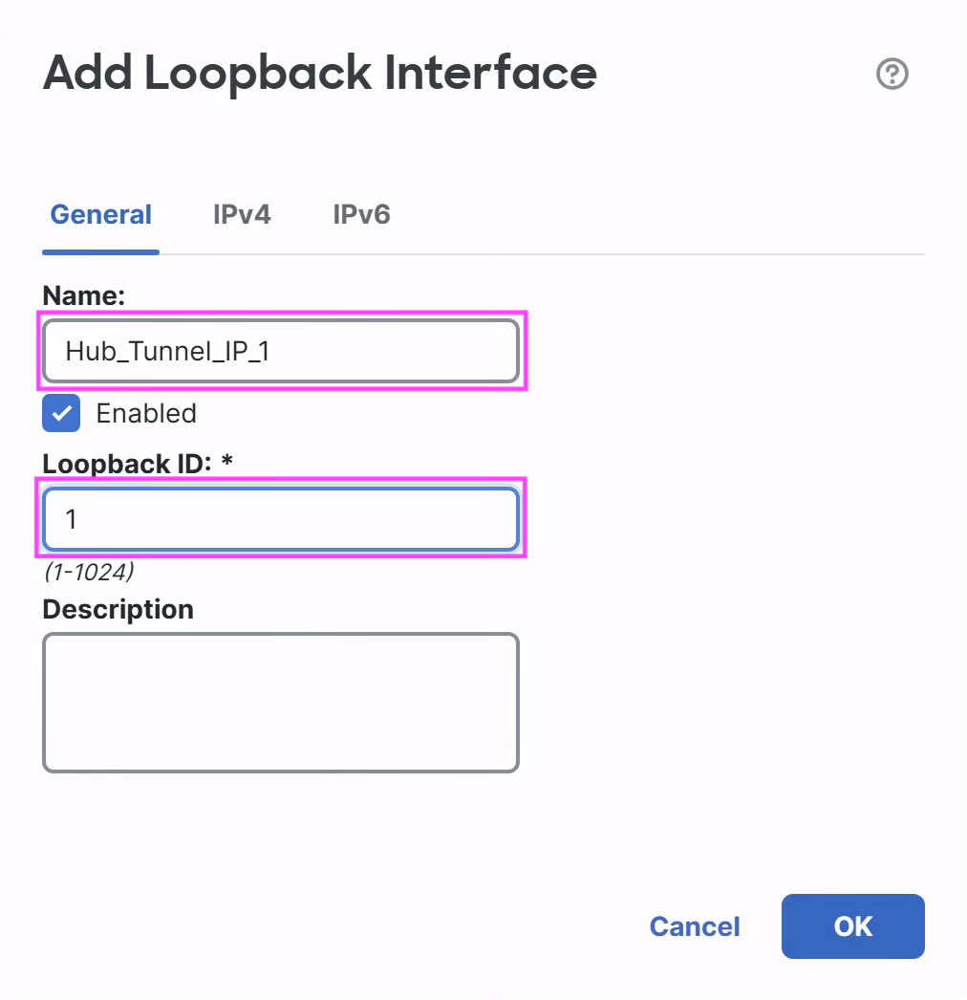{ loading=lazy }
            </figure>

        2.  In the **IPv4** tab:

            1.  **IP Type**: Use Static IP
            2.  **IP Address**: `169.254.10.1/32`

            <figure markdown style="max-width:10.0cm;">
              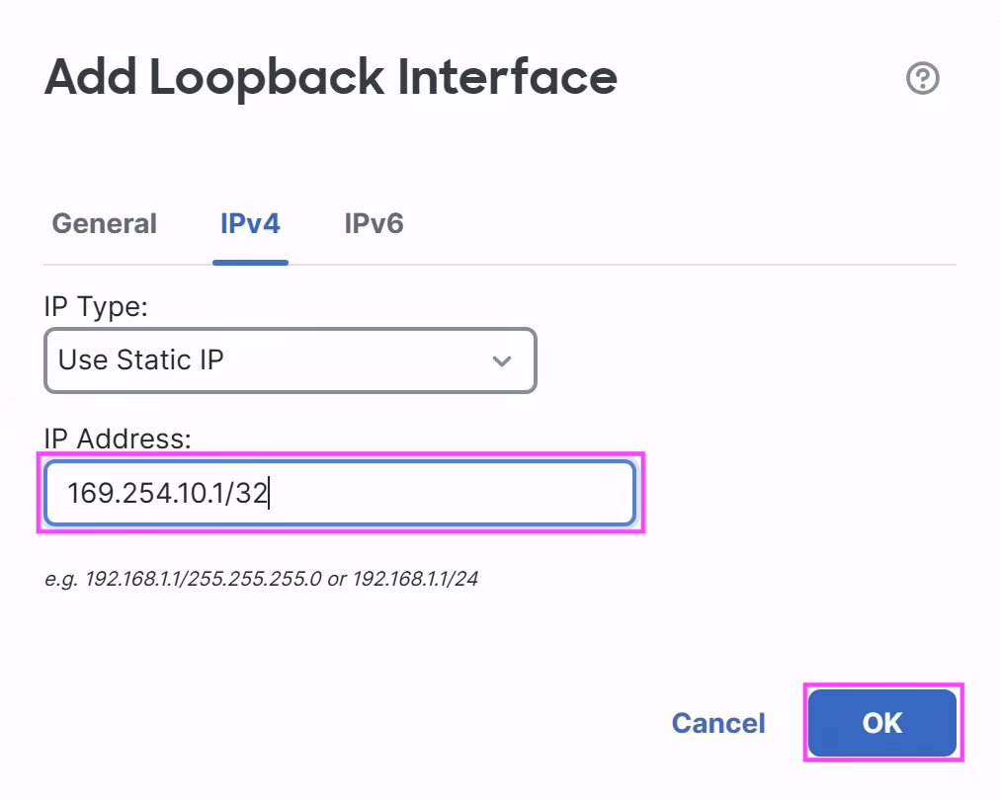{ loading=lazy }
            </figure>

        3.  Click **OK** to save the loopback.

    9.  Back on the **Add Virtual Tunnel Interface** dialog, confirm
        **Borrow IP (IP unnumbered)** is now set to
        **Loopback1 (Hub_Tunnel_IP_1)**.

        <figure markdown style="max-width:10.0cm;">
          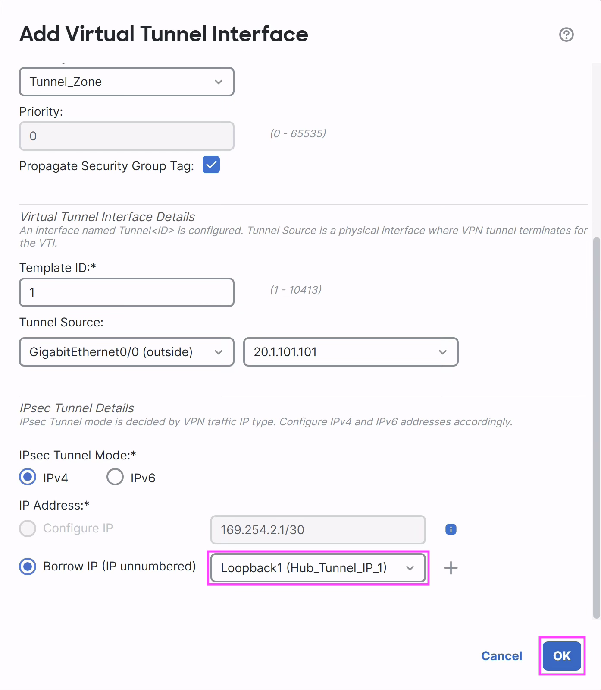{ loading=lazy }
        </figure>

3.  Click **OK** on the **Add Virtual Tunnel Interface** dialog to
    save the DVTI. You will see a dialog confirming **Virtual Tunnel
    Interface Added** successfully &mdash; click **OK**.

    <figure markdown style="max-width:10.0cm;">
      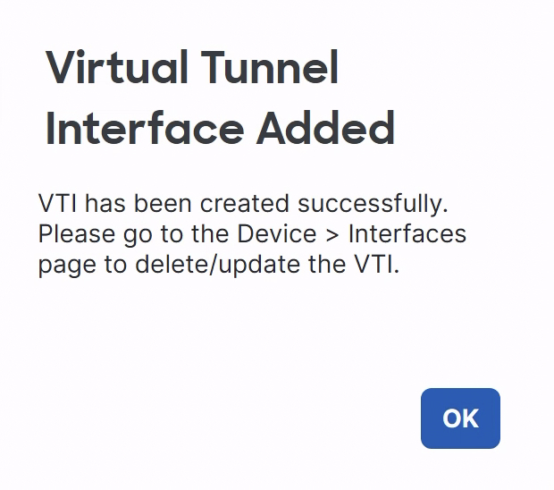{ loading=lazy }
    </figure>

4.  Back in the **Add Hub** dialog, confirm the DVTI is automatically
    populated. Otherwise, select **outside_dynamic_vti_1** from the
    **Dynamic Virtual Tunnel Interface (DVTI)** drop-down.

5.  **Hub Gateway IP Address**: shows the Tunnel Source IP &mdash; do
    not change.

6.  **Spoke Tunnel IP Address Pool**: FMC auto-generates the static
    VTI interfaces on the spoke devices. This pool defines the IP
    range FMC draws from when assigning addresses to those sVTI
    interfaces. ==Click the **+** icon next to the field== to create a
    new pool &mdash; the **New IPv4 Pool** dialog opens.

    <figure markdown style="max-width:10.0cm;">
      { loading=lazy }
    </figure>

    Fill it in:

    1.  **Name**: `NGFW_Hub_IPv4_Pool_1`
    2.  **IPv4 Address Range**: `169.254.10.3-169.254.10.100`. FMC
        assigns IPs from this range to the static VTI interfaces on
        the spoke devices.
    3.  **Mask**: `255.255.255.0`
    4.  **Allow Override**: leave disabled (default).
    5.  Click **Save** to create the pool.

    <figure markdown style="max-width:12.0cm;">
      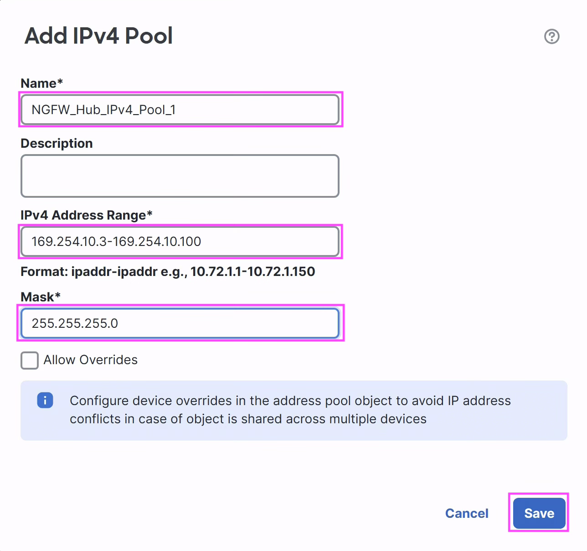{ loading=lazy }
    </figure>

    Back on the **Add Hub** dialog, set **Spoke Tunnel IP Address
    Pool** to the pool you just created &mdash; **NGFW_Hub_IPv4_Pool_1**
    (use the drop-down if it isn't auto-populated). All Hub inputs are
    now filled in &mdash; click **Add** on the **Add Hub** dialog to
    save and add the Hub to the SD-WAN topology.

    <figure markdown style="max-width:10.0cm;">
      { loading=lazy }
    </figure>

7.  The row for **NGFW-HUB** appears in the **Hubs** section of the
    **SD-WAN Topology Wizard**. Click **Next** to proceed.

    <figure markdown style="max-width:16.0cm;">
      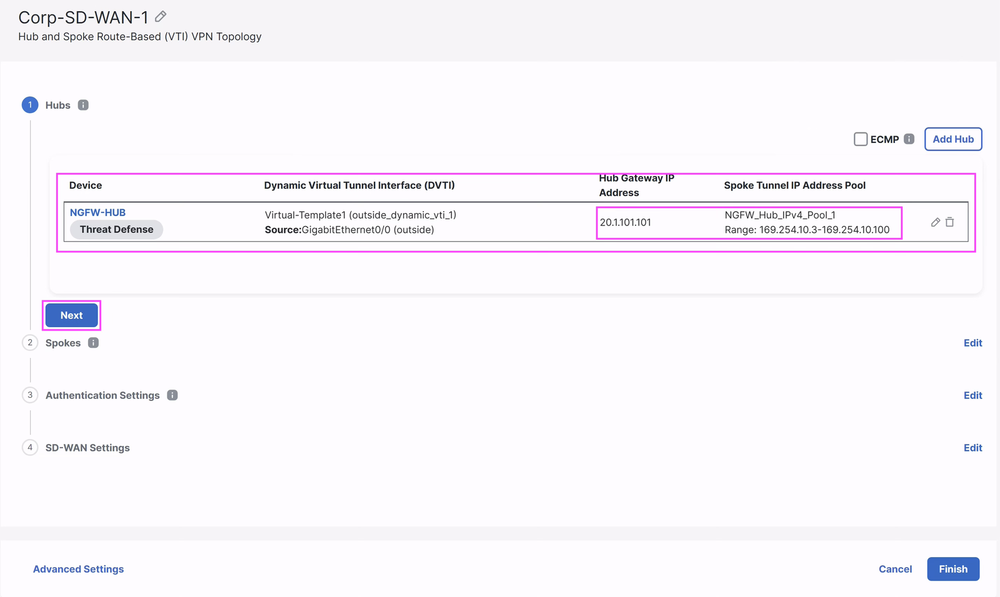{ loading=lazy }
    </figure>

### 1.1.3 SD-WAN Topology &mdash; Bulk Spoke Configuration

**Add Bulk Spoke Dialog** allows admins to add more than one Spoke
Device with simple intuitive workflow.

Click **Add Spokes (Bulk Addition)** button in the Spokes step.

<figure markdown style="max-width:16.0cm;">
  { loading=lazy }
</figure>

Enter the following details in the **Add Bulk Spokes** dialog box:

1.  **Devices**: Select **NGFW-B1** and **NGFW-B2** from the **Available
    Devices**, click on **Add** button to move the devices to
    **Selected Devices**.

2.  **Interface Name Pattern:** Ensure Interface Name Pattern field is
    set to **outside**. Using this name pattern, FMC automatically
    searches the devices for a matching interface, and these
    interfaces are selected as VPN interface for the selected spoke
    devices.

3.  **Next:** Click on **Next** button.

    <figure markdown style="max-width:12.0cm;">
      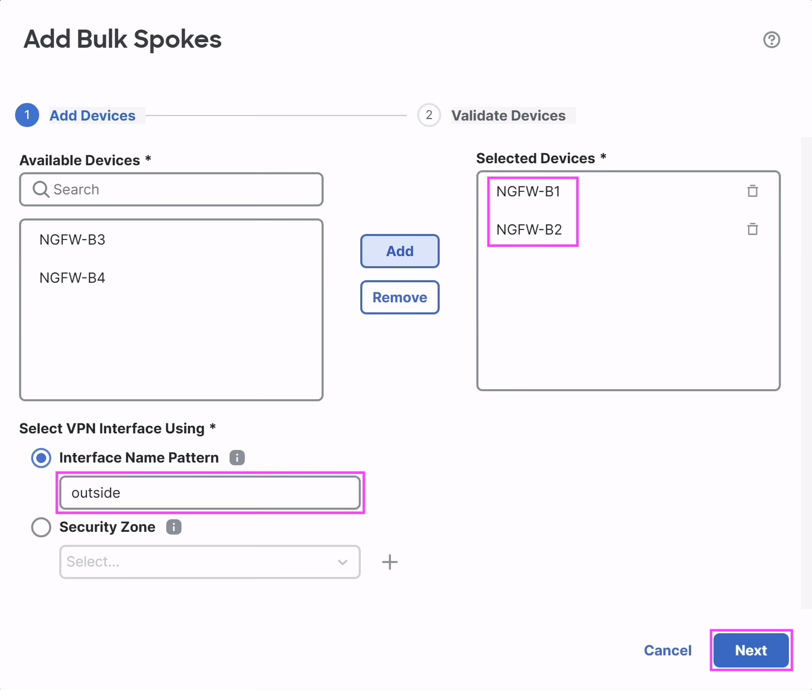{ loading=lazy }
    </figure>

4.  **Add:** Once you click on Next button, FMC lists the selected
    devices with Interfaces that matches the given name pattern.
    Review the selection and click on the **Add** button.

    <figure markdown style="max-width:12.0cm;">
      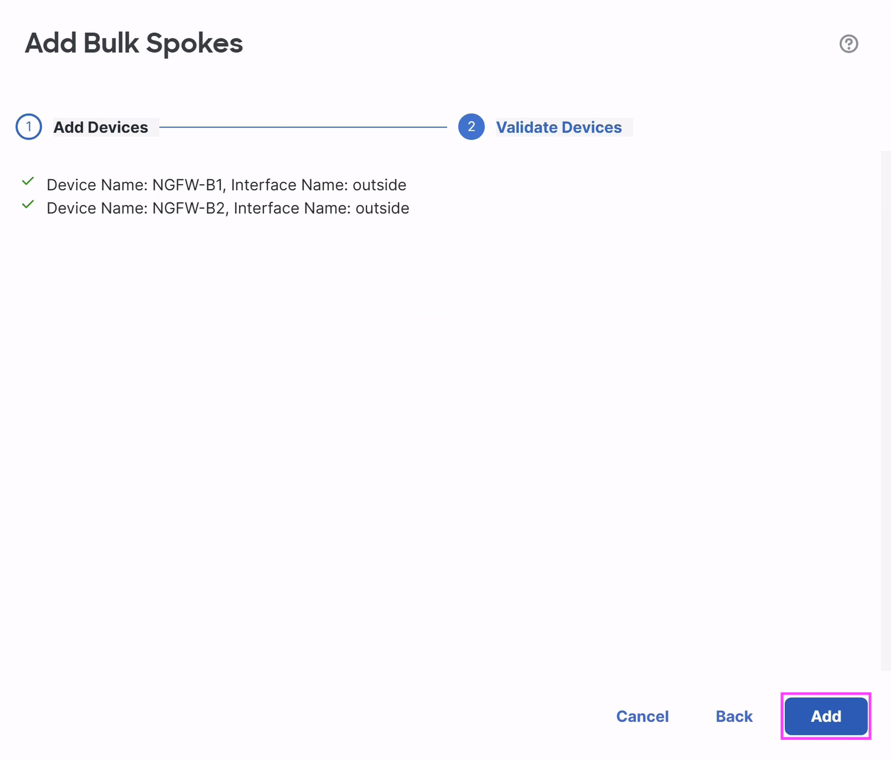{ loading=lazy }
    </figure>

5.  **Next:** Once you review the spokes, click on **Next** button to
    move on to the next step.

<figure markdown style="max-width:16.0cm;">
  { loading=lazy }
</figure>

### 1.1.4 SD-WAN Topology &mdash; Authentication Settings

This lab task uses system-defined defaults for IKE, IPsec, etc., to
reduce administrator overhead for configuration, though these settings
can be customized. In this step, you will configure pre-shared key
authentication with manual key.

1.  Click **Authentication Type** and select **Pre-shared Manual Key**

2.  Enter **cisco123** in **Key** Text Box

3.  Enter **cisco123** in **Confirm** **Key** Text Box

4.  Click on **Next** button to save the settings

<figure markdown style="max-width:16.0cm;">
  { loading=lazy }
</figure>

### 1.1.5 SD-WAN Topology &mdash; Add Tunnel Interfaces to Security Zone Automatically

This section contains the configuration that simplifies the management
of AC policy rules for Tunnel interfaces and BGP for overlay routing.

Upon finishing the SD-WAN Topology Wizard, FMC will automatically
generate Static Virtual Tunnel Interfaces on the spoke devices. Those
auto-generated Tunnel interfaces can be added into a Security Zone
which can be used to define AC rule.

Click on the **Spoke Tunnel Interface Security Zone** drop-down and
select **Tunnel_Zone**.

<figure markdown style="max-width:16.0cm;">
  { loading=lazy }
</figure>

### 1.1.6 SD-WAN Topology &mdash; Configure BGP routing

In this step, BGP is configured between Hub and Spoke devices to allow
traffic to be sent through the VPN tunnel. For reference, static
routing is added for underlay (pre-configured in this lab), over which
Spoke to Hub tunnel is established and BGP is configured as overlay.

**SD-WAN Settings** simplifies the configuration of BGP for overlay
network. By providing a few simple inputs, BGP configuration can be
deployed to all the Hubs and Spokes.

Enter the following in **SD-WAN Settings**

1)  **Enable BGP on the VPN Overlay Topology**: Enable the checkbox to
    enable BGP.

2)  **Autonomous System Number:** Ensure BGP AS is set to **64512**.

3)  **Community Tag for Local Routes:** Enter **9901** as Community Tag
    which will be used to tag local routes when redistributed.

4)  **Redistribute Connected Interfaces:** Enable the checkbox to
    redistribute the connected inside / LAN interfaces over the
    BGP overlay. Leave the default value **Default Inside** in the
    drop-down.

5)  **Enable Multiple Paths for BGP**: Enable multipath load sharing
    using BGP routes. This checkbox is **enabled** by default. Leave
    the default option.

6)  **Next**: Click on **Next** button to save the changes in SD-WAN
    Settings.

<figure markdown style="max-width:16.0cm;">
  { loading=lazy }
</figure>

### 1.1.7 SD-WAN Topology &mdash; Finish

Now, we are done with all the configuration in the SD-WAN Topology.
Click on **Finish** button to save the topology. Click **OK** for the
pop-up dialog *"Click Finish to save your changes."*

<figure markdown style="max-width:16.0cm;">
  { loading=lazy }
</figure>

<figure markdown style="max-width:10.0cm;">
  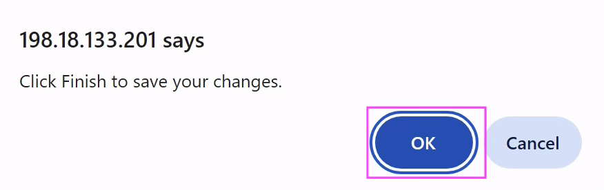{ loading=lazy }
</figure>

1.  Once configured, **Site-to-Site** VPN listing page shows the new
    SD-WAN topology on the same page i.e. on **Secure Connections \>
    Site-to-Site VPN & SD-WAN.**

<figure markdown style="max-width:16.0cm;">
  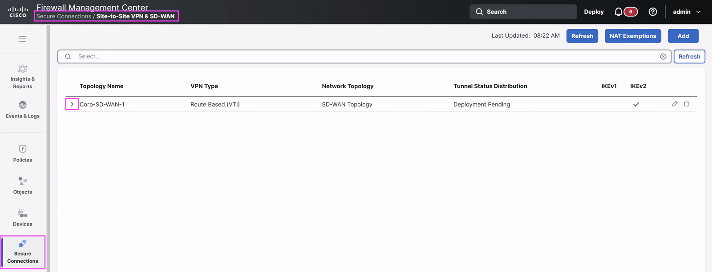{ loading=lazy }
</figure>

2.  Expand the **Corp-SD-WAN-1** node to view all the tunnels in the
    topology. It shows 2 tunnels. Since the configuration has not been
    deployed, it shows **Deployment Pending** and the tunnel shows in
    amber.

<figure markdown style="max-width:16.0cm;">
  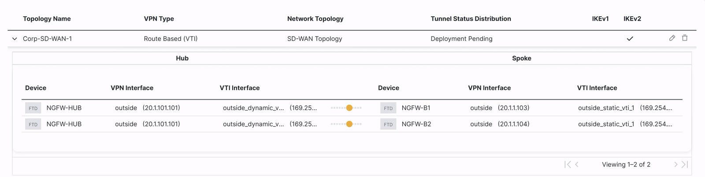{ loading=lazy }
</figure>

3.  *(Optional)* Verify the Name and IP address of auto-generated Static
    VTI Tunnels on Spoke devices.

    !!! info "Optional &mdash; sanity check only"
        This sub-step is purely for verification of what the SD-WAN Wizard
        auto-generated. Skipping it has no effect on the rest of the lab.
        If you want to confirm the static VTIs that FMC created on the
        spokes, follow the steps below; otherwise jump ahead to
        **1.2 Deploy to Hub and Spoke Devices**.

    1.  Click **pencil/edit icon** in Site-to-Site VPN Listing page
        which will open the SD-WAN Topology Wizard.

        <figure markdown style="max-width:16.0cm;">
          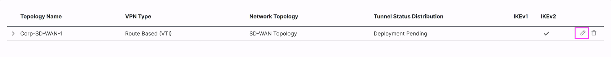{ loading=lazy }
        </figure>

    2.  Click on **edit** link in Spokes step.

        <figure markdown style="max-width:16.0cm;">
          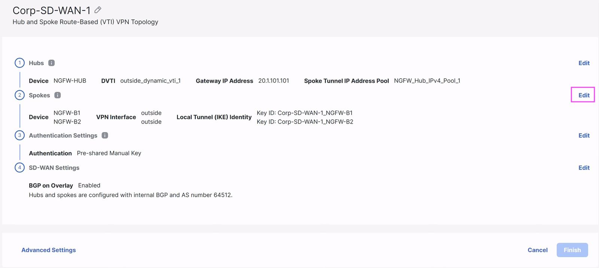{ loading=lazy }
        </figure>

    3.  Click **View Generated Tunnel Interfaces** button. This opens a
        dialog which shows Spoke devices with generated Static VTIs.

        <figure markdown style="max-width:16.0cm;">
          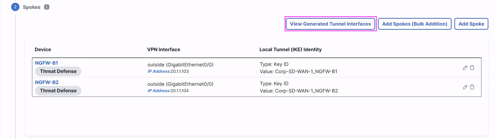{ loading=lazy }
        </figure>

    4.  Click **OK** and then click **Cancel** to revert to Site-to-Site
        VPN Listing page.

        <figure markdown style="max-width:16.0cm;">
          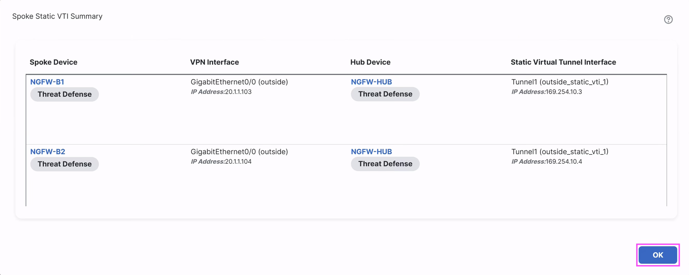{ loading=lazy }
        </figure>

    !!! warning "Stay on track"
        After reviewing the **Spoke Static VTI Summary**, **scroll down**
        and click **OK** on the dialog and then **Cancel** to return to
        the **Site-to-Site VPN Listing** page. Do not click **Finish** or
        **Save** &mdash; we don't want to alter the topology at this point.

## 1.2 Deploy to Hub and Spoke Devices

In this step, you will review all the configuration changes done on
the Hub and Spoke devices and deploy the configuration to the devices.

1)  Click the Deploy button
    { .inline-icon .off-glb }
    on the top right on FMC.

2)  This brings up the list of devices that are Ready for Deployment.
    Select the **Deploy All**
    { .inline-icon .off-glb } checkbox and
    click on **ignore warnings (if any)**
    { .inline-icon .off-glb } button to trigger the
    deployment.

3)  View the progress of the deployment on the devices and **wait till
    the deployment is marked Completed** on the Deploy dialog

<figure markdown style="max-width:10.0cm;">
  { loading=lazy }
</figure>

## 1.3 Configuring BGP Redistribution of EIGRP/OSPF Internal Routes at Hub to SD-WAN

### 1.3.1 Enable BGP on Hub device

In this step, you will enable BGP on the Hub device with the same
autonomous system number as mentioned in SD-WAN Topology.

1.  Edit the device **NGFW-HUB** by navigating to **Devices \> Device
    Management \> Edit NGFW-HUB**

<figure markdown style="max-width:16.0cm;">
  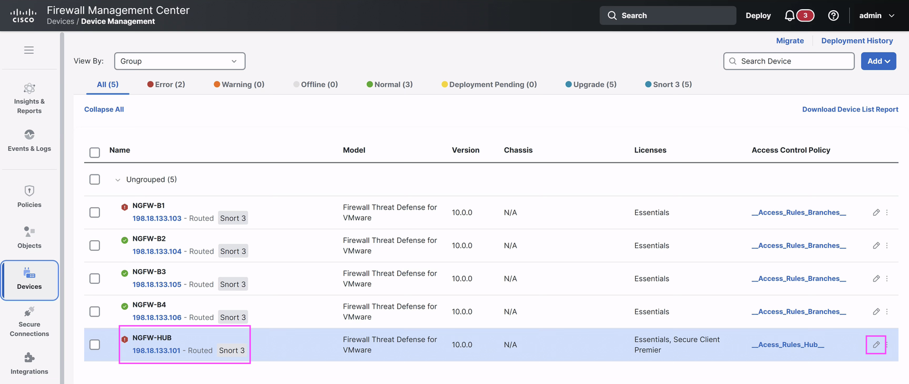{ loading=lazy }
</figure>

2.  Click on the **Routing** tab \> scroll down the left menu and click on the
    **BGP** button under **General Settings**, then fill in:

    1.  **Enable BGP**: Check the checkbox to enable BGP.
    2.  **Autonomous System Number**: type `64512` manually using the
        keyboard (same value as specified in the SD-WAN Topology).
        Avoid copy-pasting from this guide &mdash; copy-paste can
        trigger a rare UI glitch (see warning below).

    !!! warning "Rare UI glitch &mdash; AS Number may drop when moving to BGP IPv4 with copy-paste from guide"
        In some sessions the FMC UI loses the **Autonomous System Number**
        `64512` when you move to the **BGP IPv4** option below. This is
        more common when **copy-paste** is used to enter `64512`. If you
        notice the AS Number missing on the **BGP IPv4** page, do the
        following:

        1. Click **Cancel** to exit the current BGP settings.
        2. Re-open the device and navigate back to
           **Routing &rarr; General Settings &rarr; BGP**.
        3. **Type** `64512` manually in the **Autonomous System Number**
           field (do not copy-paste). The value will be preserved when
           you switch to **BGP IPv4**.

<figure markdown style="max-width:16.0cm;">
  { loading=lazy }
</figure>

3.  Click on the **BGP IPv4** routing option

    1.  **Enable IPv4**, review the AS Number defaults to **64512**

<figure markdown style="max-width:16.0cm;">
  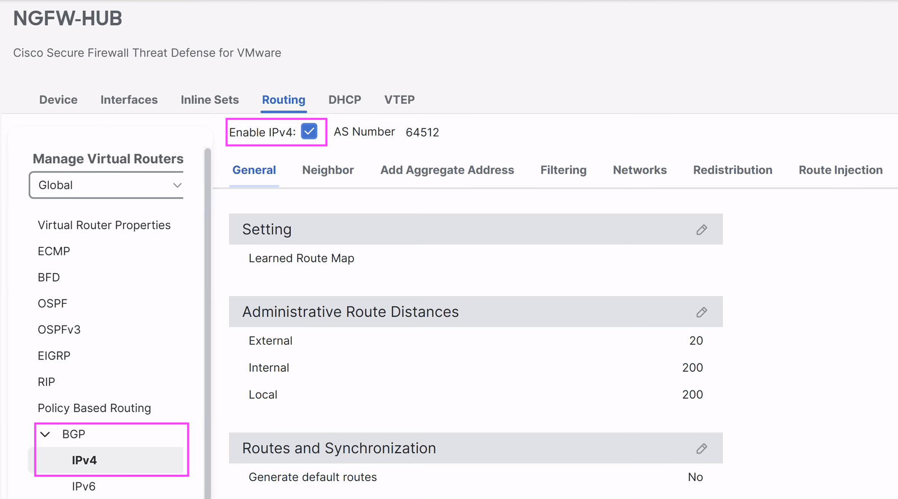{ loading=lazy }
</figure>

### 1.3.2 Configure redistribution of OSPF routes

In this step, you will enable redistribution of OSPF learnt routes
into BGP. These routes will then be advertised to the SD-WAN peers.

1.  In **BGP IPv4** settings click on **Redistribution** tab and then
    **Add**

<figure markdown style="max-width:16.0cm;">
  { loading=lazy }
</figure>

2.  This launches the **Add Redistribution** dialog. Fill it in as
    follows:

    1.  **Source Protocol**: Pick **OSPF** from the drop-down.
    2.  **Process ID**: `1`
    3.  **Route Map**: **Advertise-Hub-Protected-Networks**
    4.  Click **OK** to save the settings.

<figure markdown style="max-width:16.0cm;">
  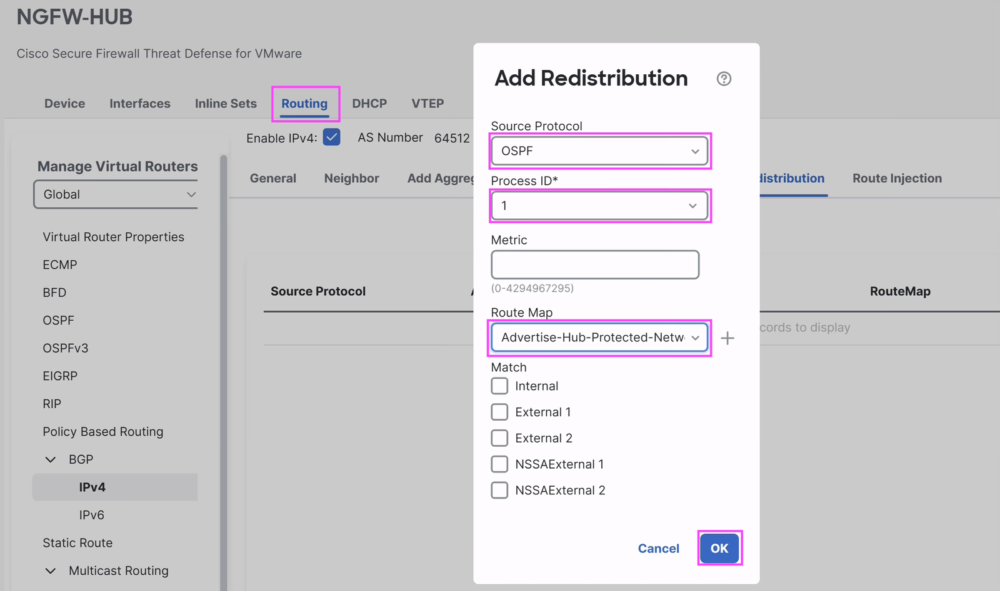{ loading=lazy }
</figure>

### 1.3.3 Configure redistribution of EIGRP routes

In this step, you will enable redistribution of EIGRP learnt routes
into BGP. These routes will then be advertised to the SD-WAN peers.

1.  In **BGP IPv4** settings click on **Redistribution** tab (you are
    already here with previous step) and then **Add**

2.  This launches the **Add Redistribution** dialog. Fill it in as
    follows:

    1.  **Source Protocol**: Pick **EIGRP** from the drop-down.
    2.  **AS Number**: `1`
    3.  **Route Map**: **Advertise-Hub-Protected-Networks**
    4.  Click **OK** to save the settings.

    <figure markdown style="max-width:16.0cm;">
      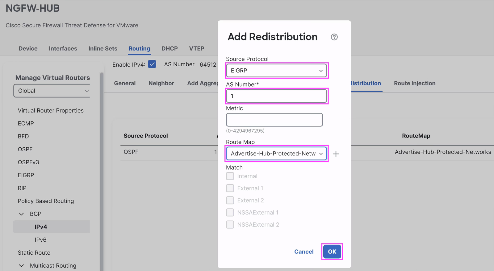{ loading=lazy }
    </figure>

3.  Click **Save** on top right to complete the configuration.

    <figure markdown style="max-width:16.0cm;">
      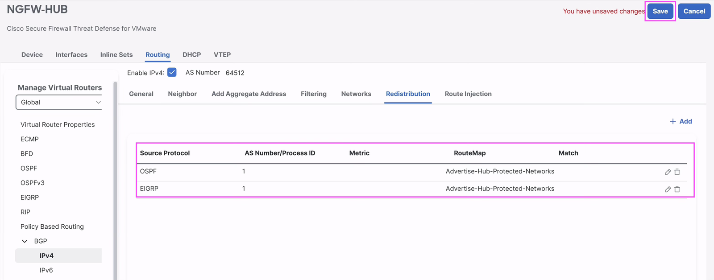{ loading=lazy }
    </figure>

## 1.4 Configuring BGP Redistribution of Static Internal Routes at Spoke (NGFW-B1) to SD-WAN

### 1.4.1 Enable BGP on Spoke device

In this step, you will enable BGP on the Spoke device (**NGFW-B1**)
with the same autonomous system number as mentioned in SD-WAN Topology.

1.  Edit the device **NGFW-B1** by navigating to **Devices \> Device
    Management \> Edit NGFW-B1**

<figure markdown style="max-width:16.0cm;">
  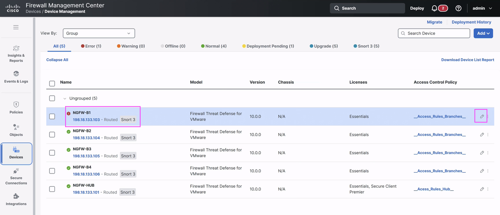{ loading=lazy }
</figure>

2.  Click on the **Routing** tab \> click on the **BGP** button under
    **General Settings**, then fill in:

    1.  **Enable BGP**: Check the checkbox to enable BGP.
    2.  **Autonomous System Number**: type `64512` manually using the
        keyboard (same value as specified in the SD-WAN Topology).
        Avoid copy-pasting from this guide.

<figure markdown style="max-width:16.0cm;">
  { loading=lazy }
</figure>

3.  Click on the **BGP IPv4** routing option

    1.  **Enable IPv4**, review the AS Number defaults to **64512**

<figure markdown style="max-width:16.0cm;">
  { loading=lazy }
</figure>

### 1.4.2 Configure redistribution of Static routes

In this step, you will enable redistribution of Static routes into
BGP. These routes will then be advertised to the SD-WAN peers.

1.  In **BGP IPv4** settings click on **Redistribution** tab and then
    **Add**

<figure markdown style="max-width:16.0cm;">
  { loading=lazy }
</figure>

2.  This launches the **Add Redistribution** dialog. Fill it in as
    follows:

    1.  **Source Protocol**: Pick **Static** from the drop-down.
    2.  **Route Map**: **Advertise-Branch-Protected-Networks**
    3.  Click **OK** to save the settings.

<figure markdown style="max-width:16.0cm;">
  { loading=lazy }
</figure>

3.  Click **Save** on top right to complete the configuration.

<figure markdown style="max-width:16.0cm;">
  { loading=lazy }
</figure>

## 1.5 Configuring BGP Redistribution of EIGRP Internal Routes at Spoke (NGFW-B2) to SD-WAN

### 1.5.1 Enable BGP on Spoke device

In this step, you will enable BGP on the Spoke device (**NGFW-B2**)
with the same autonomous system number as mentioned in SD-WAN Topology.

1.  Edit the device **NGFW-B2** by navigating to **Devices \> Device
    Management \> Edit NGFW-B2**

<figure markdown style="max-width:16.0cm;">
  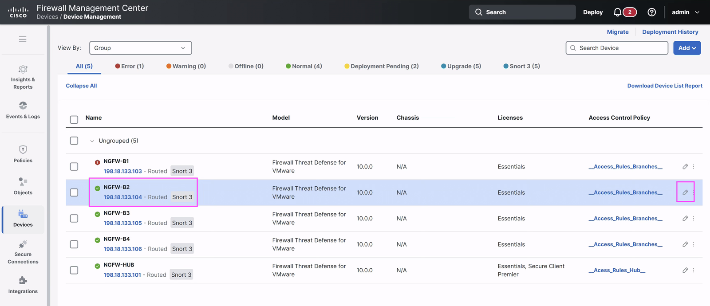{ loading=lazy }
</figure>

2.  Click on the **Routing** tab \> click on the **BGP** button under
    **General Settings**, then fill in:

    1.  **Enable BGP**: Check the checkbox to enable BGP.
    2.  **Autonomous System Number**: type `64512` manually using the
        keyboard (same value as specified in the SD-WAN Topology).
        Avoid copy-pasting from this guide.

<figure markdown style="max-width:16.0cm;">
  { loading=lazy }
</figure>

3.  Click on the **BGP IPv4** routing option

    1.  **Enable IPv4**, review the AS Number defaults to **64512**

<figure markdown style="max-width:16.0cm;">
  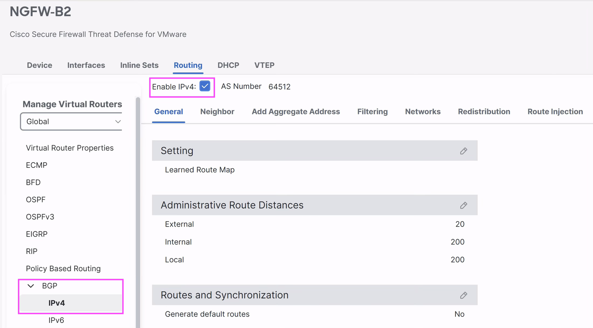{ loading=lazy }
</figure>

### 1.5.2 Configure redistribution of EIGRP routes

In this step, you will enable redistribution of EIGRP routes into BGP.
These routes will then be advertised to the SD-WAN peers.

1.  In **BGP IPv4** settings click on **Redistribution** tab and then
    **Add**

<figure markdown style="max-width:16.0cm;">
  { loading=lazy }
</figure>

2.  This launches the **Add Redistribution** dialog. Fill it in as
    follows:

    1.  **Source Protocol**: Pick **EIGRP** from the drop-down.
    2.  **AS Number**: `1`
    3.  **Route Map**: **Advertise-Branch-Protected-Networks**
    4.  Click **OK** to save the settings.

<figure markdown style="max-width:16.0cm;">
  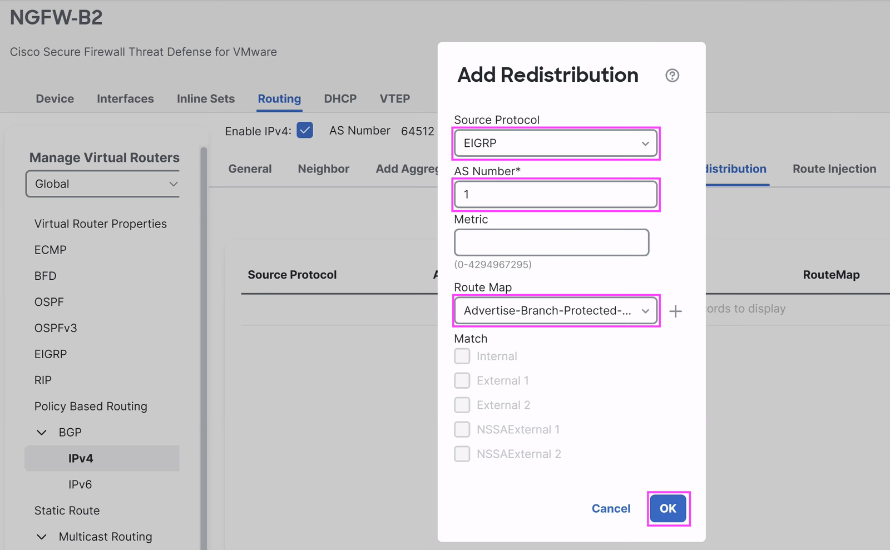{ loading=lazy }
</figure>

3.  Click **Save** on top right to complete the configuration.

<figure markdown style="max-width:16.0cm;">
  { loading=lazy }
</figure>

## 1.6 Deploy to Hub and Spoke Devices

In this step, you will review all the configuration changes done on
the Hub and Spoke devices and deploy the configuration to the devices.

1)  Click the Deploy button
    { .inline-icon .off-glb }
    on the top right on FMC.

2)  This brings up the list of devices that are Ready for Deployment.
    Select the **Deploy All**
    { .inline-icon .off-glb } checkbox and
    click on **ignore warnings (if any)**
    { .inline-icon .off-glb } button to trigger the
    deployment.

3)  View the progress of the deployment on the devices and **wait till
    the deployment is marked Completed** on the Deploy dialog

<figure markdown style="max-width:10.0cm;">
  { loading=lazy }
</figure>

## 1.7 Verify the traffic flow over the VPN tunnel from Spokes to Hub

### 1.7.1 Verify Site-to-Site VPN Tunnels

In this step, verify the VTI tunnels between the spokes and hub
devices.

Go to **Insights & Reports &rarr; VPN dashboards &rarr; SD-WAN
Summary** and check that the tunnels are up as shown below. You may
use **Refresh** to reload the tunnel status if the tunnel has not come
up yet. Wait for a few seconds for tunnel status to be updated fully.

<figure markdown style="max-width:16.0cm;">
  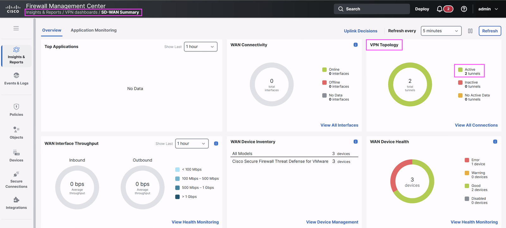{ loading=lazy }
</figure>

Go to **Insights & Reports &rarr; VPN dashboards &rarr; Site-to-Site
VPN** and check that the tunnels are up as shown below. You can also
click **View All Connections** within the **VPN Topology** widget in
the **SD-WAN Summary** dashboard to view this page:

!!! note "Node A and Node B may appear swapped"
    On the **Site-to-Site VPN** page the **Node A** and **Node B**
    columns may not always display the Hub on the left and the Spoke
    on the right. This is purely a display ordering and does not
    indicate any tunnel issue.

<figure markdown style="max-width:16.0cm;">
  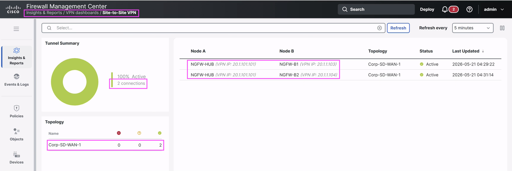{ loading=lazy }
</figure>

### 1.7.2 Verify Routes on Hub (NGFW-HUB)

When SD-WAN Topology is deployed to Hubs and Spokes, BGP commands are
auto-generated and deployed to the devices. In this step, verify the
BGP and other configured and learnt routes at the Hub.

1.  Go to **Troubleshooting &rarr; Tools &rarr; Threat Defense CLI**.

    <figure markdown style="max-width:8.0cm;">
      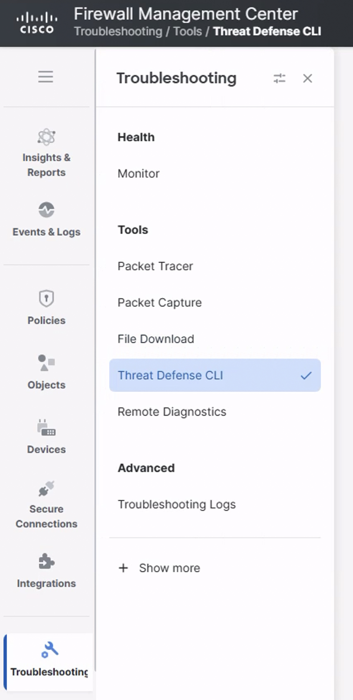{ loading=lazy }
    </figure>

2.  This launches the **CLI Troubleshoot** dialog. Fill it in as
    follows:

    1.  **Device**: **NGFW-HUB**
    2.  **Command**: `show`
    3.  **Parameter**: Type the argument `route`

3.  Click on **Execute** and review the routes.

    !!! tip "Routes may take a moment to appear"
        BGP convergence can take a few seconds to a minute after a
        deployment. If a route isn't visible immediately, wait briefly
        and click **Execute** again to refresh the output.

4.  Verify the connected routes (10.1.1.0/255.255.255.0 and
    10.1.2.0/255.255.255.0) from the Spokes that got redistributed over
    BGP

<figure markdown style="max-width:16.0cm;">
  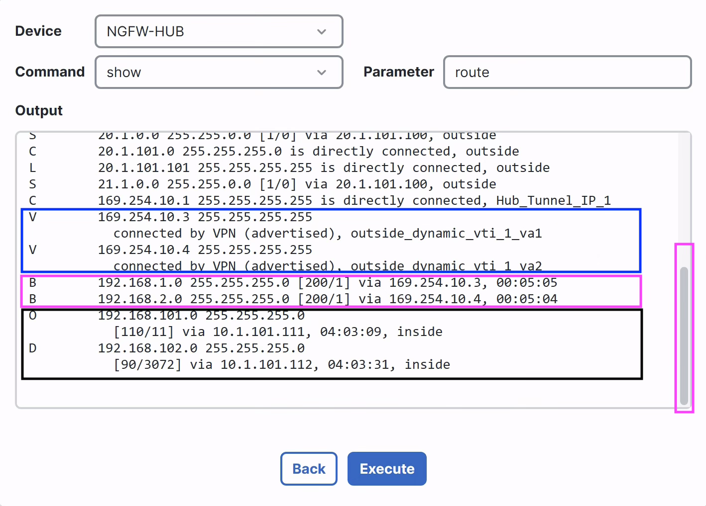{ loading=lazy }
</figure>

5.  Scroll through the routes output and verify internal routes learnt
    from OSPF (**O**) and EIGRP (**D**)

6.  Verify VPN routes (**V**), the Spokes Tunnel IP addresses

7.  Verify the protected networks at Spokes (192.168.1.0/255.255.255.0
    and 192.168.2.0/255.255.255.0) were distributed over BGP (**B**)

<figure markdown style="max-width:12.0cm;">
  { loading=lazy }
</figure>

### 1.7.3 Verify traffic between protected networks behind spoke (NGFW-B1) and hub (NGFW-HUB)

Network behind spoke (**NGFW-B1**) &mdash; 192.168.1.0/24 with a host
**192.168.1.133** (**B1H**)

Network behind hub (**NGFW-HUB**) &mdash; 192.168.101.0/24 with a host
**192.168.101.131** (**H1**)

Network behind hub (**NGFW-HUB**) &mdash; 192.168.102.0/24 with a host
**192.168.102.132** (**H2**)

1.  **Connect to B1H:** Open **Cisco Secure Firewall Quick Launch** from
    Taskbar and click on **B1H** which is present under **Linux VM
    Access.** This opens **B1H's** SSH session.

    <figure markdown style="max-width:16.0cm;">
      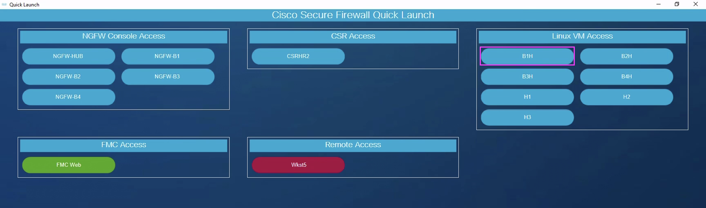{ loading=lazy }
    </figure>

2.  **Verify ping connectivity from Branch host to hosts behind Hub site.**

    1.  `ping 192.168.101.131 -c 5` which is the host behind the
        Hub device NGFW-HUB and verify that you get a response.

    2.  `ping 192.168.102.132 -c 5` which is the host behind the
        Hub device NGFW-HUB and verify that you get a response.

    <figure markdown style="max-width:16.0cm;">
      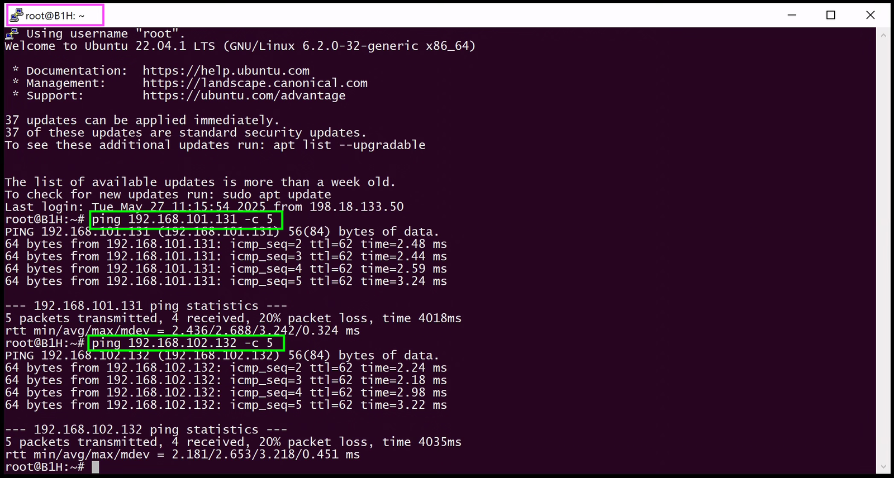{ loading=lazy }
    </figure>

3.  **Verify SSH Connection**

    1.  **SSH** to **192.168.101.131** (`ssh 192.168.101.131`) using
        password **C1sco12345** and verify SSH access works. After
        successful connection, you may **exit**.

        <figure markdown style="max-width:16.0cm;">
          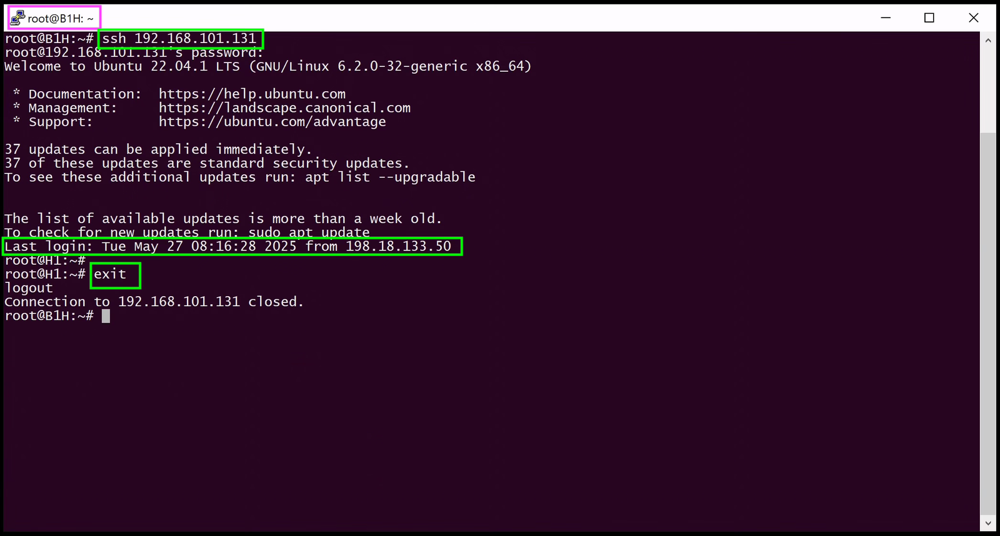{ loading=lazy }
        </figure>

    2.  **SSH** to **192.168.102.132** (`ssh 192.168.102.132`) using
        password **C1sco12345** and verify SSH access works. After
        successful connection, you may **exit**.

        <figure markdown style="max-width:16.0cm;">
          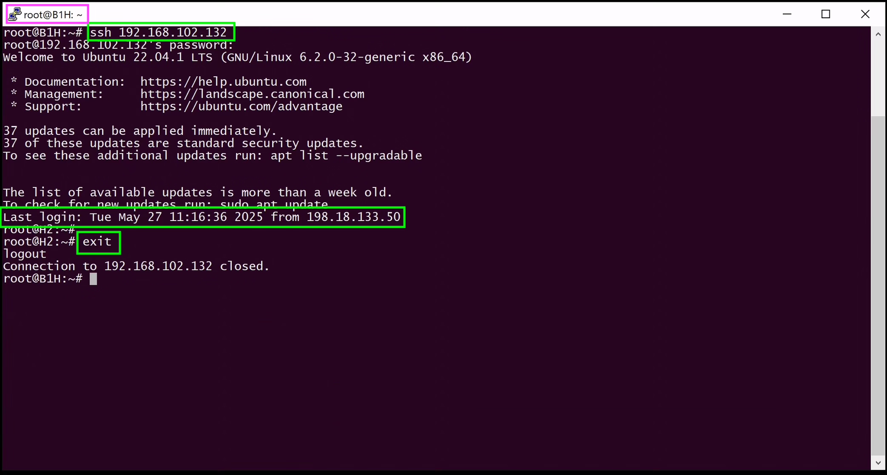{ loading=lazy }
        </figure>

### 1.7.4 Verify the traffic flow over the VPN tunnel from Spoke (NGFW-B1) to Spoke (NGFW-B2)

Network behind spoke (**NGFW-B1**) &mdash; 192.168.1.0/24 with a host
**192.168.1.133** (**B1H**)

Network behind spoke (**NGFW-B2**) &mdash; 192.168.2.0/24 with a host
**192.168.2.134** (**B2H**)

1.  **Connect to / Stay on B1H:** If you still have **B1H's** SSH
    session open from the previous step, you can continue using it.
    Otherwise, open **Cisco Secure Firewall Quick Launch** and click
    on **B1H** under **Linux VM Access** to reopen the SSH session.

    !!! tip "Reuse the existing B1H session"
        You should already be on **B1H** from the previous step
        unless the **PuTTY** window was closed.

    <figure markdown style="max-width:16.0cm;">
      { loading=lazy }
    </figure>

2.  **Verify Ping**

    1.  `ping 192.168.2.134 -c 5` which is the host behind the
        spoke device NGFW-B2 and verify that you get a response.

    <figure markdown style="max-width:16.0cm;">
      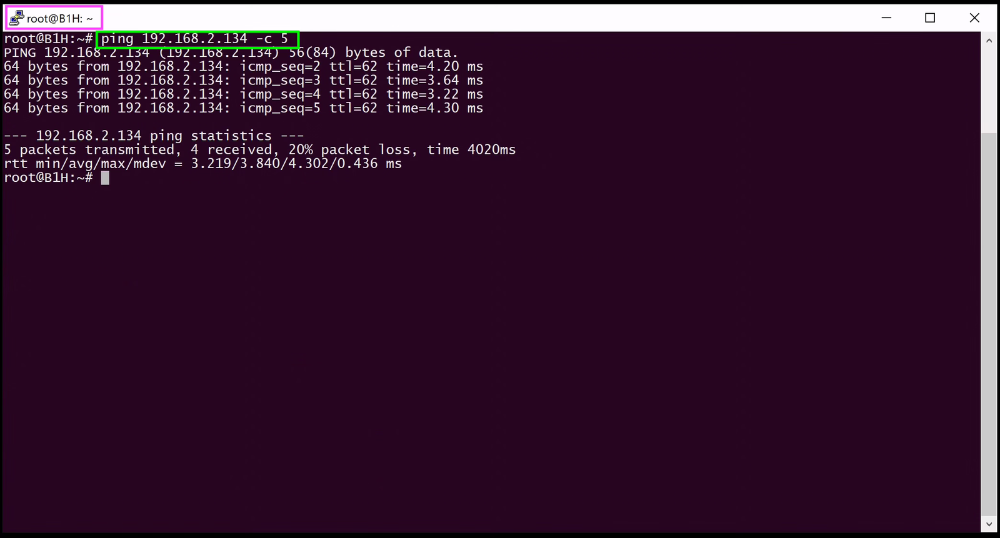{ loading=lazy }
    </figure>

3.  **Verify SSH Connection**

    1.  **SSH** to **192.168.2.134** (`ssh 192.168.2.134`) using
        password **C1sco12345** and verify SSH access works.

    2.  After successful connection, you may **exit**.

        <figure markdown style="max-width:16.0cm;">
          { loading=lazy }
        </figure>

4.  You may close all opened **PuTTY** sessions.

!!! success "Scenario 1 complete"
    You have successfully **configured and verified the SD-WAN topology
    with one Hub and multiple Spokes!**

