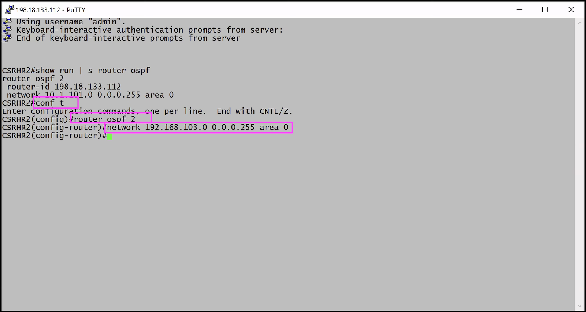
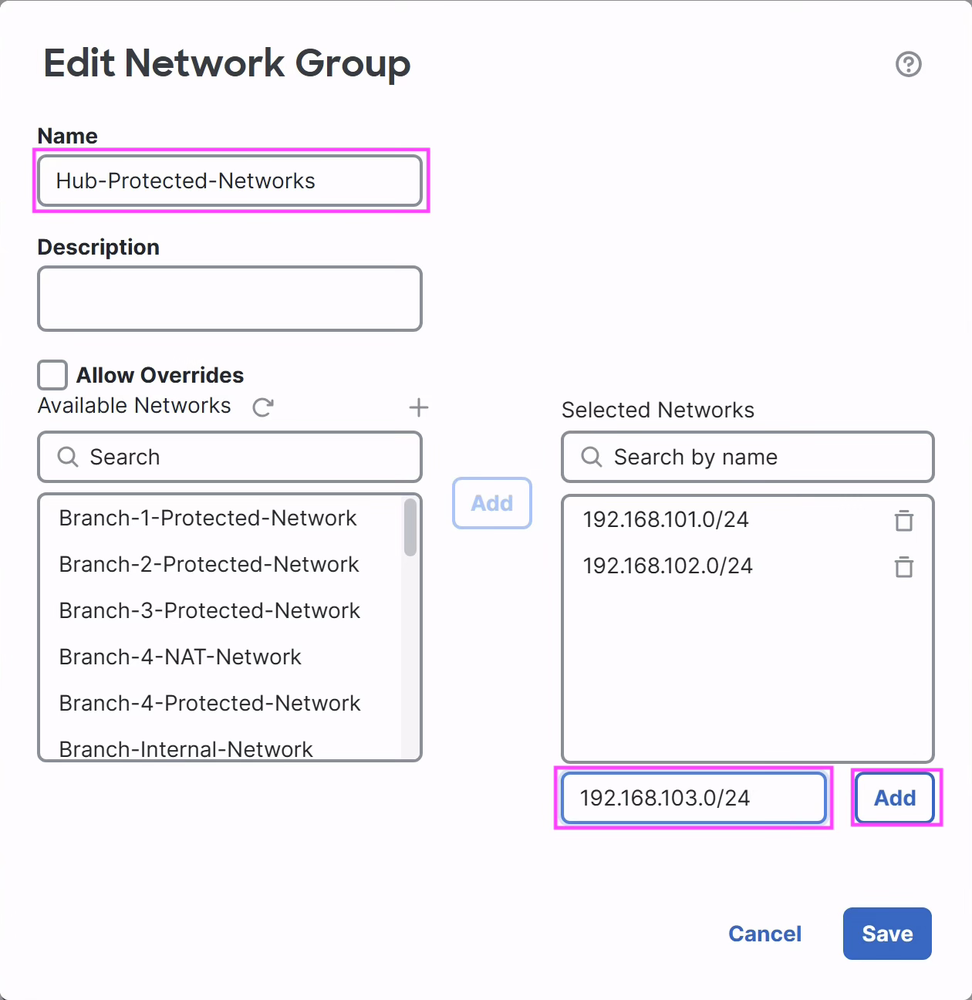
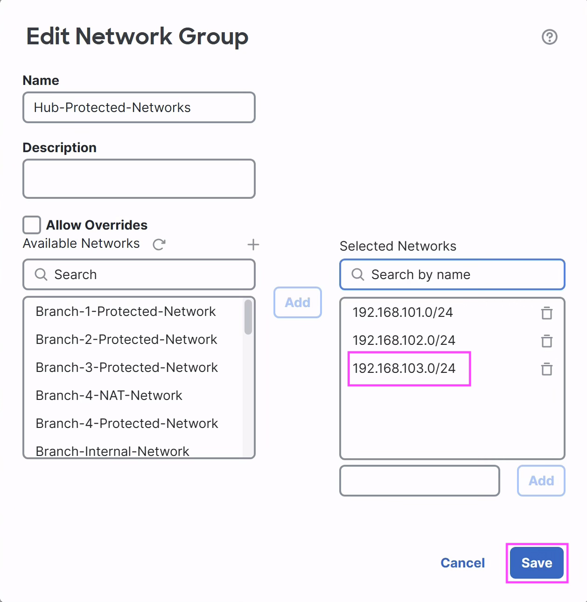
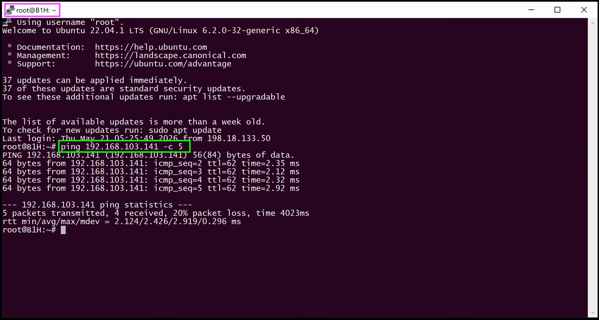
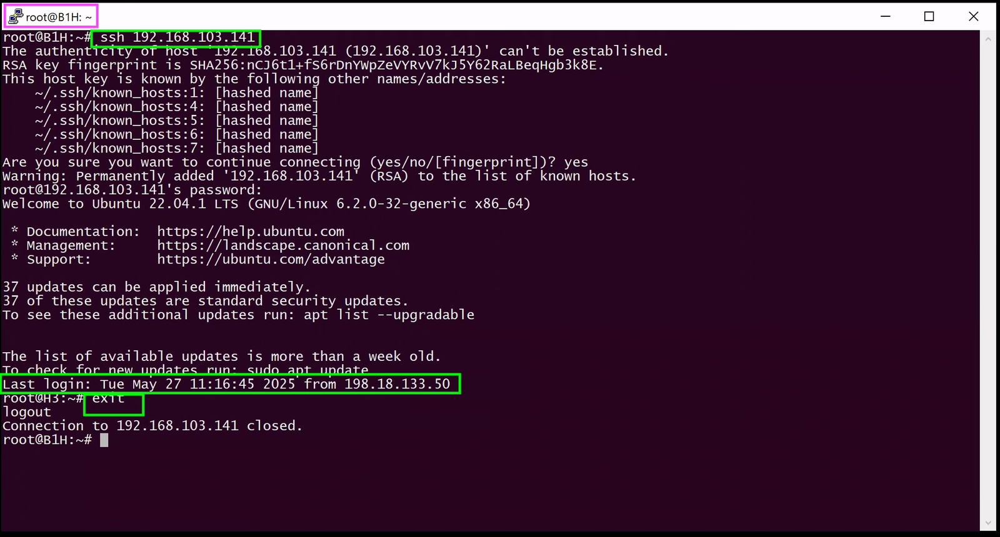

# Scenario 2: Hub Network Expansion


In this lab activity, you will learn how to negotiate topology changes
in Hub through SD-WAN. When a new network is expanded in Hub, you need
to configure and redistribute it into BGP overlay routing section.

## Network Diagram

<figure markdown style="max-width:16.0cm;">
  { loading=lazy }
</figure>

## 2.1 Add network behind Hub

### 2.1.1 Advertise new network by internal router to Hub

In this step, you will advertise this new network (192.168.103.0/24)
to Hub (**NGFW-HUB**) through the internal router (**CSRHR2**).

1.  **Connect to CSRHR2:** Open **Cisco Secure Firewall Quick Launch**
    and click on **CSRHR2** which is present under **CSR Access.**
    This opens a PuTTY window of **CSRHR2** (SSH session).

    <figure markdown style="max-width:16.0cm;">
      { loading=lazy }
    </figure>

2.  Verify the current configuration of OSPF by executing
    `show run | s router ospf`.

    <figure markdown style="max-width:16.0cm;">
      { loading=lazy }
    </figure>

3.  Add the new network in the router; the Hub device will then learn
    it through OSPF.

    Commands all at once for copy/paste convenience &mdash; make sure
    to press **Enter** after the last command:

    ```text
    configure terminal
    router ospf 2
    network 192.168.103.0 0.0.0.255 area 0
    ```

    1.  Go to configuration &mdash; `configure terminal`
    2.  Edit OSPF configuration &mdash; `router ospf 2`
    3.  Add the network &mdash; `network 192.168.103.0 0.0.0.255 area 0`
    4.  You may **close** the **CSRHR2** terminal now.

    <figure markdown style="max-width:16.0cm;">
      { loading=lazy }
    </figure>

4.  Verify the Hub device learnt this new network.

    Back to **FMC**, go to **Troubleshooting &rarr; Tools &rarr;
    Threat Defense CLI**. The **CLI Troubleshoot** dialog opens
    &mdash; fill it in as follows:

    1.  **Device**: **NGFW-HUB**
    2.  **Command**: `show`
    3.  **Parameter**: Type the argument `route ospf`
    4.  Click **Execute** and review the new route (192.168.103.0)
        learnt from the adjacent CSRHR2 router as an OSPF route.

    <figure markdown style="max-width:12.0cm;">
      { loading=lazy }
    </figure>

## 2.2 Redistribution of New Network at Hub to SD-WAN spokes

In this step, you will learn to advertise this new network at Hub
(**NGFW-HUB**) to the spokes through SD-WAN via BGP.

### 2.2.1 Edit Redistribution of OSPF on Hub device

1.  BGP Configuration uses object-group **Hub-Protected-Networks**
    which should be edited with the new network.

2.  Click on the **Objects** menu &mdash; it opens at **Network**
    objects by default.

3.  Click the **Edit** (pencil) icon next to the object-group named
    **Hub-Protected-Networks**. Scroll down if required to find the
    object.

    <figure markdown style="max-width:16.0cm;">
      { loading=lazy }
    </figure>

4.  In the **Edit Network Object** dialog, type the network in the
    **Network** field and click **Add**:

    ```text
    192.168.103.0/24
    ```

    <figure markdown style="max-width:10.0cm;">
      { loading=lazy }
    </figure>

5.  Click **Save** to update the object-group.

    <figure markdown style="max-width:10.0cm;">
      { loading=lazy }
    </figure>

## 2.3 Deploy to Hub and Spoke Devices

In this step, you will review all the configuration changes done on
the Hub and Spoke devices and deploy the configuration to the devices.

1)  Click the Deploy button
    { .inline-icon .off-glb }
    on the top right on FMC.

2)  This brings up the list of devices that are Ready for Deployment.
    Select the **Deploy All**
    { .inline-icon .off-glb } checkbox and
    click on **ignore warnings (if any)**
    { .inline-icon .off-glb } button to trigger the
    deployment.

3)  View the progress of the deployment on the devices and **wait till
    the deployment is marked Completed** on the Deploy dialog

<figure markdown style="max-width:10.0cm;">
  { loading=lazy }
</figure>

## 2.4 Verify the traffic flow over the VPN tunnel from Spoke to Hub

### 2.4.1 Verify Routes on Spoke, NGFW-B1

In this step, you will verify the BGP and other connected and
redistributed routes at the Hub.

1.  Go to **Troubleshooting &rarr; Tools &rarr; Threat Defense CLI**.

2.  This launches the **CLI Troubleshoot** dialog. Fill it in as
    follows:

    1.  **Device**: **NGFW-B1**
    2.  **Command**: `show`
    3.  **Parameter**: Type the argument `route bgp`

3.  Click **Execute** and review the routes.

4.  Verify the new network (192.168.103.0) at Hub is redistributed
    over BGP. Scroll down in the output if required to find the
    `192.168.103.0` route.

    <figure markdown style="max-width:12.0cm;">
      { loading=lazy }
    </figure>

### 2.4.2 Verify Routes on Spoke, NGFW-B2

1.  Go to **Troubleshooting &rarr; Tools &rarr; Threat Defense CLI**
    *(you should already be here from the previous step)*.

2.  This launches the **CLI Troubleshoot** dialog. Fill it in as
    follows:

    1.  **Device**: **NGFW-B2**
    2.  **Command**: `show`
    3.  **Parameter**: Type the argument `route bgp`

3.  Click **Execute** and review the routes.

4.  Verify the new network (192.168.103.0) at Hub is redistributed
    over BGP. Scroll down in the output if required to find the
    `192.168.103.0` route.

    <figure markdown style="max-width:12.0cm;">
      { loading=lazy }
    </figure>

### 2.4.3 Verify traffic between protected networks behind spoke (NGFW-B1) and hub (NGFW-HUB)

Network behind spoke (**NGFW-B1**) – 192.168.1.0/24 with a host
**192.168.1.133** (**B1H**)

New network behind hub (**NGFW-HUB**) – 192.168.103.0/24 with host
**192.168.103.141** (**H3**)

1.  **Re/Connect to B1H:** Reopen the **B1H**'s SSH access from the
    taskbar from the previous scenario, or open **Cisco Secure
    Firewall Quick Launch** and click **B1H** under **Linux VM
    Access**. This opens **B1H**'s SSH session.

    <figure markdown style="max-width:16.0cm;">
      { loading=lazy }
    </figure>

2.  **Verify Ping** &mdash; ping the host behind **NGFW-HUB**
    (`192.168.103.141`) and verify that you get a response:

    ```bash
    ping 192.168.103.141 -c 5
    ```

    <figure markdown style="max-width:16.0cm;">
      { loading=lazy }
    </figure>

3.  **Verify SSH Connection** &mdash; SSH to **192.168.103.141**
    using password **C1sco12345** and verify SSH access works:

    ```bash
    ssh 192.168.103.141
    ```

    After a successful connection, you may **exit**.

    <figure markdown style="max-width:16.0cm;">
      { loading=lazy }
    </figure>

4.  You may close all opened **PuTTY** sessions and minimize the
    **Cisco Secure Firewall Quick Launch** window.

!!! success "Scenario 2 complete"
    You have successfully **configured and verified the SD-WAN topology
    with Hub expansion!**

