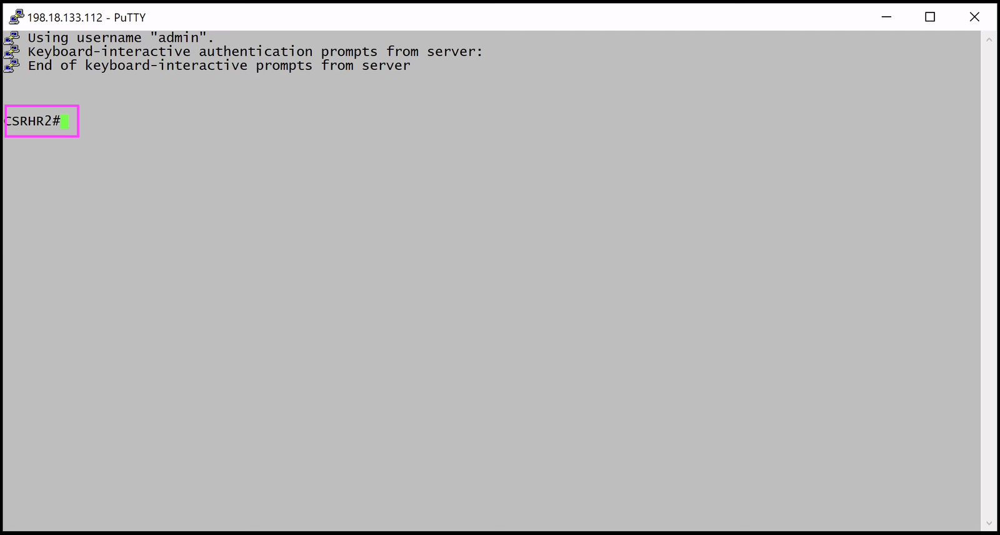
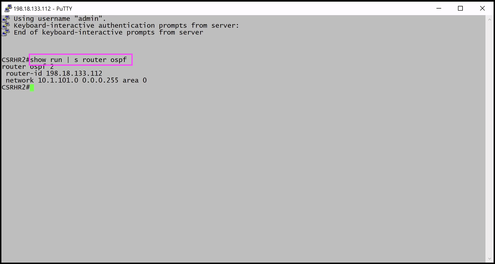
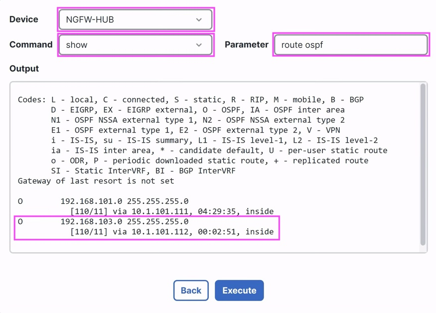
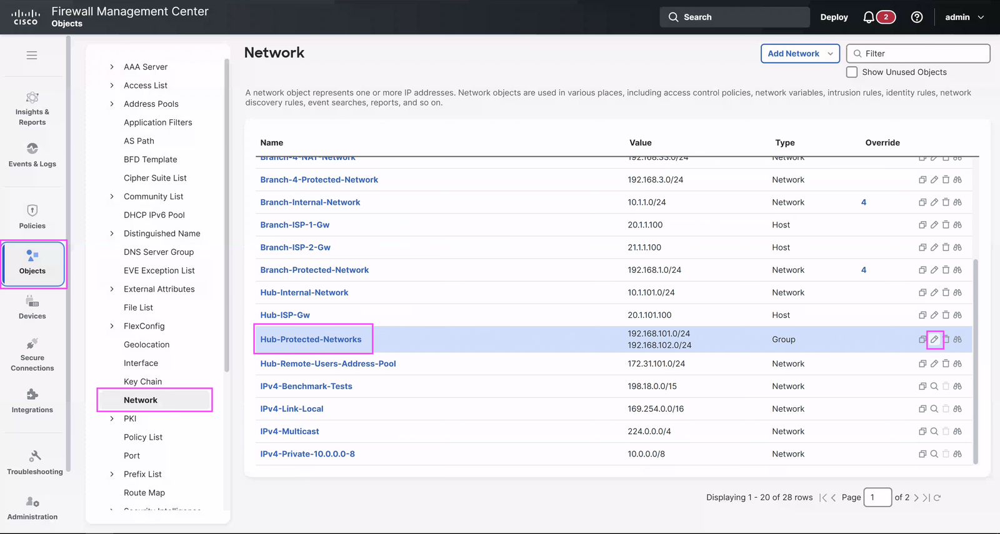
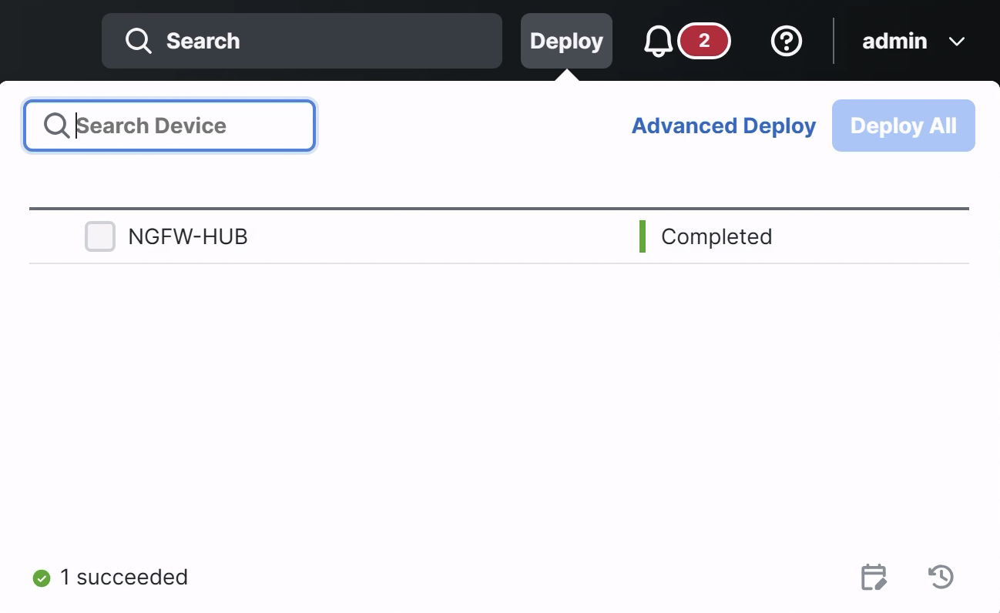
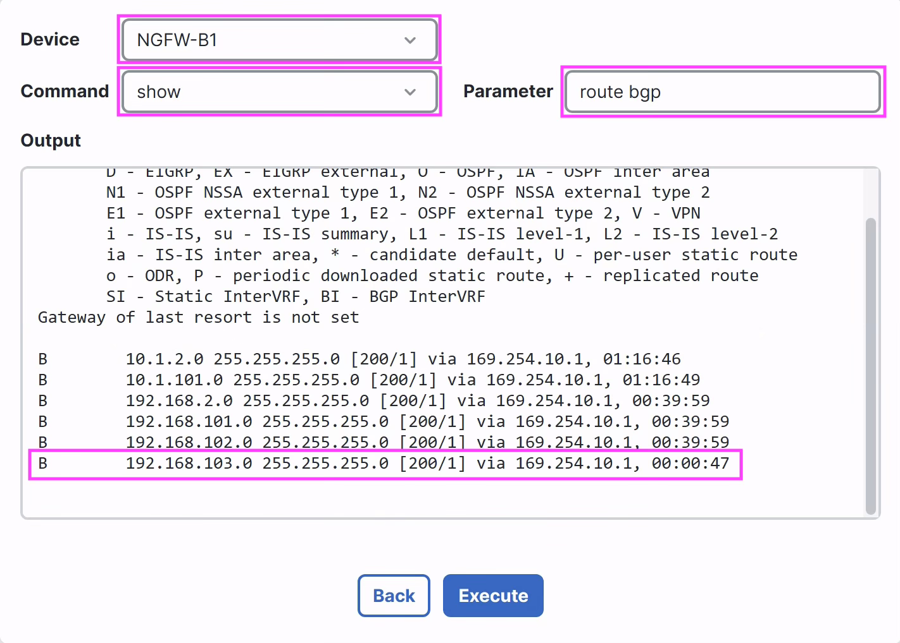
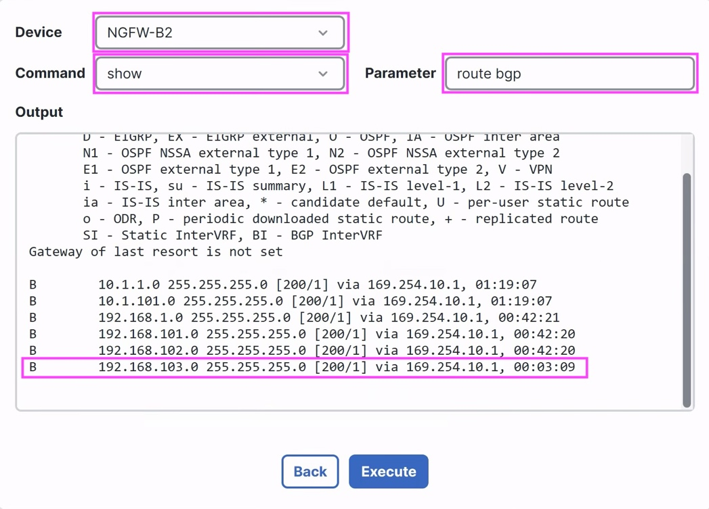

# Scenario 2: Hub Network Expansion

In this lab activity, you will learn how to negotiate topology changes
in Hub through SD-WAN. When a new network is expanded in Hub, you need
to configure and redistribute it into BGP overlay routing section.

## Network Diagram

<figure markdown style="max-width:16.5cm;">
  { loading=lazy }
</figure>

## Task 1: Add network behind Hub

### Step 1: Advertise new network by internal router to Hub

In this step, you will advertise this new network (192.168.103.0/24)
to Hub (**NGFW-HUB**) through the internal router (**CSRHR2**).

1.  **Connect to CSRHR2:** Open **Cisco Secure Firewall Quick Launch**
    and click on **CSRHR2** which is present under **CSR Access.**
    This opens a PuTTY window of **CSRHR2** (SSH session).

2.  You may minimize Cisco Secure Firewall Quick Launch Window

<figure markdown style="max-width:16.5cm;">
  { loading=lazy }
</figure>

<figure markdown style="max-width:16.4cm;">
  { loading=lazy }
</figure>

3.  Verify the current configuration of OSPF by executing **show run \|
    s router ospf**

<figure markdown style="max-width:16.5cm;">
  { loading=lazy }
</figure>

4.  Add the new network in router then Hub device will learn it through
    OSPF

Commands all at once for copy-paste purpose –

**configure terminal**

**router ospf 2**

**network 192.168.103.0 0.0.0.255 area 0**

1.  Go to configuration – **configure terminal**

2.  Edit OSPF configuration – **router ospf 2**

3.  Add the network – **network 192.168.103.0 0.0.0.255 area 0**

4.  You may **close** the **CSRHR2** terminal now

<figure markdown style="max-width:16.5cm;">
  { loading=lazy }
</figure>

5.  Verify the Hub device learnt this new network

    1.  Go to **Troubleshooting \> Tools \> Threat Defense CLI**

    2.  This launches the **CLI Troubleshoot** dialog.

        1.  **Device** – **NGFW-HUB**

        2.  **Command** – show

        3.  **Parameter** – Type the argument **route ospf**

    3.  Click on **Execute** and review the new route (192.168.103.0)
        learnt from adjacent CSRHR2 router as an OSPF route

<figure markdown style="max-width:12.0cm;">
  { loading=lazy }
</figure>

## Task 2: Redistribution of New Network at Hub to SD-WAN spokes

In this step, you will learn to advertise this new network at Hub
(**NGFW-HUB**) to the spokes through SD-WAN via BGP.

### Step 1: Edit Redistribution of OSPF on Hub device

1.  BGP Configuration uses object-group **Hub-Protected-Networks** which
    should be edited with new network.

2.  Navigate to **Objects \> Network**

3.  **Edit** (pencil icon) object-group named **Hub-Protected-Networks**

<figure markdown style="max-width:16.5cm;">
  { loading=lazy }
</figure>

4.  Enter network **192.168.103.0/24** and Click **Add**

    1.  Click on **Save** to update the object-group

<figure markdown style="max-width:16.5cm;">
  { loading=lazy }
</figure>

<figure markdown style="max-width:16.5cm;">
  { loading=lazy }
</figure>

## Task 3: Deploy to Hub and Spoke Devices

In this step, you will review all the configuration changes done on
the Hub and Spoke devices and deploy the configuration to the devices.

1)  Click the Deploy button
    { .inline-icon .off-glb }
    on the top right on FMC.

2)  This brings up the list of devices that are Ready for Deployment.
    Select the { .inline-icon .off-glb }and
    click on **ignore warnings (if any)**
    { .inline-icon .off-glb } button to trigger the
    deployment.

3)  View the progress of the deployment on the devices and **wait till
    the deployment is marked Completed** on the Deploy dialog

<figure markdown style="max-width:10.0cm;">
  { loading=lazy }
</figure>

## Task 4: Verify the traffic flow over the VPN tunnel from Spoke to Hub

### Step 1: Verify Routes on Spoke, NGFW-B1

In this step, you will verify the BGP and other connected and
redistributed routes at the Hub.

1.  Go to **Troubleshooting \> Tools \> Threat Defense CLI**

2.  This launches the **CLI Troubleshoot** dialog.

    1.  **Device** – **NGFW-B1**

    2.  **Command** – show

    3.  **Parameter** – Type the argument **route bgp**

3.  Click **Execute** and review the routes, you may scroll down a bit
    if required

4.  Verify the new network (192.168.103.0) at Hub is redistributed over
    BGP

<figure markdown style="max-width:12.0cm;">
  { loading=lazy }
</figure>

### Step 2: Verify Routes on Spoke, NGFW-B2

1.  Go to **Troubleshooting \> Tools \> Threat Defense CLI**

2.  This launches the **CLI Troubleshoot** dialog.

    1.  **Device** – **NGFW-B2**

    2.  **Command** – show

    3.  **Parameter** – Type the argument **route bgp**

3.  Click **Execute** and review the routes, you may scroll down a bit
    if required

4.  Verify the new network (192.168.103.0) at Hub is redistributed over
    BGP

<figure markdown style="max-width:12.0cm;">
  { loading=lazy }
</figure>

### Step 3: Verify traffic between protected networks behind spoke (NGFW-B1) and hub (NGFW-HUB)

Network behind spoke (**NGFW-B1**) – 192.168.1.0/24 with a host
**192.168.1.133** (**B1H**)

New network behind hub (**NGFW-HUB**) – 192.168.103.0/24 with host
**192.168.103.141** (**H3**)

1.  **Re/Connect to B1H:** Reopen the **B1H**’s SSH access from taskbar
    from the previous scenario or open **Cisco Secure Firewall Quick
    Launch** and click on **B1H** which is present under **Linux VM
    Access.** This opens up **B1H**’s SSH session.

<figure markdown style="max-width:16.1cm;">
  { loading=lazy }
</figure>

2.  **Verify Ping**

    1.  `ping 192.168.103.141 -c 5` which is the Host behind the
        Hub device NGFW-HUB and verify that you are getting the
        response.

<figure markdown style="max-width:16.4cm;">
  { loading=lazy }
</figure>

3.  **Verify SSH Connection**

    1.  **SSH** to **192.168.103.141**, using password **C1sco12345**
        and verify SSH access works.

Note: For any prompt, “Are you sure you want to continue connecting
…?”, type “yes”.

2.  After successful connection, you may **exit**.

<figure markdown style="max-width:16.5cm;">
  { loading=lazy }
</figure>

4.  You may close all opened the **PuTTY** sessions

You have successfully configured and verified the SD-WAN topology with
hub expansion!!!

