# Scenario 3: Branch Expansion

In this lab activity, you will learn how to accommodate new branch
acquisition into an existing SD-WAN deployment. When a new branch is
added, you need to add it to the existing SD-WAN Topology and
redistribute its routes into BGP overlay routing.

## Network Diagram

<figure markdown style="max-width:16.5cm;">
  { loading=lazy }
</figure>

## Task 1: Configuring SD-WAN Topology to include new Spoke (NGFW-B3)

### Step 1: Edit SD-WAN Topology

To edit SD-WAN Topology, go to **Secure Connections \> Site-to-Site
VPN & SD-WAN** click **Edit** on the topology **Corp-SD-WAN-1**.

<figure markdown style="max-width:16.4cm;">
  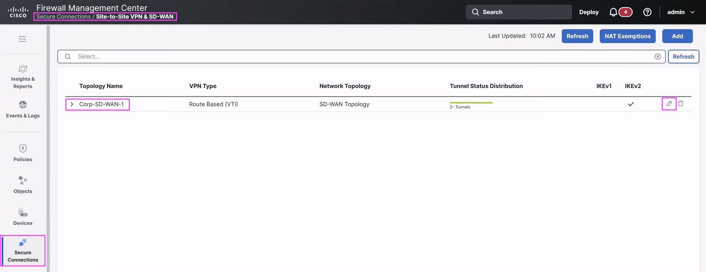{ loading=lazy }
</figure>

### Step 2: SD-WAN Topology – Add Spoke Configuration

Click on **Edit** at **Spokes** step to add the new Spoke into SD-WAN.

<figure markdown style="max-width:16.5cm;">
  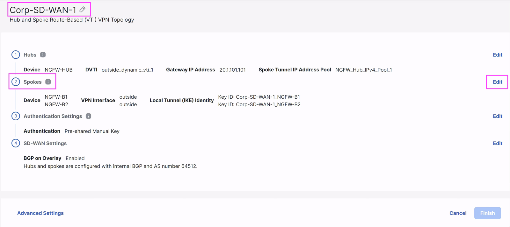{ loading=lazy }
</figure>

Click on **Add Spoke**.

<figure markdown style="max-width:16.4cm;">
  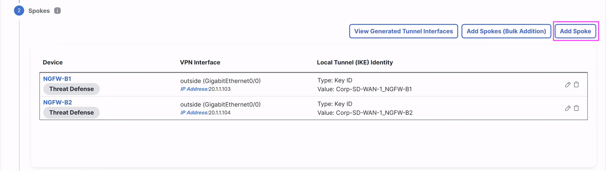{ loading=lazy }
</figure>

Enter the following details in the **Add Spoke** dialog box:

1)  **Devices**: Click drop down to select **NGFW-B3** from **Available
    Devices**.

2)  **VPN Interface:** Select **outside_1** from the list of available
    interfaces.

3)  **Identity Type:** Use the prepopulated default value.

4)  Click **Save** to add the Spoke into SD-WAN Topology

<figure markdown style="max-width:9.2cm;">
  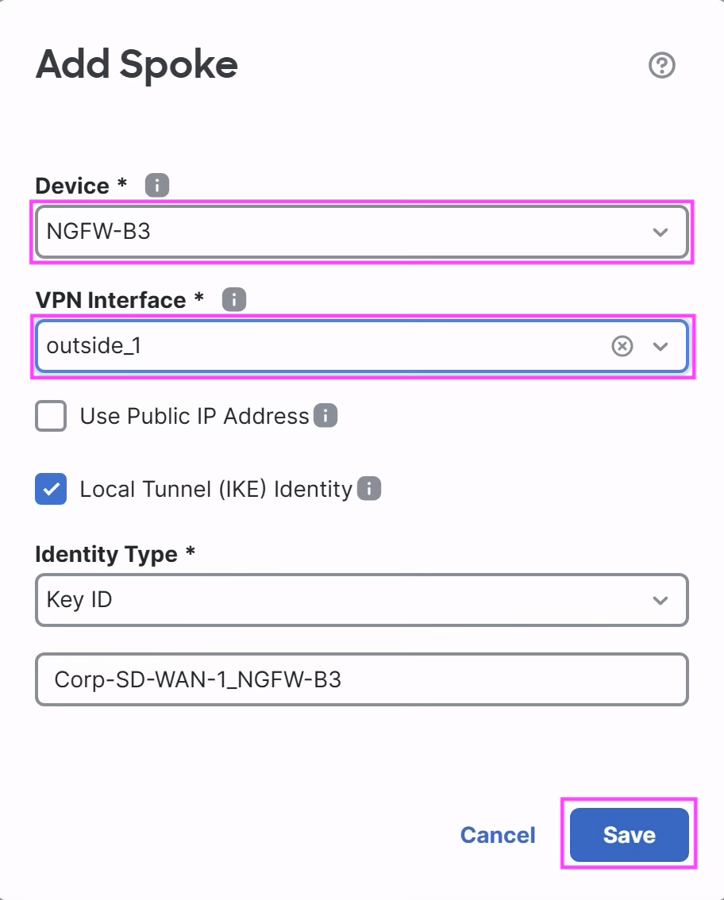{ loading=lazy }
</figure>

<figure markdown style="max-width:16.5cm;">
  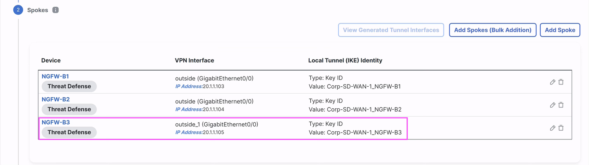{ loading=lazy }
</figure>

### Step 3: SD-WAN Topology - Finish

Now, we are done with all the configuration required to add new branch
in the SD-WAN Topology. Click **Finish** button to save the topology.
Click **OK** for the pop-up dialog “**Click Finish to save your
changes.**”

<figure markdown style="max-width:16.4cm;">
  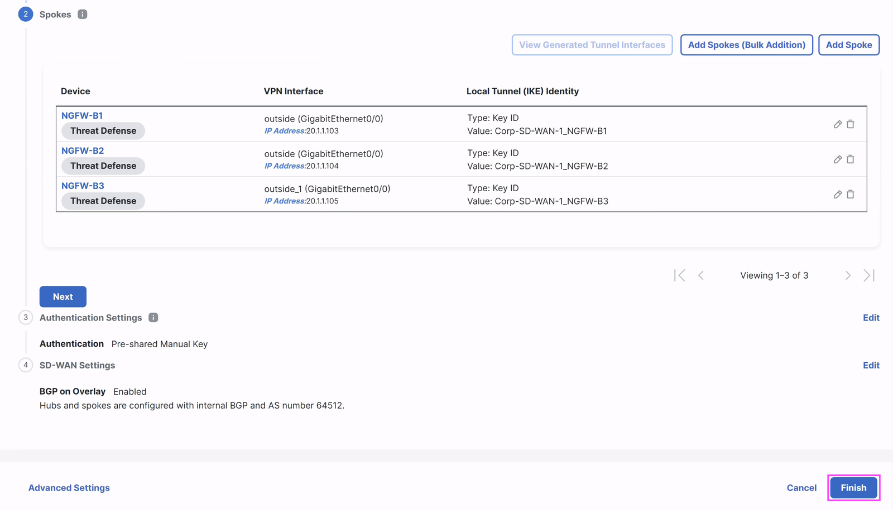{ loading=lazy }
</figure>

1.  Once configured, **Site-to-Site** VPN listing page shows the new
    SD-WAN topology on the same page i.e. on **Secure Connections \>
    Site-to-Site VPN & SD-WAN.**

<figure markdown style="max-width:16.5cm;">
  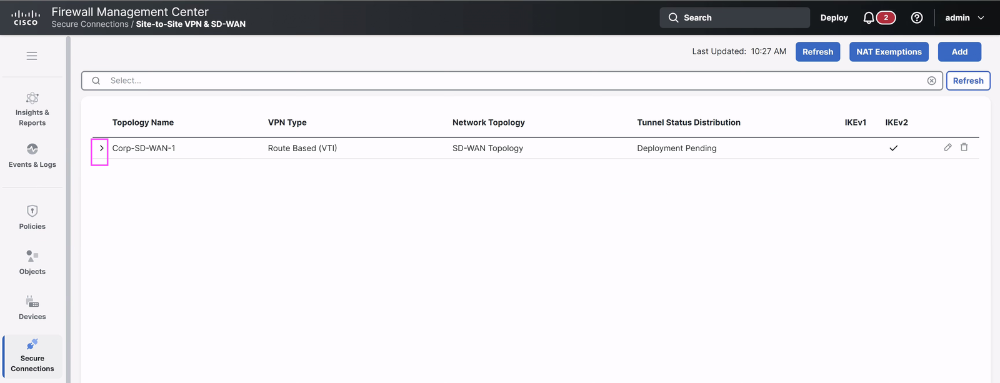{ loading=lazy }
</figure>

2.  Expand the **Corp-SD-WAN-1** node to view all the tunnels in the
    topology. It shows 3 tunnels, 2 of which are existing established
    tunnels. Since the configuration has not been deployed, it shows
    **Deployment Pending** and the new spoke tunnel shows in Amber
    color.

<figure markdown style="max-width:16.5cm;">
  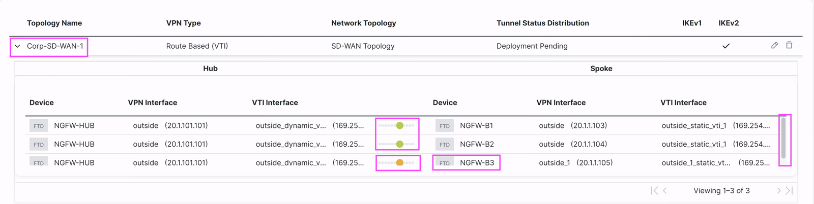{ loading=lazy }
</figure>

## Task 2: Deploy to Hub and Spoke Devices

In this step, you will review all the configuration changes done on
the Hub and Spoke devices and deploy the configuration to the devices.

1)  Click the Deploy button
    { .inline-icon .off-glb }
    on the top right on FMC.

2)  This brings up the list of devices that are Ready for Deployment.
    Select the { .inline-icon .off-glb }and
    click on **ignore warnings (if any)**
    { .inline-icon .off-glb } button to trigger the
    deployment.

3)  View the progress of the deployment on the devices and **wait till
    the deployment is marked Completed** on the Deploy dialog

<figure markdown style="max-width:10.0cm;">
  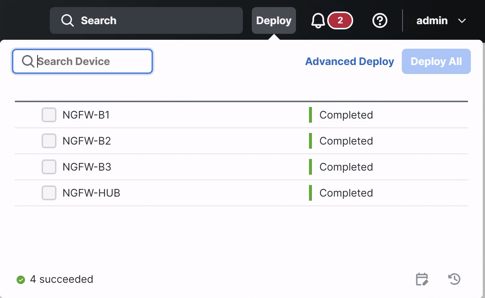{ loading=lazy }
</figure>

## Task 3: Configuring BGP Redistribution of OSPF Internal Routes at Spoke (NGFW-B3) to SD-WAN

### Step 1: Enable BGP on Spoke device

In this step, you will enable BGP on Spoke device (**NGFW-B3**) with
same autonomous number as mentioned in SD-WAN Topology.

1.  Edit the device **NGFW-B3** by navigating to **Devices \> Device
    Management \> Edit NGFW-B3**

<figure markdown style="max-width:16.4cm;">
  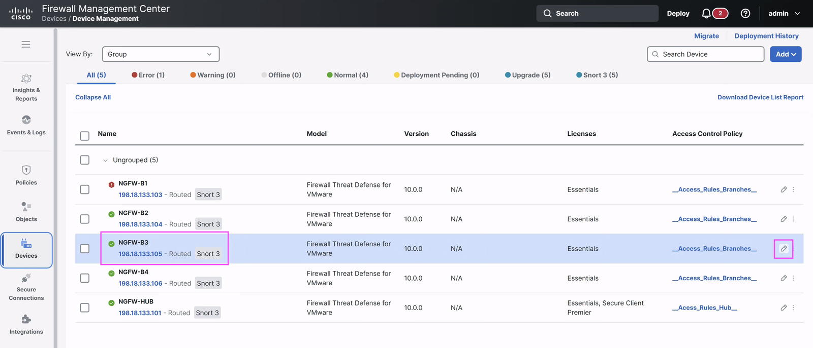{ loading=lazy }
</figure>

2.  Click on the **Routing** tab \> Click **BGP** button on the
    **General** **Settings**

    1.  **Enable BGP**: Enable the checkbox to enable BGP.

    2.  **Autonomous System Number:** Enter **64512** as BGP AS number,
        same as specified in SD-WAN Topology

<figure markdown style="max-width:16.4cm;">
  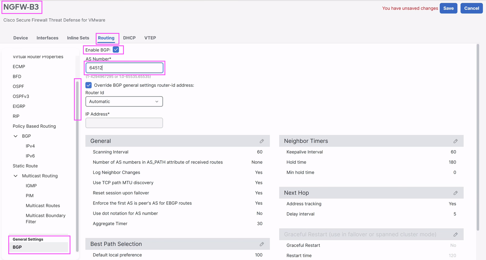{ loading=lazy }
</figure>

3.  Click on the **BGP IPv4** routing option

    1.  **Enable IPv4**, review the AS Number defaults to **64512**

<figure markdown style="max-width:16.5cm;">
  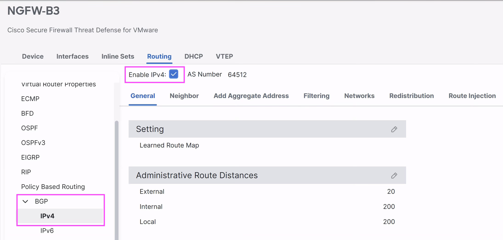{ loading=lazy }
</figure>

### Step 2: Configure redistribution of OSPF routes

In this step, you will enable redistribution of OSPF routes into BGP.
These routes will then be advertised to the SD-WAN peers.

1.  In **BGP IPv4** settings click on **Redistribution** tab and then
    **Add**

<figure markdown style="max-width:16.5cm;">
  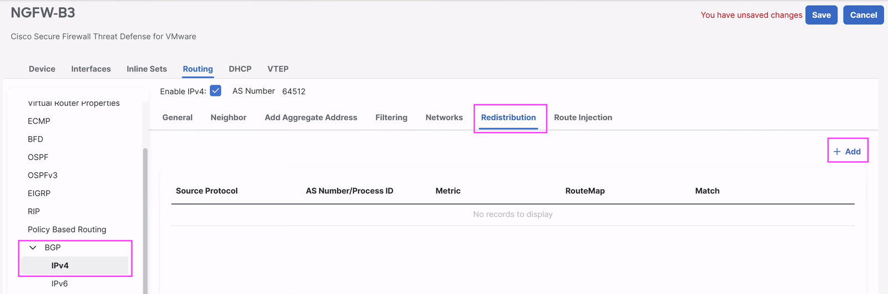{ loading=lazy }
</figure>

2.  This launches the **Add Redistribution** dialog with the following
    details.

    1.  **Source Protocol** – Click on drop down menu and select OSPF

    2.  **Process ID** – Choose ‘1’

    3.  **Route Map** – Click on drop down and select
        **Advertise-Branch-Protected-Networks  
        Note:** Route-map is configured to use object with overrides
        which allows same object to be used for different branch FTDs
        using different values.

    4.  Click **OK** to save the settings

<figure markdown style="max-width:6.0cm;">
  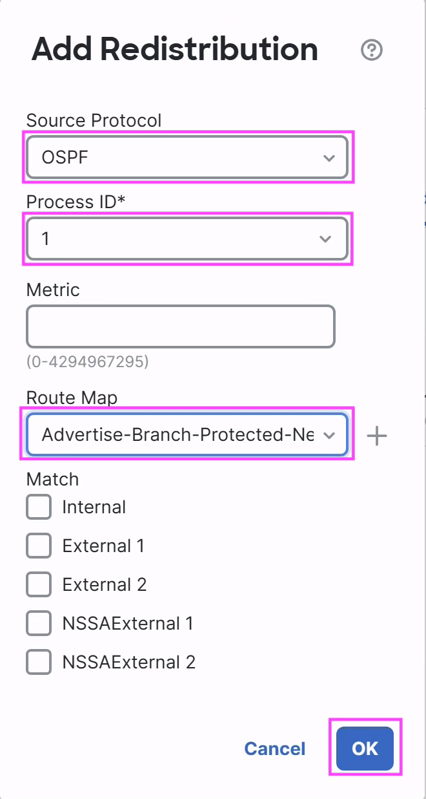{ loading=lazy }
</figure>

3.  Click **Save** on top right to complete the configuration.

<figure markdown style="max-width:16.5cm;">
  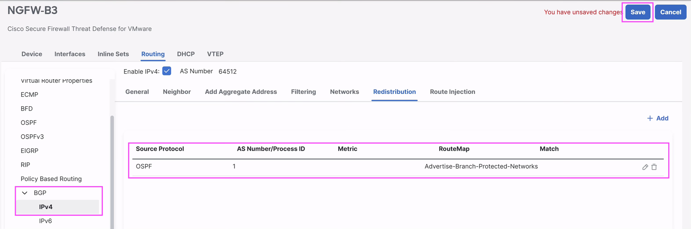{ loading=lazy }
</figure>

## Task 4: Deploy to Hub and Spoke Devices

In this step, you will review all the configuration changes done on
the Hub and Spoke devices and deploy the configuration to the devices.

1)  Click the Deploy button
    { .inline-icon .off-glb }
    on the top right on FMC.

2)  This brings up the list of devices that are Ready for Deployment.
    Select the { .inline-icon .off-glb }and
    click on **ignore warnings (if any)**
    { .inline-icon .off-glb } button to trigger the
    deployment.

3)  View the progress of the deployment on the devices and **wait till
    the deployment is marked Completed** on the Deploy dialog

<figure markdown style="max-width:10.2cm;">
  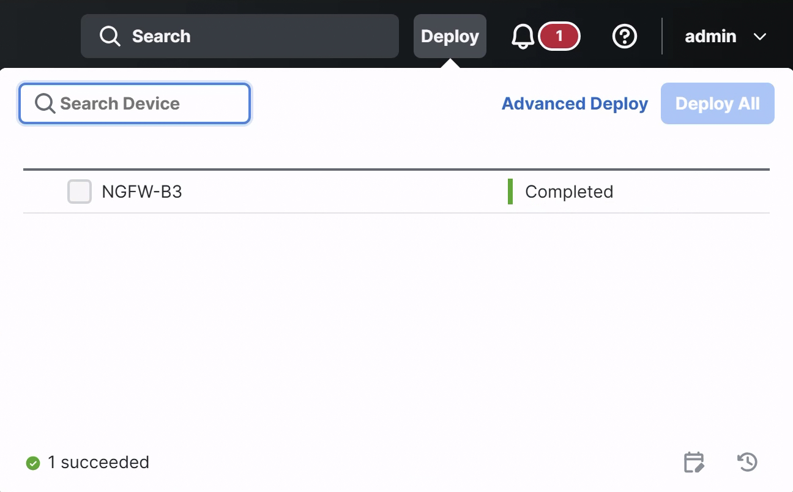{ loading=lazy }
</figure>

## Task 5: Verify the traffic flow over the VPN tunnel from Spoke to Hub

### Step 1: Verify Site-to-Site VPN Tunnels

In this step, you will verify the VTI tunnels between the spokes and
hub devices.

Go to **Insights & Reports -\> VPN dashboards -\> SD-WAN Summary** and
Check that the tunnels are up as shown below. You may use **Refresh**
to reload the tunnels status if tunnel has not come up yet. Wait for
few seconds for tunnel status to be updated fully.

<figure markdown style="max-width:16.5cm;">
  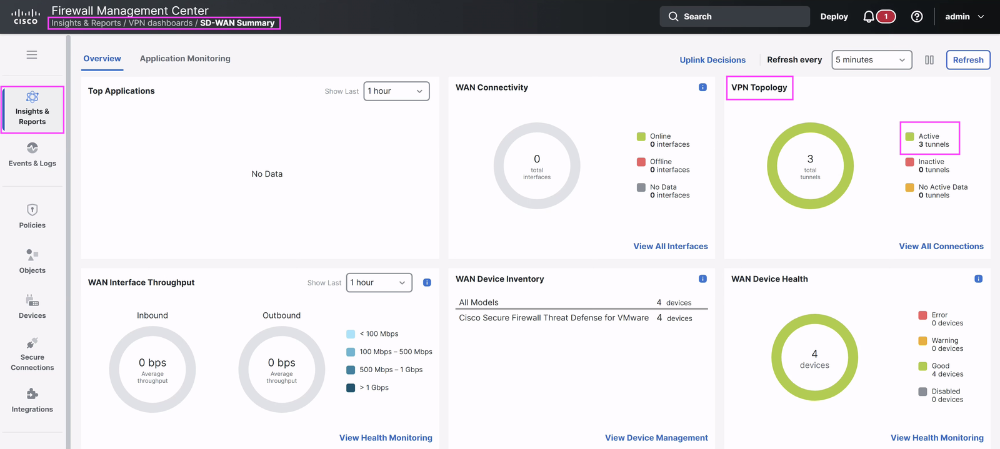{ loading=lazy }
</figure>

Go to **Insights & Reports -\> VPN dashboards -\> Site-to-Site VPN**
and Check that the tunnels are up as shown below.

<figure markdown style="max-width:16.5cm;">
  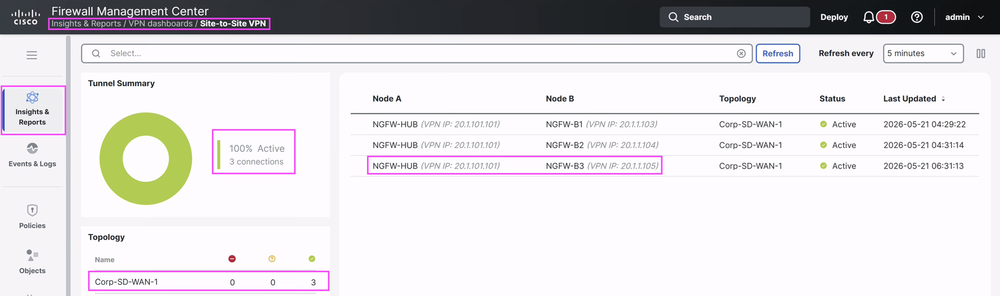{ loading=lazy }
</figure>

### Step 2: Verify Routes on Hub (NGFW-HUB)

In this step, you can verify the BGP and other routes at the Hub.

1.  Go to **Troubleshooting \> Tools \> Threat Defense CLI**

2.  This launches the **CLI Troubleshoot** dialog.

    1.  **Device** – **NGFW-HUB**

    2.  **Command** – show

    3.  **Parameter** – Type the argument **route bgp**

3.  Click **Execute** and review the routes, scroll down output if
    required

4.  Verify the new route from spoke is redistributed over BGP

<figure markdown style="max-width:12.0cm;">
  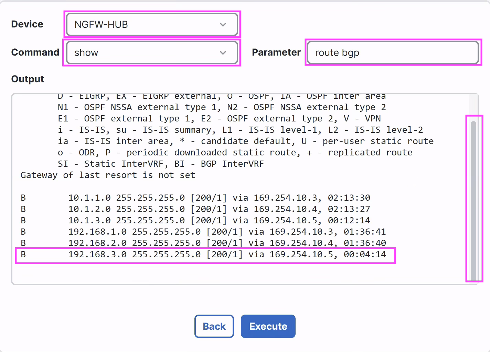{ loading=lazy }
</figure>

### Step 3: Verify traffic between protected networks behind spoke (NGFW-B3) and hub (NGFW-HUB)

Network behind spoke (**NGFW-B3**) – 192.168.3.0/24 with a host
**192.168.3.141** (**B3H**)

Network behind hub (**NGFW-HUB**) – 192.168.101.0/24 with a host
**192.168.101.131** (**H1**)

1.  **Connect to B3H:** Open **Cisco Secure Firewall Quick Launch** from
    Desktop and click **B3H** which is present under **Linux VM
    Access.** This opens **B3H’s** SSH session.

<figure markdown style="max-width:16.0cm;">
  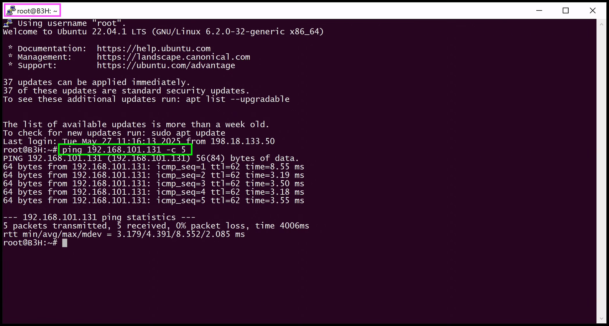{ loading=lazy }
</figure>

2.  **Verify Ping**

    1.  `ping 192.168.101.131 -c 5` which is the Host behind the
        Hub device NGFW-HUB and verify that you are getting the response

<figure markdown style="max-width:16.5cm;">
  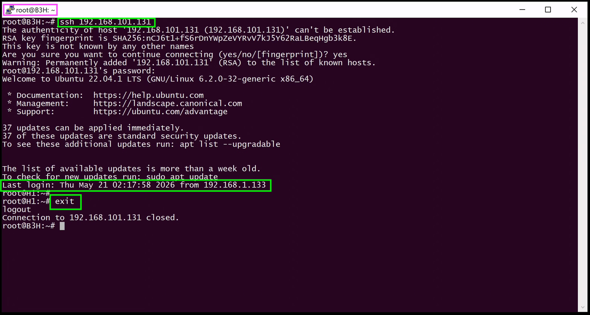{ loading=lazy }
</figure>

3.  **Verify SSH Connection**

    1.  **SSH** to **192.168.101.131** using password **C1sco12345** and
        verify SSH access works. After successful connection, you may
        **exit**.

<figure markdown style="max-width:16.5cm;">
  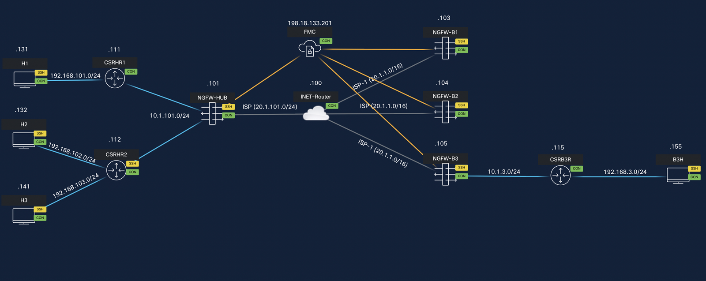{ loading=lazy }
</figure>

4.  You may **close all** opened the **PuTTY** sessions

You have successfully configured and verified the SD-WAN topology with
Branch expansion!!!

