# Scenario 4: Adding Secondary ISP to Branch (NGFW-B3)

In previous scenario, you configured spoke NGFW-B3 with single ISP
using SD-WAN topology. In this scenario, you will extend the
deployment by configuring NGFW-B3 with an additional ISP for link
redundancy.  
  
To configure SD-WAN with dual ISP on the spoke device, you need to
configure a new SD-WAN Topology for ISP2.

## Network Diagram

<figure markdown style="max-width:16.0cm;">
  { loading=lazy }
</figure>

## 4.1 Enable ISP2 at Spoke (NGFW-B3)

For this lab section, the ISP2 Link is intentionally kept
disabled/shut and needs to be enabled. This is to simulate the ISP2
link up in real-time for the lab.

### 4.1.1 Bring up ISP2

1.  Edit the device **NGFW-B3** by navigating to **Devices \> Device
    Management \> Edit NGFW-B3**

<figure markdown style="max-width:16.0cm;">
  { loading=lazy }
</figure>

2.  On the **Interfaces** tab Click the **Edit** for
    **GigabitEthernet0/1** interface which has logical name
    **outside_2**. This opens the Edit Physical Interface dialogue

<figure markdown style="max-width:16.0cm;">
  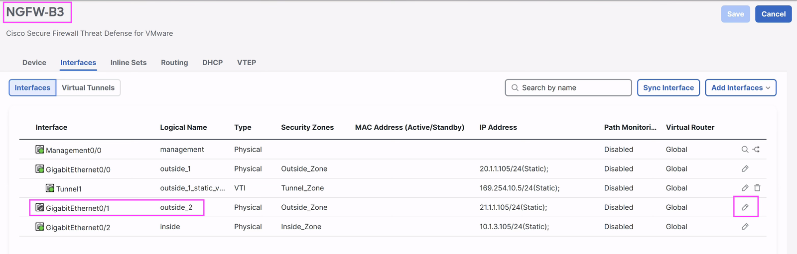{ loading=lazy }
</figure>

3.  Click on **Enabled** and click **OK**.

    <figure markdown style="max-width:12.0cm;">
      { loading=lazy }
    </figure>

4.  This brings us back to the **Interfaces** tab &mdash; click **Save**
    on the top right.

    <figure markdown style="max-width:16.0cm;">
      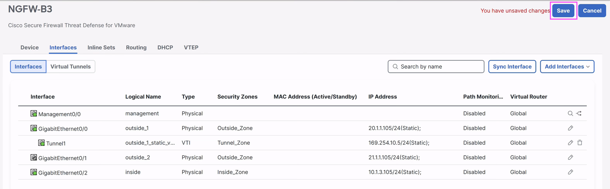{ loading=lazy }
    </figure>

## 4.2 Configuring SD-WAN Topology between Spoke with ISP2 and Headquarters (Hub) using DVTI on Hub

### 4.2.1 Create SD-WAN Topology

Go to **Secure Connections \> Site-to-Site VPN & SD-WAN** Click
**Add** button at top right

Enter the following details in the pop-up:

1.  **Topology Name**: name the VPN topology as **Corp-SD-WAN-2**.

2.  Ensure the following are selected:

    1.  **VPN Type**: SD-WAN Topology
    2.  **VPN Topology**: Hub and Spoke

3.  Click **Create**.

<figure markdown style="max-width:16.0cm;">
  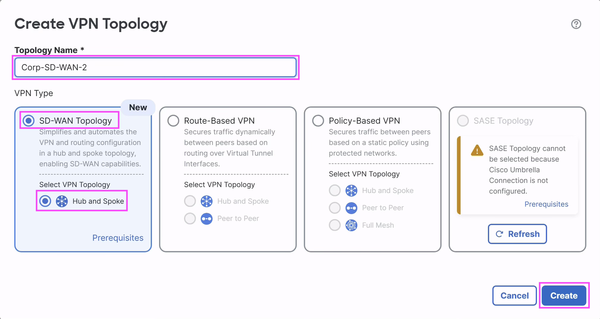{ loading=lazy }
</figure>

### 4.2.2 SD-WAN Topology – Hub Configuration

Once the SD-WAN Topology is created, SD-WAN Wizard page will open.
Click the **Add Hub** button in Hubs section to add the Hub device.

Enter the following details in the **Add Hub** dialog:

1.  **Device**: click the drop-down and select the Hub FTD &mdash;
    **NGFW-HUB**.

    <figure markdown style="max-width:10.0cm;">
      { loading=lazy }
    </figure>

2.  **Dynamic Virtual Tunnel Interface (DVTI)**: ==click the **+** icon
    adjacent to the drop-down== to create an inline DVTI. The **Add
    Virtual Tunnel Interface** dialog opens.

    !!! tip "Fields you actually configure"
        Most fields in this dialog are auto-populated. You only need to set:

        - **Security Zone** (item d) &mdash; choose `Tunnel_Zone`
        - **Tunnel Source IP Address** (item f) &mdash; set to `20.1.101.101`
        - **IP Address &rarr; Borrow IP** (item h) &mdash; create a Loopback

        The rest can be left at their defaults.

    1.  **Tunnel Type**: pre-selected to **Dynamic**, greyed out
        &mdash; *no change*.
    2.  **Name**: pre-filled as `outside_dynamic_vti_2` &mdash;
        *keep the default*.
    3.  **Enabled**: enabled by default &mdash; *leave as-is*.
    4.  **Security Zone**: select **Tunnel_Zone** from the drop-down.
    5.  **Template ID**: a unique ID, pre-filled with `2` &mdash;
        *no change*.
    6.  **Tunnel Source**: defaults to **outside**. If not, pick
        **outside** from the drop-down. Set the **Tunnel Source IP
        Address** to `20.1.101.101`.

    <figure markdown style="max-width:10.0cm;">
      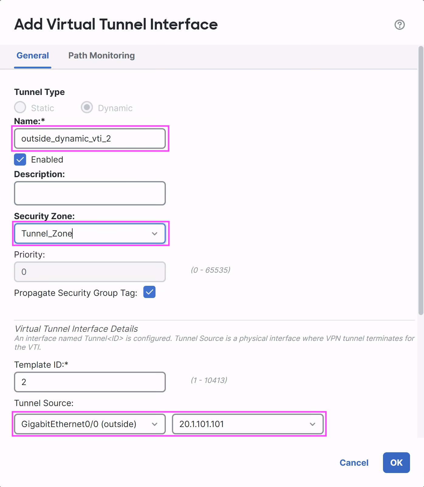{ loading=lazy }
    </figure>

    !!! info "Scroll down"
        Scroll down in the **Add Virtual Tunnel Interface** dialog to
        see the remaining fields below.

    7.  **IPsec Tunnel Mode**: defaults to **IPv4** &mdash;
        *leave as-is*.
    8.  **IP Address**: DVTI is a template interface and can't have a
        static IP &mdash; it must **Borrow IP (IP unnumbered)** from
        another interface (Cisco recommends a **Loopback**). ==Click
        the **+** icon next to the **Select Interface** drop-down== to
        create one &mdash; the **Add Loopback Interface** dialog opens:

        <figure markdown style="max-width:10.0cm;">
          { loading=lazy }
        </figure>

        1.  In the **General** tab:

            1.  **Name**: `Hub_Tunnel_IP_2`
            2.  **Loopback ID**: `2`

            <figure markdown style="max-width:10.0cm;">
              { loading=lazy }
            </figure>

        2.  In the **IPv4** tab:

            1.  **IP Type**: Use Static IP
            2.  **IP Address**: `169.254.20.1/32`

            <figure markdown style="max-width:10.0cm;">
              { loading=lazy }
            </figure>

        3.  Click **OK** to save the loopback.

    9.  Back on the **Add Virtual Tunnel Interface** dialog, confirm
        **Borrow IP (IP unnumbered)** is now set to
        **Loopback2 (Hub_Tunnel_IP_2)**. Click **OK** to save the DVTI.
        You will see a dialog confirming **Virtual Tunnel Interface
        Added** successfully &mdash; click **OK**.

        <figure markdown style="max-width:10.0cm;">
          { loading=lazy }
        </figure>

3.  Back in the **Add Hub** dialog, confirm the DVTI is automatically
    populated. Otherwise, select **outside_dynamic_vti_2** from the
    **Dynamic Virtual Tunnel Interface (DVTI)** drop-down.

4.  **Hub Gateway IP Address**: shows the Tunnel Source IP &mdash; do
    not change.

5.  **Spoke Tunnel IP Address Pool**: FMC auto-generates the static
    VTI interfaces on the spoke devices. This pool defines the IP
    range FMC draws from when assigning addresses to those sVTI
    interfaces. ==Click the **+** icon next to the field== to create
    a new pool &mdash; the **New IPv4 Pool** dialog opens.

    <figure markdown style="max-width:10.0cm;">
      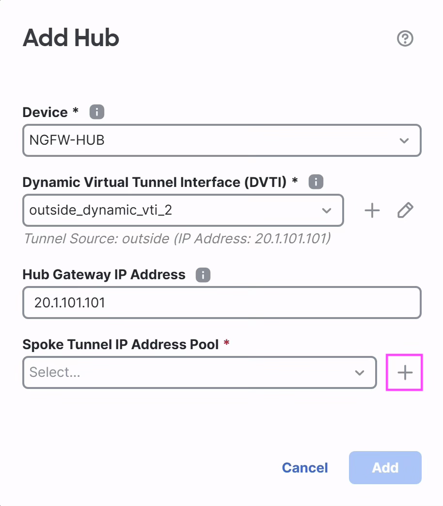{ loading=lazy }
    </figure>

    Fill it in:

    1.  **Name**: `NGFW_Hub_IPv4_Pool_2`
    2.  **IPv4 Address Range**: `169.254.20.3-169.254.20.100`. FMC
        assigns IPs from this range to the static VTI interfaces on
        the spoke devices.
    3.  **Mask**: `255.255.255.0`
    4.  **Allow Override**: leave disabled (default).
    5.  Click **Save** to create the pool.

    <figure markdown style="max-width:10.0cm;">
      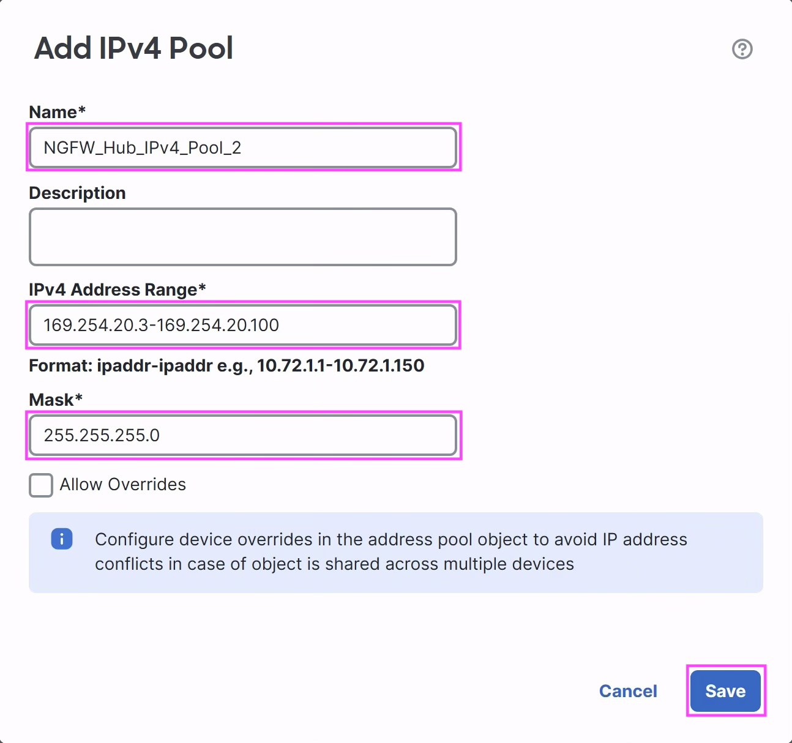{ loading=lazy }
    </figure>

6.  Back in the **Add Hub** dialog, set **Spoke Tunnel IP Address
    Pool** to the pool you just created &mdash; **NGFW_Hub_IPv4_Pool_2**
    (use the drop-down if it isn't auto-populated). All Hub inputs are
    now filled in &mdash; click **Add** on the **Add Hub** dialog to
    save and add the Hub to the SD-WAN topology.

    <figure markdown style="max-width:10.0cm;">
      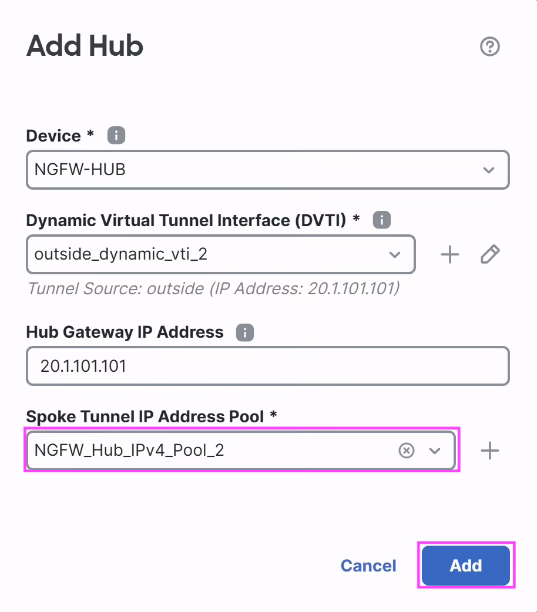{ loading=lazy }
    </figure>

7.  The row for **NGFW-HUB** appears in the **Hubs** section of the
    **SD-WAN Topology Wizard**. Click **Next** to proceed.

    <figure markdown style="max-width:16.0cm;">
      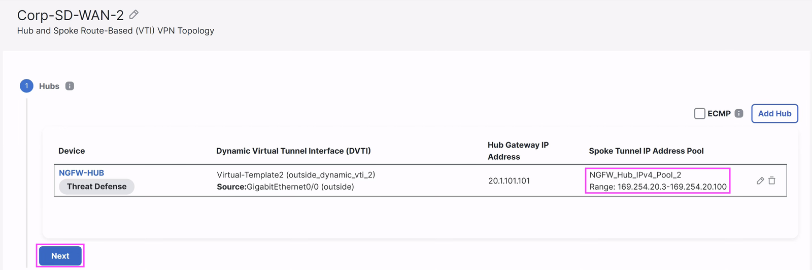{ loading=lazy }
    </figure>

### 4.2.3 SD-WAN Topology – Add Spoke Configuration

**Add Spoke Dialog** assists you to add one Spoke Device with simple
steps.

Click on **Add Spoke** button in the spokes step.

<figure markdown style="max-width:16.0cm;">
  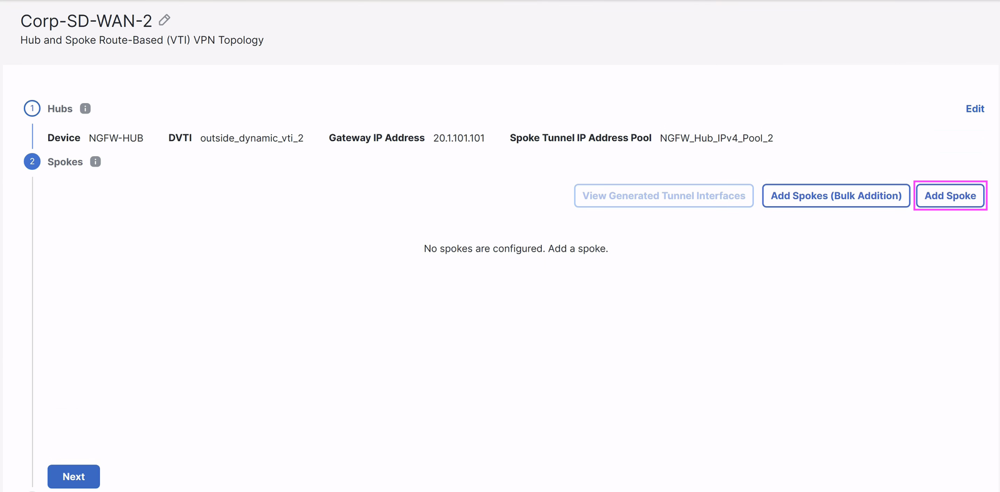{ loading=lazy }
</figure>

Enter the following details in the **Add Spoke** dialog box:

1.  **Devices**: Select **NGFW-B3** from the **Available Devices**.

2.  **VPN Interface:** Select **outside_2** from the list of available
    interfaces.

    !!! warning "Pick the right VPN interface"
        Make sure ==**outside_2**== is selected &mdash; not `outside`
        or `outside_1`. This second topology must be built on
        **outside_2** (ISP2) to enable dual-ISP load sharing on
        **NGFW-B3**.

3.  **Identity Type:** Nothing to change &mdash; keep the default values.

4.  **Save:** Click on **Save** to add the Spoke into SD-WAN Topology.

    <figure markdown style="max-width:8.0cm;">
      { loading=lazy }
    </figure>

5.  Click on **Next** button to proceed.

    <figure markdown style="max-width:16.0cm;">
      { loading=lazy }
    </figure>

### 4.2.4 SD-WAN Topology: Authentication Settings

In this step, you will configure pre-shared key authentication with
manual key. Leave the Transform Sets and IKEv2 Policies as per default
selection.

1.  Click on **Authentication Type** and select **Pre-shared Manual
    Key**

2.  Enter **cisco123** in **Key** Text Box

3.  Enter **cisco123** in **Confirm** **Key** Text Box

4.  Click on **Next** button to save the settings

<figure markdown style="max-width:16.0cm;">
  { loading=lazy }
</figure>

### 4.2.5 SD-WAN Topology – Add Tunnel Interfaces to Security Zone

Click on the **Spoke Tunnel Interface Security Zone** drop-down and
select **Tunnel_Zone**.

<figure markdown style="max-width:16.0cm;">
  { loading=lazy }
</figure>

### 4.2.6 SD-WAN Topology – Configure BGP routing

Enter the following in **SD-WAN Settings**

1.  **Enable BGP on the VPN Overlay Topology**: Enable the checkbox to
    enable BGP for the overlay network.

2.  **Autonomous System Number:** Enter **64512** as BGP AS number in
    **Autonomous System Number** field.

3.  **Community Tag for Local Routes:** Enter **9901** in as **Community
    Tag** which will be used to tag connected and redistributed local
    routes.

4.  **Redistribute Connected Interfaces:** Enable the checkbox to
    redistribute the connected inside / LAN interfaces over the
    BGP overlay. Leave the default value **Default Inside** in the
    drop-down.

5.  **Enable Multiple Paths for BGP**: Enable multipath load sharing
    using BGP routes. This checkbox is **enabled** by default. Leave the
    default option.

6.  **Next**: Click on **Next** button to save the changes in SD-WAN
    Settings.

<figure markdown style="max-width:16.0cm;">
  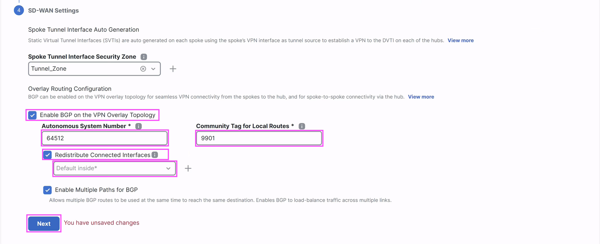{ loading=lazy }
</figure>

### 4.2.7 SD-WAN Topology - Finish

Now, we are done with all the configuration in the SD-WAN Topology.
**Scroll down** and click the **Finish** button to save the topology.
Click **OK** for the pop-up dialog *"Click Finish to save your
changes."*

<figure markdown style="max-width:16.0cm;">
  { loading=lazy }
</figure>

1.  Once configured, the **Site-to-Site** VPN listing page shows the
    new SD-WAN topology on the same page i.e. **Secure Connections \>
    Site-to-Site VPN & SD-WAN**.

    <figure markdown style="max-width:16.0cm;">
      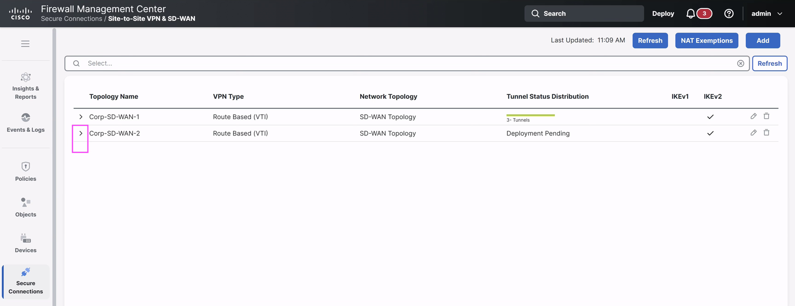{ loading=lazy }
    </figure>

2.  Expand the **Corp-SD-WAN-2** node to view the tunnel in the
    topology. Since the configuration has not been deployed, it shows
    **Deployment Pending** and the spoke tunnel shows in amber colour.

    <figure markdown style="max-width:16.0cm;">
      { loading=lazy }
    </figure>

## 4.3 Configure ECMP over the primary and secondary VTI interfaces

In this step, you will configure ECMP on the primary and secondary
Static VTI interfaces on the Branch for redundancy and load balancing
VPN traffic.

### 4.3.1 Configure ECMP Zone on Spoke NGFW-B3

1.  Navigate to **Devices \> Device Management \> Edit NGFW-B3**, click
    the **Routing** tab, then click **ECMP** on the left Table of
    Contents view.

    <figure markdown style="max-width:16.0cm;">
      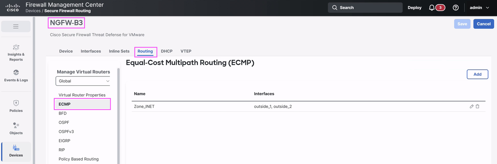{ loading=lazy }
    </figure>

2.  Click the **Add** button on the top to launch the **Add ECMP**
    window.

3.  Enter the **Name** field as **`Zone_VTI`**.

4.  Select **outside_1_static_vti_1** and **outside_2_static_vti_2**
    from **Available Interfaces** and click the **Add** button in the
    middle to move them to the selected interfaces.

5.  Click **OK** to save the ECMP zone.

    <figure markdown style="max-width:12.0cm;">
      { loading=lazy }
    </figure>

6.  View the **ZONE_INET** and **ZONE_VTI** zones listed on the ECMP
    page. Click the top **Save** button to save the changes.

    <figure markdown style="max-width:16.0cm;">
      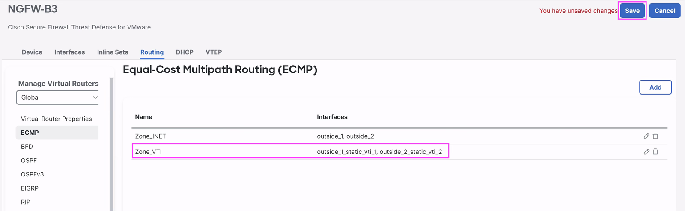{ loading=lazy }
    </figure>

## 4.4 Deploy to Hub and Spoke Devices

In this step, you will review all the configuration changes done on
the Hub and Spoke devices and deploy the configuration to the devices.

1)  Click the Deploy button
    { .inline-icon .off-glb }
    on the top right on FMC.

2)  This brings up the list of devices that are Ready for Deployment.
    Select the **Deploy All**
    { .inline-icon .off-glb } checkbox and
    click on **ignore warnings (if any)**
    { .inline-icon .off-glb } button to trigger the
    deployment.

3)  View the progress of the deployment on the devices and **wait till
    the deployment is marked Completed** on the Deploy dialog

<figure markdown style="max-width:10.0cm;">
  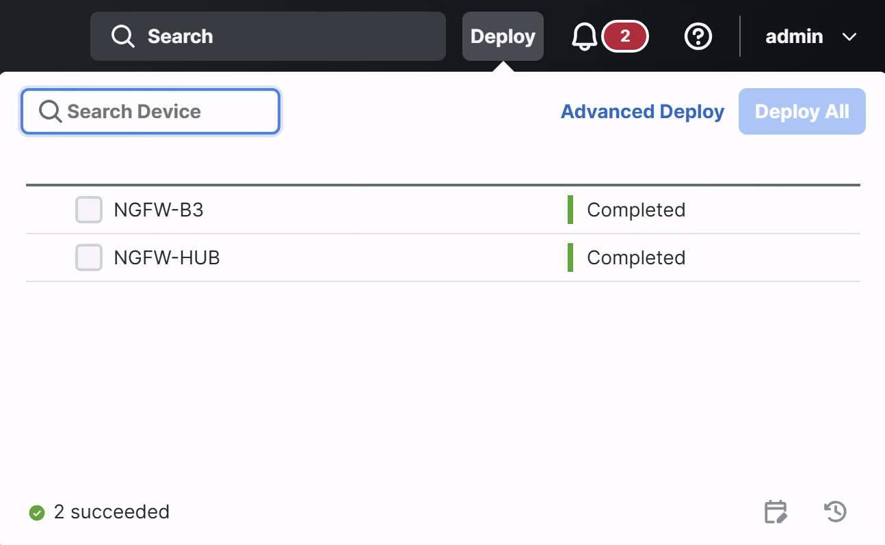{ loading=lazy }
</figure>

## 4.5 Verify the traffic distribution across dual ISP links

### 4.5.1 Verify Site-to-Site VPN Tunnels

Go to **Insights & Reports -\> VPN dashboards -\> Site-to-Site VPN**
and check that the tunnels are up in the Site-to-Site Monitoring
Dashboard as shown.

!!! info "Tunnel-up may take a few seconds"
    Use ==**Refresh**== to reload the tunnel status if a tunnel has
    not come up yet. The second SD-WAN topology over **ISP2** can
    take a few extra seconds to converge &mdash; click ==**Refresh**==
    a few times until both spoke tunnels show as **UP**.

<figure markdown style="max-width:16.0cm;">
  { loading=lazy }
</figure>

### 4.5.2 Verify traffic between protected networks behind spoke (NGFW-B3) and hub (NGFW-HUB)

Verify the traffic distribution across dual ISP by sending traffic
from hosts behind the NGFW-B3 to hosts behind the NGFW-HUB.

Network behind spoke (**NGFW-B3**) &mdash; 192.168.3.0/24 with a host
**192.168.3.155** (**B3H**).

Network behind Hub (**NGFW-HUB**) &mdash; 192.168.101.0/24 with a host
**192.168.101.131** (**H1**).

1.  **Set up Unified Events**

    This task leverages the Unified Events Viewer (UEV) to validate
    connectivity. Launch the UEV on FMC in a new tab and navigate to
    **Events & Logs \> Analysis \> Unified Events**.

    1.  Add specific columns to the default columns by clicking the
        small
        { .inline-icon .off-glb }
        icon at the top right of the **Events** table.

        The Columns are arranged in alphabetical order. By scrolling,
        select **Decrypt Peer**, **Egress Interface**, **Encrypt
        Peer**, **Ingress Interface** and **VPN Action**.

        !!! tip
            You can also use the **Filter columns** field at the top
            of the column picker to search for these and select them.
            After all selections are made, click **Apply**.

        <figure markdown style="max-width:16.0cm;">
          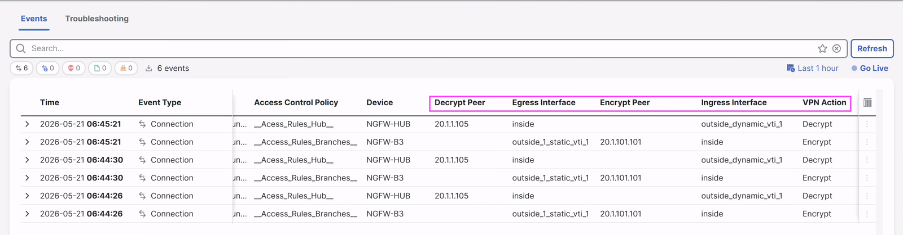{ loading=lazy }
        </figure>

    2.  Adjust the view by using the horizontal scroll to the end so
        the new columns appear along with **Access Control Policy**
        and **Device**. If required, adjust the column widths by
        dragging the separation line on each column header.

        <figure markdown style="max-width:16.0cm;">
          { loading=lazy }
        </figure>

    3.  Click **Go Live** to enter Live View.

        <figure markdown style="max-width:16.0cm;">
          { loading=lazy }
        </figure>

2.  **Connect to B3H:** Open **Cisco Secure Firewall Quick Launch**
    and click **B3H** under **Linux VM Access**.

    !!! tip "Window layout"
        Minimize the **Quick Launch** window and keep the FMC UI in
        the background while keeping the **B3H** SSH window in the
        foreground &mdash; that way you can ping from **B3H** and
        watch events appear in FMC in real time.

3.  **Send periodic pings to 192.168.101.131**

    1.  `ping 192.168.101.131 -c 3` to generate 3 pings from the host
        behind **NGFW-B3** to the host behind **NGFW-HUB**.
    2.  Run the **ping command 3 to 5 times** until you see more
        connection events popping up.

    <figure markdown style="max-width:16.0cm;">
      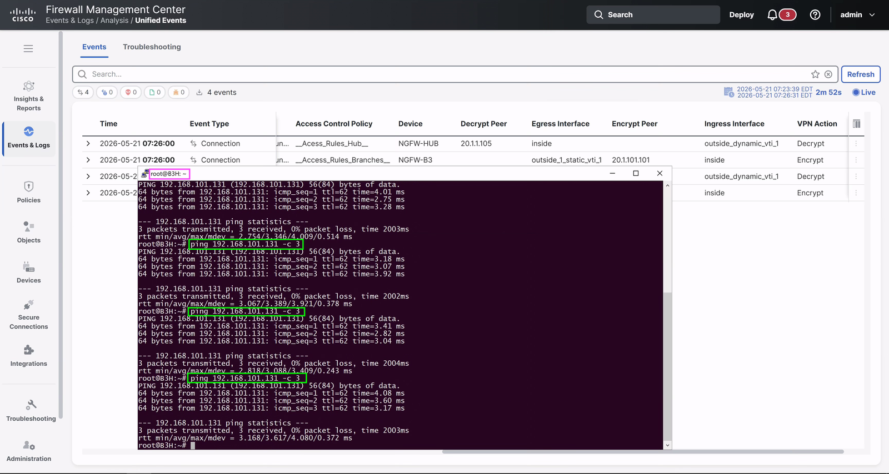{ loading=lazy }
    </figure>

4.  Navigate to FMC to view the events.

    <figure markdown style="max-width:16.0cm;">
      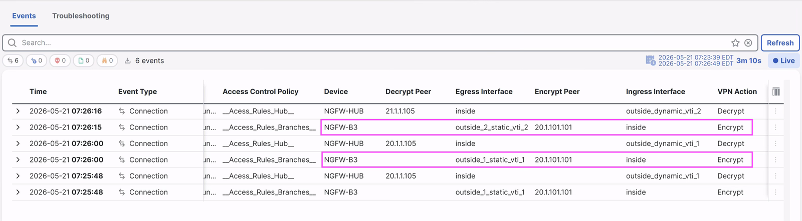{ loading=lazy }
    </figure>

    Observe the following:

    - Events with **VPN Action** = *Encrypt* are sourced from device
      **NGFW-B3**, with the egress interface load-balanced between the
      tunnel interfaces.
    - Some connections leave via **outside_1_static_vti_1** (over ISP1:
      **outside_1**); others via **outside_2_static_vti_2** (over
      ISP2: **outside_2**).
    - If you don't see events on *both* tunnel interfaces, run the
      `ping` command a few more times until events appear from both.

    Click **Live** to leave the Live View, then close all open
    **PuTTY** sessions.

!!! success "Scenario 4 complete"
    You have successfully **verified traffic load balancing between
    ISP1 & ISP2 on spoke NGFW-B3!**

