# Scenario 4: Adding Secondary ISP to Branch (NGFW-B3)

In previous scenario, you configured spoke NGFW-B3 with single ISP
using SD-WAN topology. In this scenario, you will extend the
deployment by configuring NGFW-B3 with an additional ISP for link
redundancy.  
  
To configure SD-WAN with dual ISP on the spoke device, you need to
configure a new SD-WAN Topology for ISP2.

## Network Diagram

<figure markdown style="max-width:16.0cm;">
  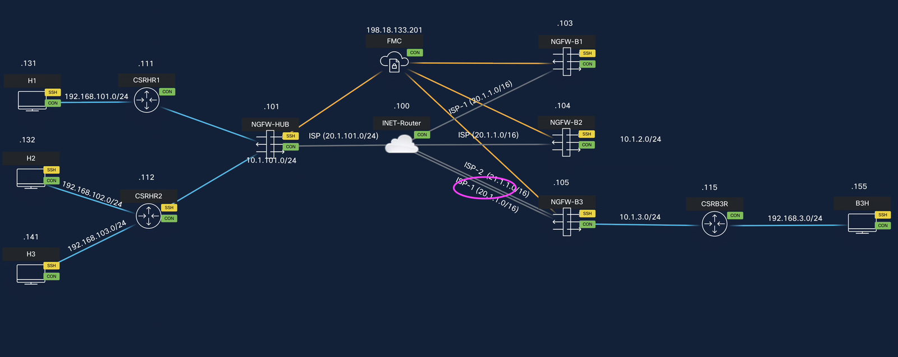{ loading=lazy }
</figure>

## Task 1: Enable ISP2 at Spoke (NGFW-B3)

For this lab section, the ISP2 Link is intentionally kept
disabled/shut and needs to be enabled. This is to simulate the ISP2
link up in real-time for the lab.

### Step 1: Bring up ISP2

1.  Edit the device **NGFW-B3** by navigating to **Devices \> Device
    Management \> Edit NGFW-B3**

<figure markdown style="max-width:16.0cm;">
  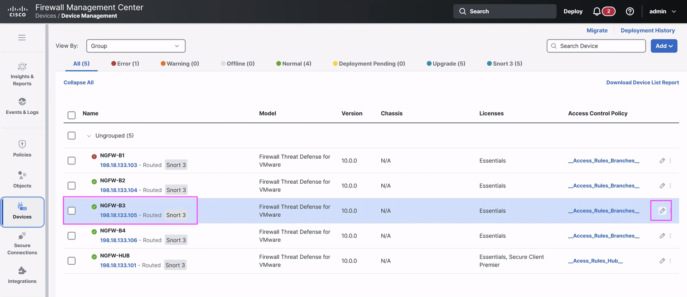{ loading=lazy }
</figure>

2.  On the **Interfaces** tab Click the **Edit** for
    **GigabitEthernet0/1** interface which has logical name
    **outside_2**. This opens the Edit Physical Interface dialogue

<figure markdown style="max-width:16.0cm;">
  { loading=lazy }
</figure>

3.  Click on **Enabled** and Click OK

<figure markdown style="max-width:12.0cm;">
  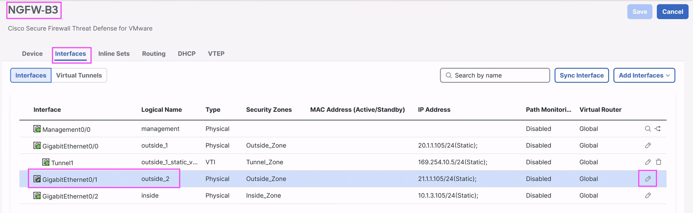{ loading=lazy }
</figure>

4.  This brings us back to Interfaces Tab, Click **Save** on top right.

<figure markdown style="max-width:12.0cm;">
  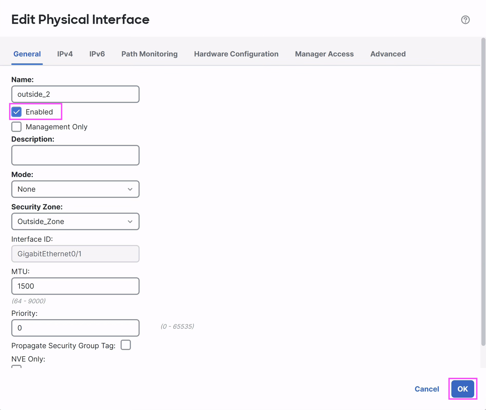{ loading=lazy }
</figure>

## Task 2: Configuring SD-WAN Topology between Spoke with ISP2 and Headquarters (Hub) using DVTI on Hub

### Step 1: Create SD-WAN Topology

Go to **Secure Connections \> Site-to-Site VPN & SD-WAN** Click
**Add** button at top right

Enter the following details in the pop-up:

1)  **Topology Name**: **Corp-SD-WAN-2**

2)  Ensure the following are selected

    1.  VPN Type**: SD-WAN Topology** 

    2.  VPN Topology: **Hub and Spoke**

3)  Click **Create**

<figure markdown style="max-width:16.0cm;">
  { loading=lazy }
</figure>

### Step 2: SD-WAN Topology – Hub Configuration

Once the SD-WAN Topology is created, SD-WAN Wizard page will open.
Click the **Add Hub** button in Hubs section to add the Hub device.

Enter the following details in the pop-up:

1)  **Device: **Select the Hub FTD from the dropdown **– NGFW-HUB**

2)  **Dynamic Virtual Tunnel Interface (DVTI):** Click on the **+**
    beside the Drop-down selector to create an inline Dynamic Virtual
    Tunnel interface. This launches the **Add Virtual Tunnel
    Interface** pop-up dialog with the following details.

    1.  **Tunnel Type** is pre-selected to **Dynamic** and greyed out.

    2.  **Name** of the tunnel is pre-filled as
        **outside_dynamic_vti_2** but can be changed. In this step, we
        will keep it as default.

    3.  **Enabled** field is to enable the DVTI. It is enabled by
        default.

    4.  **Security Zone** – Click on drop down menu and select
        **Tunnel_Zone** as security zone for this tunnel interface**.**

    5.  **Template ID –** Unique ID for DVTI interface already
        pre-filled with value ‘2’ for this step.

    6.  **Tunnel Source** – Physical interface that is the Source of the
        DVTI interface. It is prepopulated by default with **outside**.
        If not, Click on the drop-down and select the interface
        **outside**.

    7.  **Tunnel Source IP Address –** Select the IP Address
        **20.1.101.101** in the drop down

<figure markdown style="max-width:12.0cm;">
  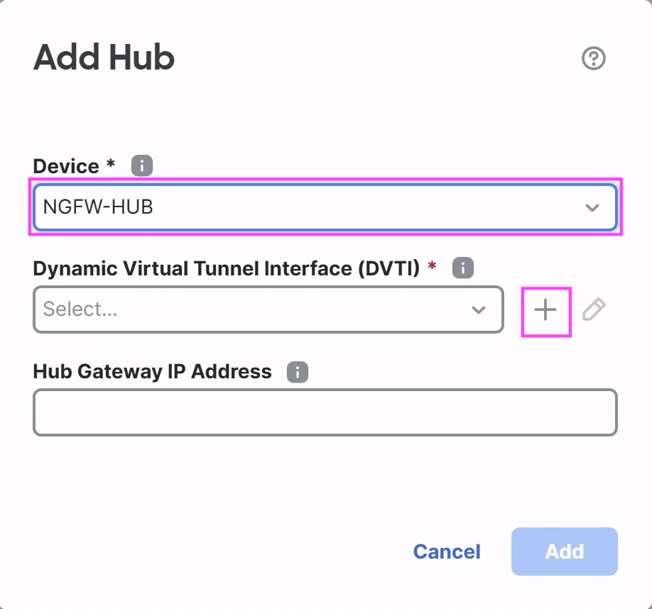{ loading=lazy }
</figure>

<figure markdown style="max-width:9.6cm;">
  { loading=lazy }
</figure>

8.  **IPsec Tunnel Mode** – It is set to IPv4 as default. Please do not
    change.

9.  **IP Address** – Click **+** beside the **Select Interface**
    drop-down to create a Loopback Interface. The **+** button launches
    **Add Loopback Interface** dialog.

    1.  In the **General** Tab, provide:

        1.  Name – Provide a name **Hub_Tunnel_IP_2**

        2.  **Loopback ID –** Select as **2**

    2.  In the **IPv4** tab, within **IP Address** tab, enter Loopback
        interface IP as **169.254.20.1/32**

10. Now, back on the Add Virtual Interface dialog, click drop-down on
    **Borrow IP (IP unnumbered)** field and select the
    **Loopback2(Hub_Tunnel_IP_2)** that you just created.

11. Click OK below the above section on the **Add Virtual Tunnel
    Interface** dialog to save the DVTI. You will see a dialog
    confirming **Virtual Tunnel Interface Added** successfully. Click
    **OK.**

<figure markdown style="max-width:9.6cm;">
  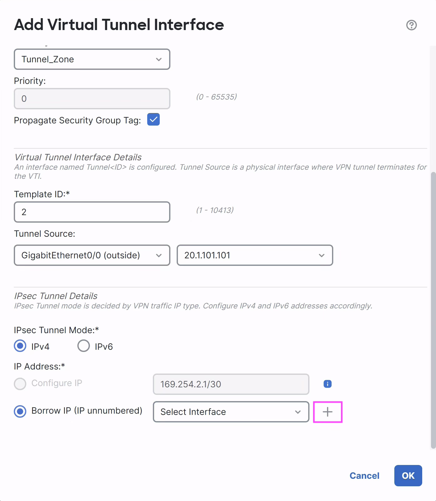{ loading=lazy }
</figure>

<figure markdown style="max-width:10.7cm;">
  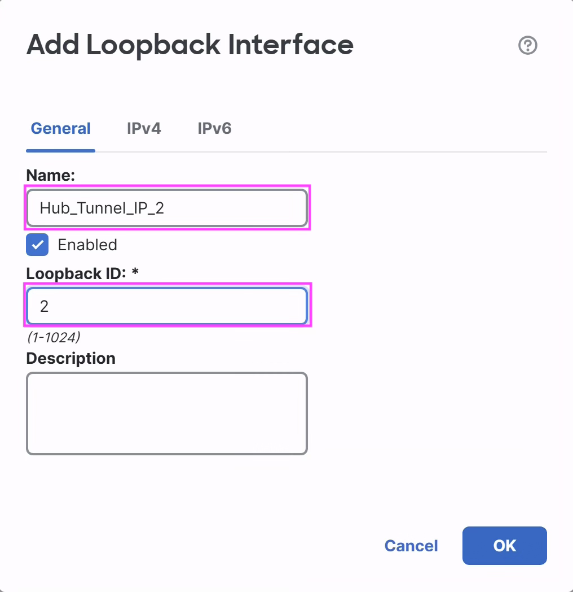{ loading=lazy }
</figure>

<figure markdown style="max-width:12.0cm;">
  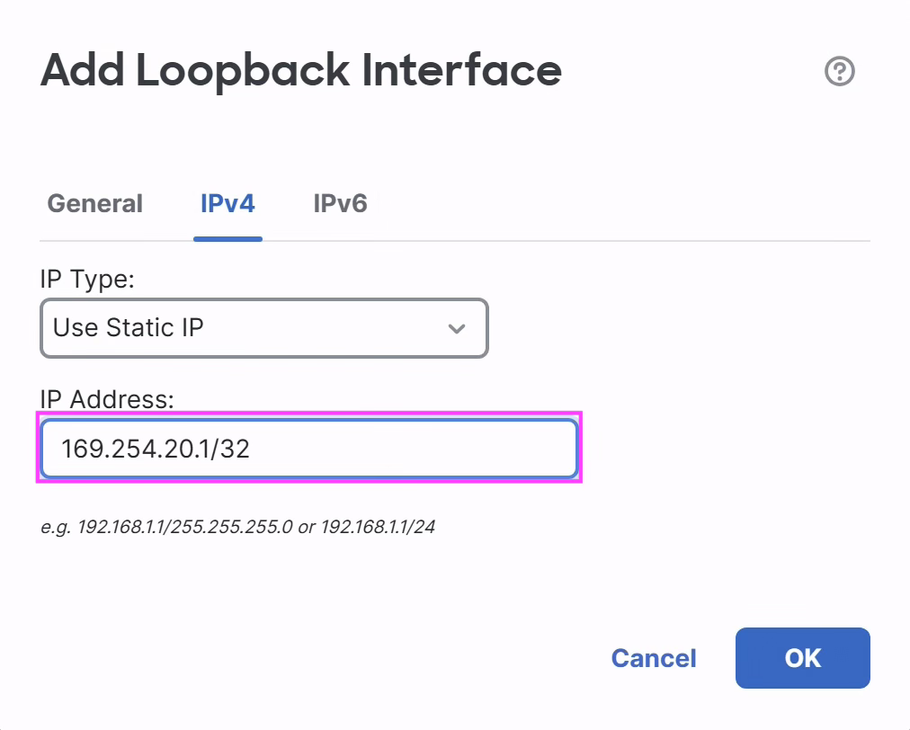{ loading=lazy }
</figure>

<figure markdown style="max-width:8.1cm;">
  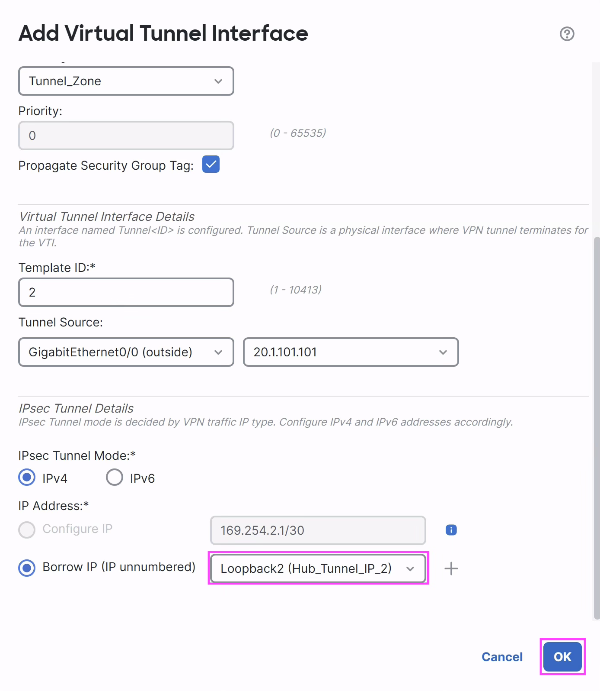{ loading=lazy }
</figure>

3)  Now you are back to the **Add Hub** dialog. The required value will
    be auto-populated but if not, select the dropdown in the **Dynamic
    Virtual Tunnel Interface (DVTI)** field to select the generated
    DVTI – **outside_dynamic_vti_2**

4)  **Hub Gateway IP Address:** This field will show the Tunnel Source
    IP. Please do not change it.

5)  **Spoke Tunnel IP Address Pool:**

    1.  **Click** **+** icon next to **Spoke Tunnel IP Address Pool** to
        add a new IPv4 Address Pool

    2.  Enter the following details in the IPv4 Address Pool Add Dialog

        1.  **Name:** Enter **NGFW_Hub_IPv4_Pool_2** as the name of the
            IPv4 Pool Object

        2.  **IPv4 Address Range:** Enter the IP range
            **169.254.20.3-169.254.20.100**. FMC will assign IP
            addresses from this range to the static VTI interfaces on
            the spoke devices.

        3.  **Mask:** Enter **255.255.255.0** as subnet mask

        4.  **Allow Override:** By default, allow override is disabled.
            Please keep it unchecked.

        5.  Click on **Save**

6)  Now you are back to the **Add Hub** dialog. Click on the dropdown in
    the **Spoke Tunnel IP Address Pool** field to select the IPv4
    Address Pool Object **NGFW_Hub_IPv4_Pool_2**

<figure markdown style="max-width:11.9cm;">
  { loading=lazy }
</figure>

<figure markdown style="max-width:10.8cm;">
  { loading=lazy }
</figure>

<figure markdown style="max-width:10.8cm;">
  { loading=lazy }
</figure>

7)  You have successfully added all inputs for the Hub. Click on **Add**
    button on the **Add Hub** dialog to save the Hub and add to the
    SD-WAN topology. You can see the row for **NGFW-HUB** Hub now in
    **Hubs** section of the **SD-WAN Topology Wizard**. Click **Next**
    to proceed.

<figure markdown style="max-width:16.0cm;">
  { loading=lazy }
</figure>

### Step 3: SD-WAN Topology – Add Spoke Configuration

**Add Spoke Dialog** assists you to add one Spoke Device with simple
steps.

Click on **Add Spoke** button in spokes step.

<figure markdown style="max-width:16.0cm;">
  { loading=lazy }
</figure>

Enter the following details in the **Add Spoke** dialog box:

1)  **Devices**: Select **NGFW-B3** from the **Available Devices**.

2)  **VPN Interface:** Select **outside_2** from the list of available
    interfaces.

3)  **Identity Type:** Nothing to change and Keep the default values.

4)  **Save:** Click on Save to add the Spoke into SD-WAN Topology

5)  Click on **Next** button to proceed

<figure markdown style="max-width:8.9cm;">
  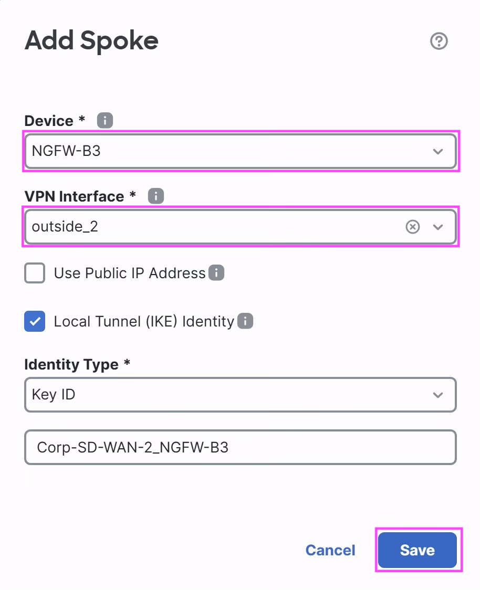{ loading=lazy }
</figure>

<figure markdown style="max-width:16.0cm;">
  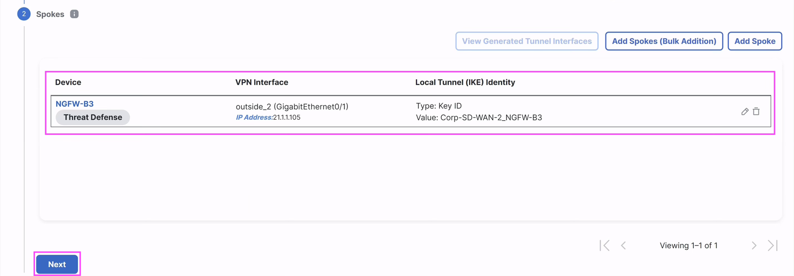{ loading=lazy }
</figure>

### Step 4: SD-WAN Topology: Authentication Settings

In this step, you will configure pre-shared key authentication with
manual key. Leave the Transform Sets and IKEv2 Policies as per default
selection.

1.  Click on **Authentication Type** and select **Pre-shared Manual
    Key**

2.  Enter **cisco123** in **Key** Text Box

3.  Enter **cisco123** in **Confirm** **Key** Text Box

4.  Click on **Next** button to save the settings

<figure markdown style="max-width:16.0cm;">
  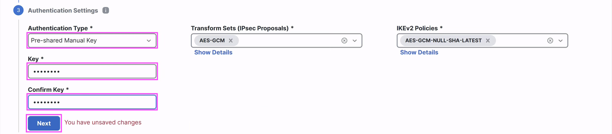{ loading=lazy }
</figure>

### Step 5: SD-WAN Topology – Add Tunnel Interfaces to Security Zone

Click on the **Spoke Tunnel Interface Security Zone** drop-down and
select **Tunnel_Zone**.

<figure markdown style="max-width:16.0cm;">
  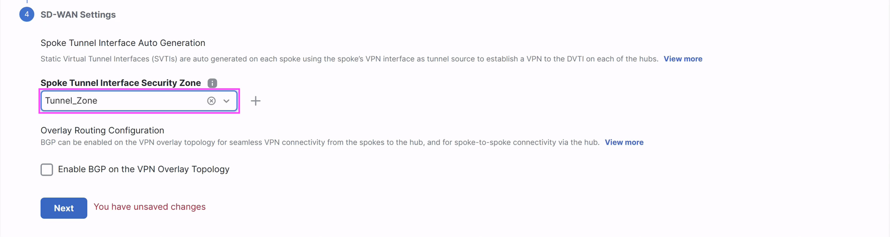{ loading=lazy }
</figure>

### Step 6: SD-WAN Topology – Configure BGP routing

Enter the following in **SD-WAN Settings**

1.  **Enable BGP on the VPN Overlay Topology**: Enable the checkbox to
    enable BGP for the overlay network.

2.  **Autonomous System Number:** Enter **64512** as BGP AS number in
    **Autonomous System Number** field.

3.  **Community Tag for Local Routes:** Enter **9901** in as **Community
    Tag** which will be used to tag connected and redistributed local
    routes.

4.  **Redistribute Connected Interfaces**: Connected inside or LAN
    interfaces for redistribution of BGP on the overlay topology

    1.  Enable **Redistribute Connected Interfaces** checkbox

    2.  Leave the default value **Default Inside** in the drop-down

5.  **Enable Multiple Paths for BGP**: Enable multipath load sharing
    using BGP routes. This checkbox is **enabled** by default. Leave the
    default option.

6.  **Next**: Click on **Next** button to save the changes in SD-WAN
    Settings.

<figure markdown style="max-width:16.0cm;">
  { loading=lazy }
</figure>

### Step 7: SD-WAN Topology - Finish

Now, we are done with all the configuration in the SD-WAN Topology.
Click on **Finish** button to save the topology. Click **OK** for the
pop-up dialog “**Click Finish to save your changes.**”

<figure markdown style="max-width:16.0cm;">
  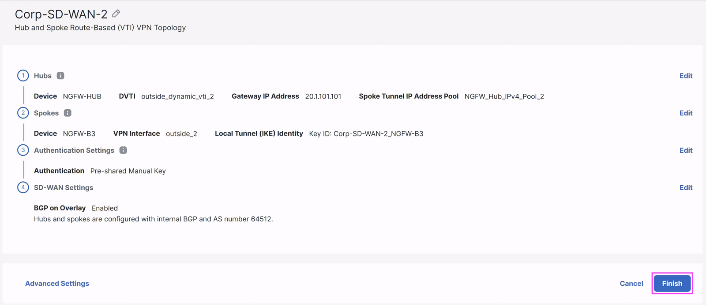{ loading=lazy }
</figure>

1.  Once configured, **Site-to-Site** VPN listing page shows the new
    SD-WAN topology on the same page i.e. on **Secure Connections \>
    Site-to-Site VPN & SD-WAN.**

<figure markdown style="max-width:16.0cm;">
  { loading=lazy }
</figure>

2.  Expand the **Corp-SD-WAN-2** node to view the tunnel in the
    topology. Since the configuration has not been deployed, it shows
    **Deployment Pending** and the spoke tunnel shows in Amber color.

<figure markdown style="max-width:16.0cm;">
  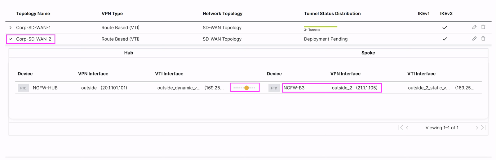{ loading=lazy }
</figure>

## Task 3: Configure ECMP over the primary and secondary VTI interfaces

In this step, you will configure ECMP on the primary and secondary
Static VTI interfaces on the Branch for redundancy and load balancing
VPN traffic.

### Step 1: Configure ECMP Zone on Spoke NGFW-B3

1)  Navigate to **Devices \> Device Management** \> Edit **NGFW-B3** \>
    Click on the **Routing** tab -\> Click on **ECMP** on the left Table
    of Contents view.

<figure markdown style="max-width:16.0cm;">
  { loading=lazy }
</figure>

2)  Click on the **Add** button on the top to launch the **Add ECMP**
    window.

3)  Enter **Name** field as ***Zone_VTI***

4)  Select ***outside_1_static_vti_1*** and ***outside_2_static_vti_2***
    from the **Available Interfaces** and click on the **Add** button in
    the middle to Select the interfaces.

5)  Click **OK** to save the ECMP zone.

<figure markdown style="max-width:12.0cm;">
  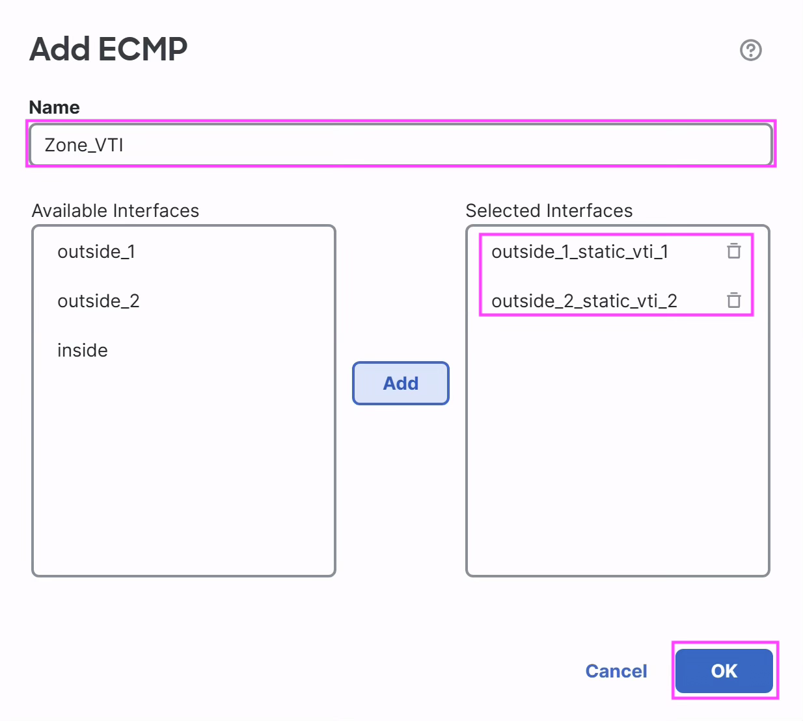{ loading=lazy }
</figure>

6)  View the ZONE_INET and ZONE_VTI zone listed on the ECMP page. Click
    on the top **Save** to save the changes.

<figure markdown style="max-width:16.0cm;">
  { loading=lazy }
</figure>

## Task 4: Deploy to Hub and Spoke Devices

In this step, you will review all the configuration changes done on
the Hub and Spoke devices and deploy the configuration to the devices.

1)  Click the Deploy button
    { .inline-icon .off-glb }
    on the top right on FMC.

2)  This brings up the list of devices that are Ready for Deployment.
    Select the { .inline-icon .off-glb }and
    click on **ignore warnings (if any)**
    { .inline-icon .off-glb } button to trigger the
    deployment.

3)  View the progress of the deployment on the devices and **wait till
    the deployment is marked Completed** on the Deploy dialog

<figure markdown style="max-width:10.0cm;">
  { loading=lazy }
</figure>

## Task 5: Verify the traffic distribution across dual ISP links

### Step 1: Verify Site-to-Site VPN Tunnels

Go to **Insights & Reports -\> VPN dashboards -\> Site-to-Site VPN**
and Check that the tunnels are up in the Site-to-Site Monitoring
Dashboard as shown. You may use **Refresh** to reload the tunnels
status if tunnel has not come up yet. Wait for few seconds for tunnel
status to be updated fully.

<figure markdown style="max-width:16.0cm;">
  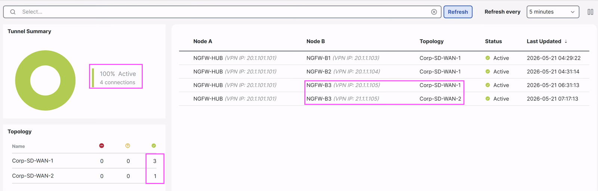{ loading=lazy }
</figure>

### Step 2: Verify traffic between protected networks behind spoke (NGFW-B3) and hub (NGFW-HUB)

Verify the traffic distribution across dual ISP by sending the traffic
from hosts behind the NGFW-B3 to hosts behind the NGFW-HUB.

Network behind spoke (**NGFW-B3**) – 192.168.3.0/24 with a host
**192.168.3.155** (**B3H**)

Network behind Hub (**NGFW-HUB**) – 192.168.101.0/24 with a host
**192.168.101.131** (**H1**)

1.  Setup **Unified Events**

This task leverages the Unified Events and validates the connectivity.
Launch the Unified Events Viewer (UEV) on FMC in a new tab and
navigate to **Events & Logs \> Analysis \> Unified Events.**

1.  **Setting up the UEV:**

1.  Add specific columns to the default columns by clicking on small
    { .inline-icon .off-glb }
    icon at the top right of Events table.

    1.  The Columns are arranged in Alphabetical order; by scrolling,  
        Select **Decrypt Peer, Egress Interface, Encrypt Peer, Ingress
        Interface and VPN Action,** and Click **Apply.**

2.  Adjust the view by using the horizontal scroll to the end that show
    the new Columns along with **Access Control Policy** and **Device.**
    If required, try adjusting the Column widths to fit the view by
    adjusting separation line on each of the column headers.

<figure markdown style="max-width:16.0cm;">
  { loading=lazy }
</figure>

3.  Click on **Go Live** to enter Live View

<figure markdown style="max-width:16.0cm;">
  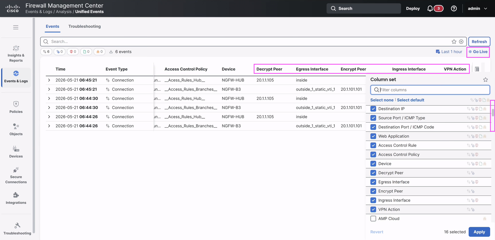{ loading=lazy }
</figure>

<figure markdown style="max-width:16.0cm;">
  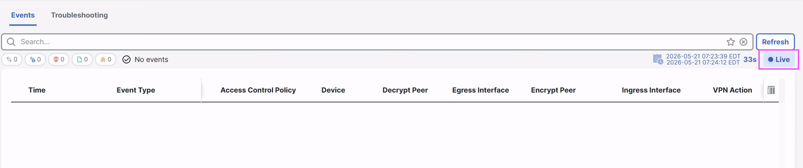{ loading=lazy }
</figure>

1.  **Connect to B3H:** Open **Cisco Secure Firewall Quick Launch** and
    click on **B3H** which is present under **Linux VM Access**

2.  You may minimize **Quick Launch window** and keep FMC UI at the
    background while B3H SSH window on foreground

3.  **Send periodic pings to 192.168.101.131**

1.  `ping 192.168.101.131 -c 3` to generate 3 pings from host
    behind **NGFW-B3** to the host behind **NGFW-HUB**

2.  Run **ping command 3 to 5 times** until you see more connections
    events popping up**.**

<figure markdown style="max-width:16.0cm;">
  { loading=lazy }
</figure>

<figure markdown style="max-width:16.0cm;">
  { loading=lazy }
</figure>

1)  Navigate to FMC for viewing the events:

    1.  You can view the events with VPN Action as Encrypt. They are
        sourced from Device NGFW-B3, and Egress Interface is load
        balanced between Tunnel Interfaces.

    2.  Some of the connections are sent out via
        **outside_1_static_vti_1** (via ISP1: **outside_1**) and some
        are sent out via **outside_2_static_vti_2** (via ISP2:
        **outside_2)**

    3.  In case of no events from both the tunnel interfaces, run the
        **ping** command few more times until you see events from both
        the interfaces.

2)  Click on **Live** to Leave Live View

1.  You may close all opened the **PuTTY** sessions

You have successfully verified the traffic load balancing between ISP1
& ISP2 on spoke NGFW-B3!!!

