# Scenario 5: Branch Expansion with overlap network (Optional)

In this lab activity, you will learn how to introduce a new branch
acquisition into SD-WAN deployment with the LAN network that overlaps
with protected network of an existing branch. When a new branch is
added with overlapping networks, it can be configured in SD-WAN
Topology using either VRF or Pre-Encryption NAT to allow seamless
connectivity. In this scenario, you will configure a new branch in
SD-WAN Topology, Pre-Encryption NAT and redistribute the routes into
BGP overlay network.

## Network Diagram

<figure markdown style="max-width:16.0cm;">
  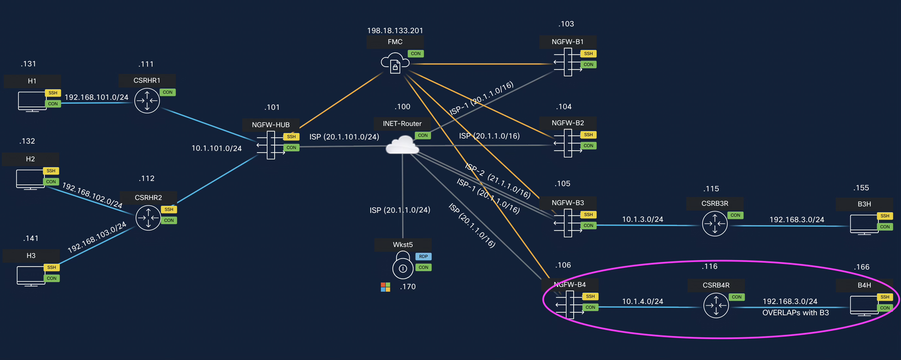{ loading=lazy }
</figure>

## 5.1 Check spoke is having overlap network

### 5.1.1 Verify Routes on Hub (NGFW-B4)

In this step, you can verify the protected network at spoke NGFW-B4
overlaps with other spoke NGFW-B3.

1.  Go to **Troubleshooting \> Tools \> Threat Defense CLI**.

2.  This launches the **CLI Troubleshoot** dialog. Fill it in as
    follows:

    1.  **Device**: **NGFW-B4**
    2.  **Command**: `show`
    3.  **Parameter**: Type the argument `route ospf`

3.  Click on **Execute** and review the routes. Notice this has same LAN
    (192.168.3.0) as **NGFW-B3**

<figure markdown style="max-width:12.0cm;">
  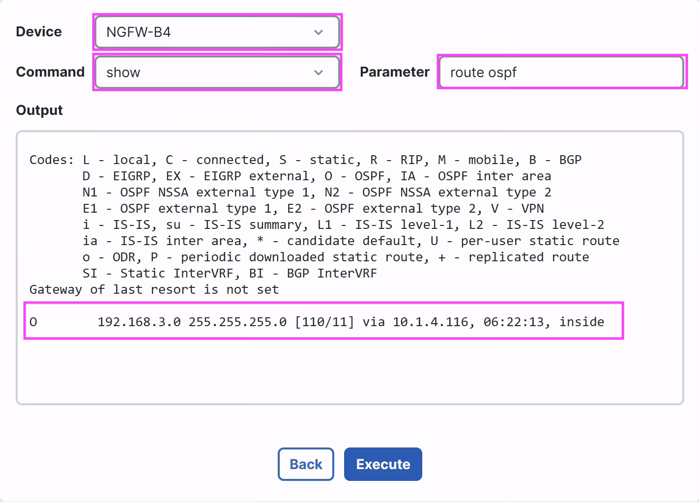{ loading=lazy }
</figure>

## 5.2 Choose a NAT network and Add Static Route for it

The overlapping networking cannot be advertised to SD-WAN as they will
not be installed. For this lab section, choose a non-overlapping
network that will be used to NAT 192.168.3.0/24. In this scenario,
192.168.33.0/24 is chosen as the NAT network.

### 5.2.1 Add Static route for NAT network

1.  Edit the device **NGFW-B4** by navigating to **Devices \> Device
    Management \> Edit NGFW-B4**

<figure markdown style="max-width:16.0cm;">
  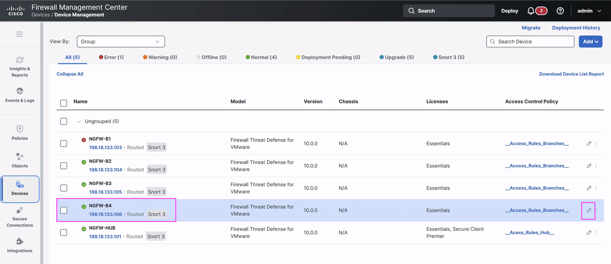{ loading=lazy }
</figure>

2.  Click on the **Routing** tab \> Click on **Static Route** button

    1.  Click on **Add Route** button  
          
        !!! note

            This step adds a **Null** route for post NAT IP i.e.
            192.168.33.0/24 on **NGFW-B4**, this allows the branch firewall
            to be able to redistribute this network to other peers, in this
            case Hub i.e. **NGFW-HUB** to which the hosts behind hub can
            respond to.

<figure markdown style="max-width:16.0cm;">
  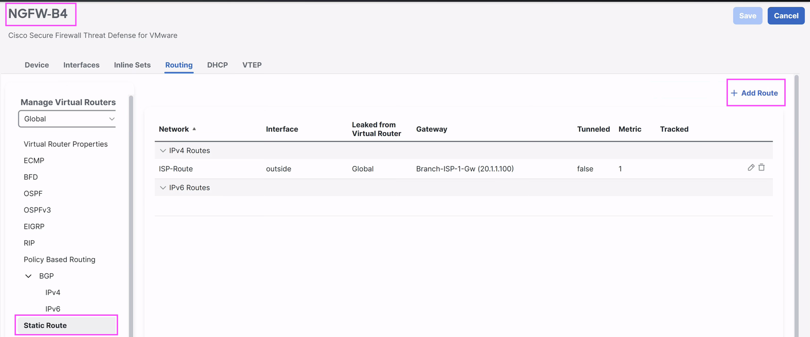{ loading=lazy }
</figure>

3.  The **Add Static Route Configuration** dialog opens. Fill it in
    as follows:

    1.  **Type**: IPv4 (don't change).
    2.  **Interface**: **Null0** (since we originate this network).
    3.  **Available Network**: **Branch-4-NAT-Network** (pre-configured as `192.168.33.0/24` &mdash; hover the object to verify).
    4.  Click **OK** to add the route.

<figure markdown style="max-width:8.0cm;">
  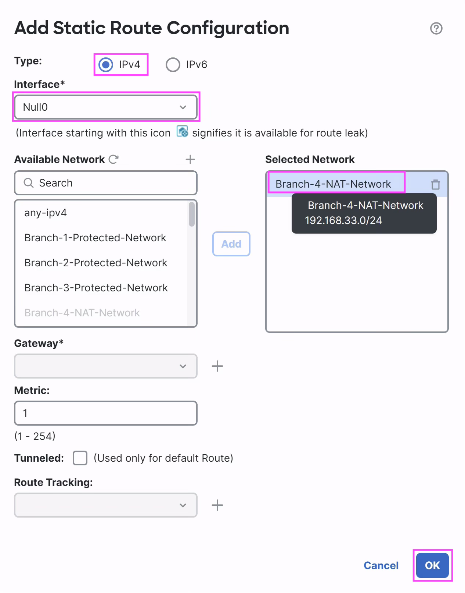{ loading=lazy }
</figure>

4.  Click **Save** to save the changes

<figure markdown style="max-width:16.0cm;">
  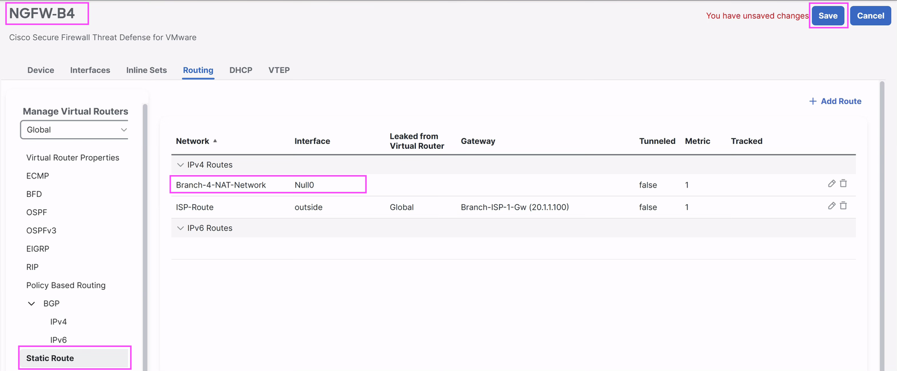{ loading=lazy }
</figure>

## 5.3 Configuring SD-WAN Topology to include new Spoke (NGFW-B4)

### 5.3.1 Edit SD-WAN Topology

To edit SD-WAN Topology, go to **Secure Connections \> Site-to-Site
VPN & SD-WAN** click **Edit** on the topology **Corp-SD-WAN-1**.

<figure markdown style="max-width:16.0cm;">
  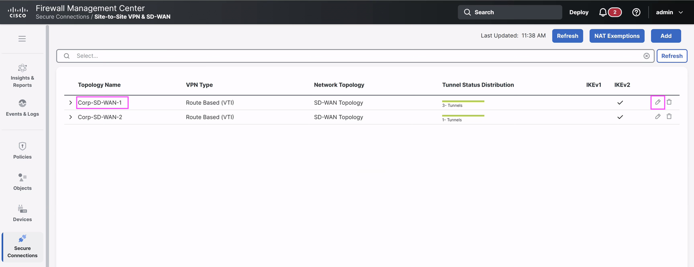{ loading=lazy }
</figure>

### 5.3.2 SD-WAN Topology – Add Spoke Configuration

Click on **Edit** at **Spokes** step to add the new Spoke into SD-WAN.

<figure markdown style="max-width:16.0cm;">
  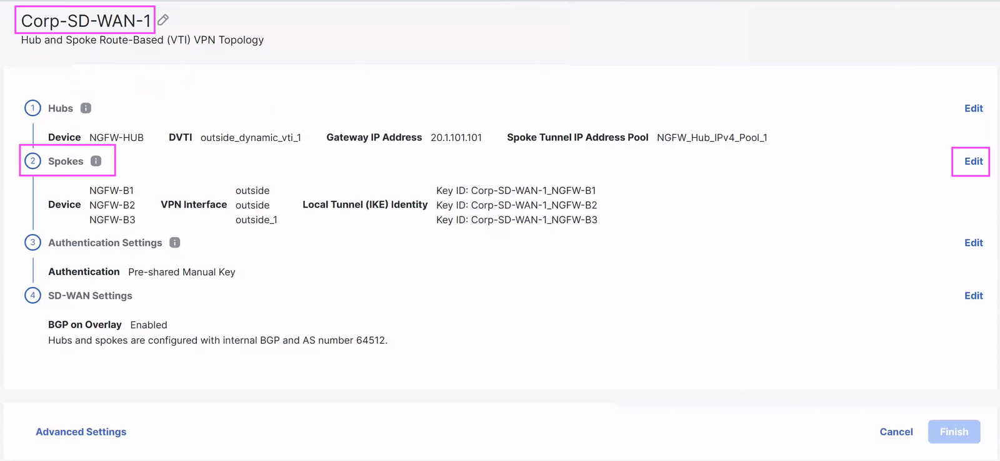{ loading=lazy }
</figure>

Click on **Add Spoke**.

<figure markdown style="max-width:16.0cm;">
  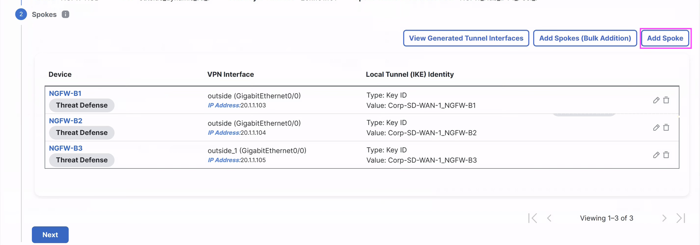{ loading=lazy }
</figure>

Enter the following details in the **Add Spoke** dialog box:

1)  **Devices**: Select **NGFW-B4** from the **Available Devices**.

2)  **VPN Interface:** Select **outside** from the list of available
    interfaces.

3)  **Identity Type:** Retain the default values.

4)  **Save:** Click on Save to add the Spoke into SD-WAN Topology

<figure markdown style="max-width:8.0cm;">
  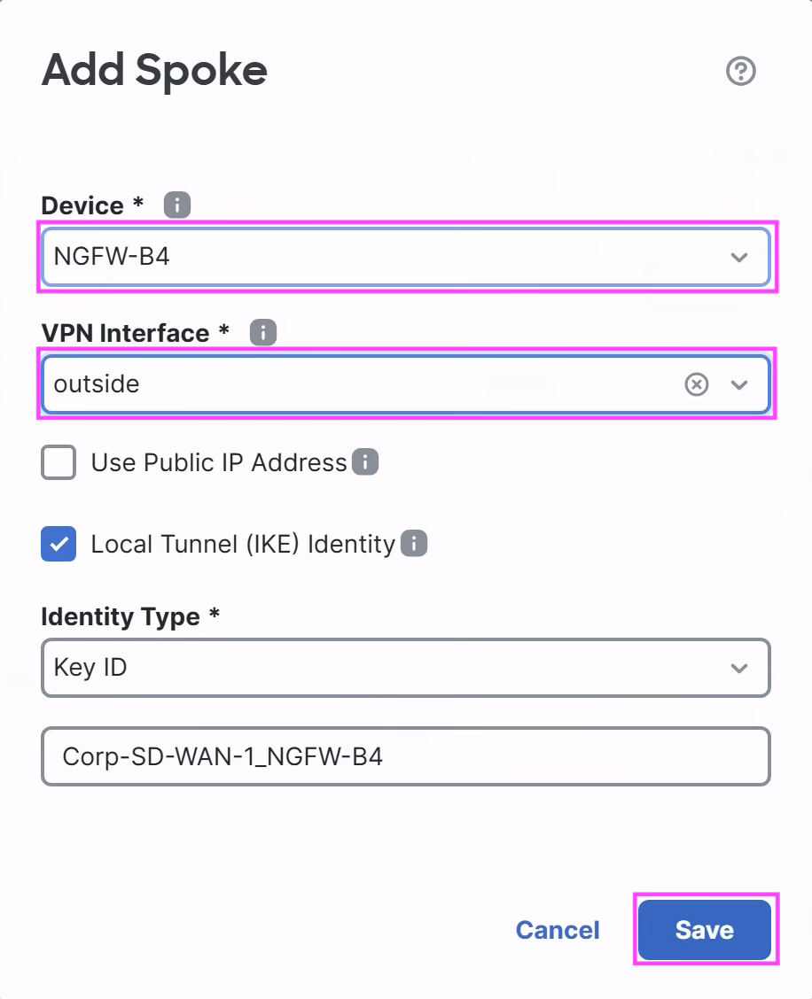{ loading=lazy }
</figure>

<figure markdown style="max-width:16.0cm;">
  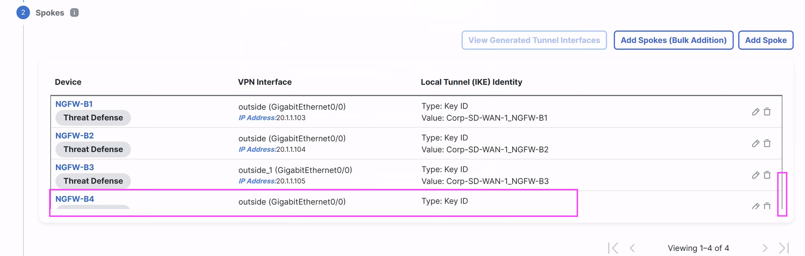{ loading=lazy }
</figure>

### 5.3.3 SD-WAN Topology - Finish

**Scroll down** and click the **Finish** button to save the topology.
Click **OK** for the pop-up dialog *"Click Finish to save your changes."*

<figure markdown style="max-width:16.0cm;">
  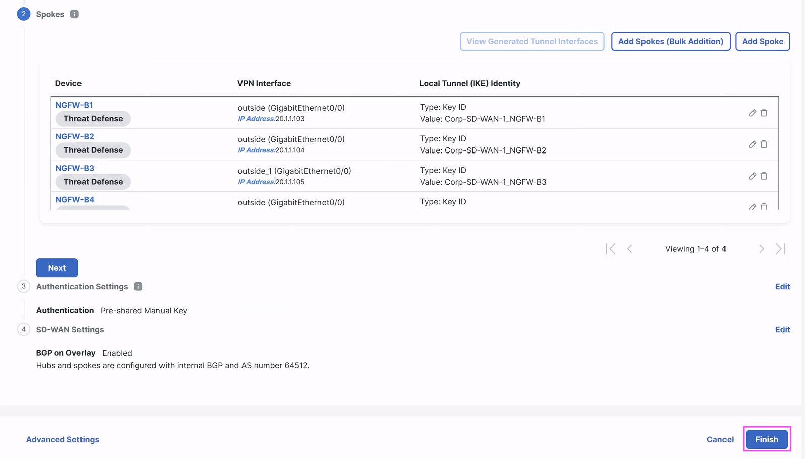{ loading=lazy }
</figure>

1.  You can view the SD-WAN topology in the Site-to-Site VPN listing
    page: **Secure Connections \> Site-to-Site VPN & SD-WAN.**

<figure markdown style="max-width:16.0cm;">
  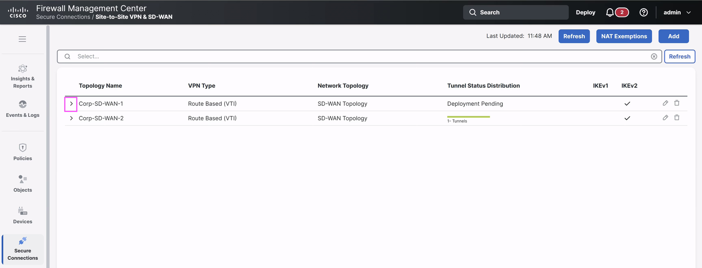{ loading=lazy }
</figure>

2.  Expand the **Corp-SD-WAN-1** node to view all the tunnels in the
    topology. It shows 4 tunnels, 3 of which are existing established
    tunnels. Scroll down to view all the tunnels information. Since the
    configuration has not been deployed, it shows **Deployment Pending**
    and the new spoke tunnel shows in Amber color.

<figure markdown style="max-width:16.0cm;">
  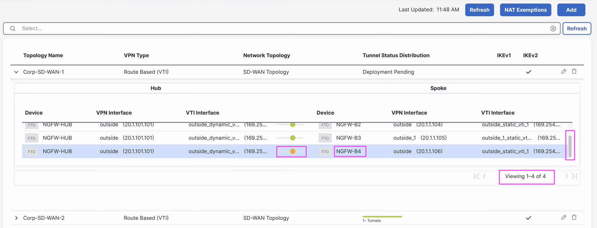{ loading=lazy }
</figure>

## 5.4 Deploy to Hub and Spoke Devices

In this step, you will review all the configuration changes done on
the Hub and Spoke devices and deploy the configuration to the devices.

1)  Click the Deploy button
    { .inline-icon .off-glb }
    on the top right on FMC.

2)  This brings up the list of devices that are Ready for Deployment.
    Select the { .inline-icon .off-glb }and
    click on **ignore warnings (if any)**
    { .inline-icon .off-glb } button to trigger the
    deployment.

3)  View the progress of the deployment on the devices and **wait till
    the deployment is marked Completed** on the Deploy dialog

<figure markdown style="max-width:12.0cm;">
  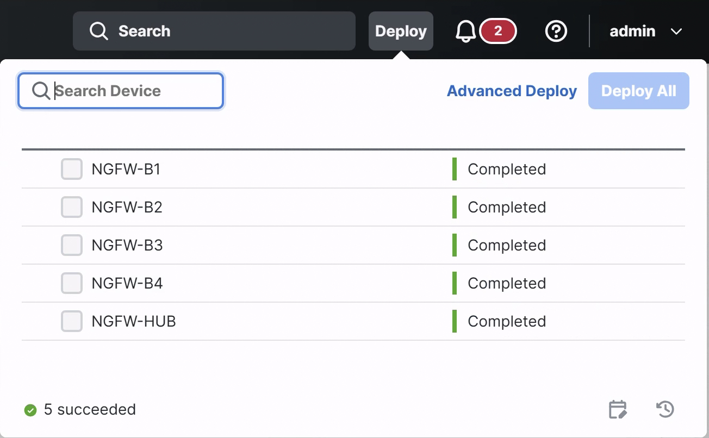{ loading=lazy }
</figure>

## 5.5 Configuring NAT policy for protected network at Spoke (NGFW-B4)

In this task, you will configure NAT policy to hide protected network
using NATed network.

### 5.5.1 Add NAT Policy

In this step, a new NAT policy is created.

1.  Navigate to **Policies \> Network policies \> NAT**

<figure markdown style="max-width:6.0cm;">
  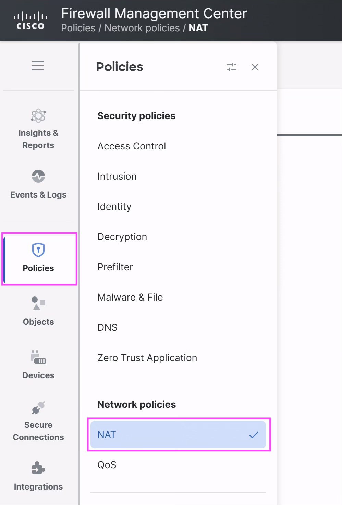{ loading=lazy }
</figure>

2.  Click on the **New Policy** button

<figure markdown style="max-width:16.0cm;">
  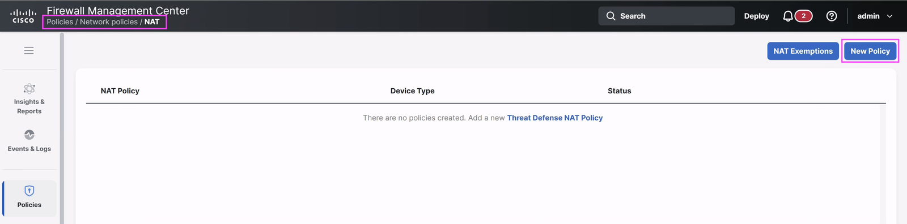{ loading=lazy }
</figure>

3.  The **New Policy** dialog opens. Fill it in as follows:

    1.  **Name**: `NGFW-B4-NAT-Policies`
    2.  **Available Devices and Templates**: Select **NGFW-B4**, then click **Add to Policy**.
    3.  Click **Save**.

<figure markdown style="max-width:12.0cm;">
  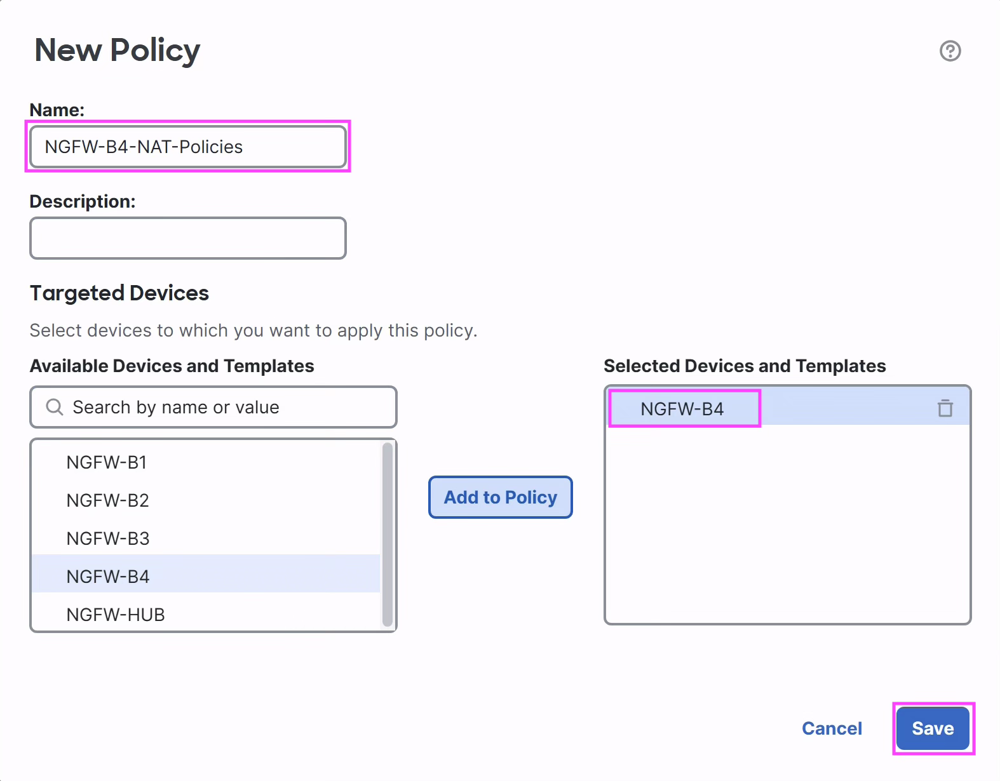{ loading=lazy }
</figure>

### 5.5.2 Add Rule

In this step, you will configure NAT rule to hide protected network
using NATed network.

1.  Click on Add **Rule**

<figure markdown style="max-width:16.0cm;">
  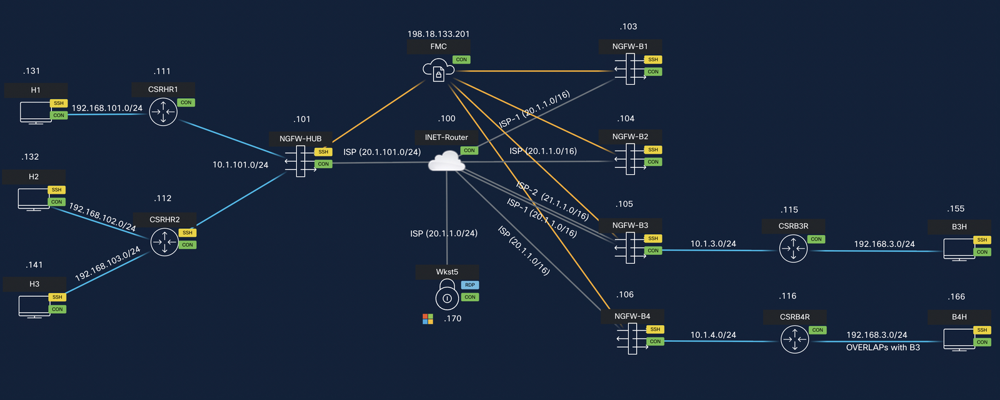{ loading=lazy }
</figure>

2.  The **Add NAT Rule** dialog opens. Fill it in as follows:

    1.  **NAT Rule**: Select **Auto NAT Rule** from the drop-down.
    2.  **Type**: Select **Static**.

    Click the **Interface Objects** tab and set:

    1.  **Source Interface Objects**: Pick **Inside_Zone** from **Available Interface Objects** and click **Add to Source**.
    2.  **Destination Interface Objects**: Leave as **any** (default).

<figure markdown style="max-width:12.0cm;">
  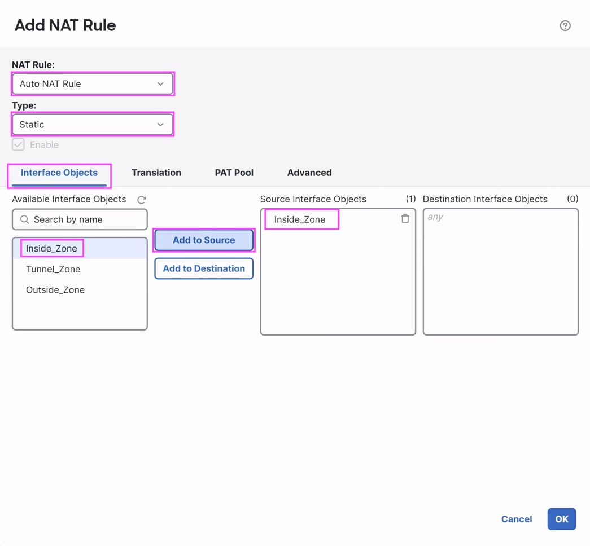{ loading=lazy }
</figure>

4.  Click the **Translation** tab and set:

    1.  **Original Source**: Pick **Branch-4-Protected-Network** from the drop-down.
    2.  **Translated Source**: Select **Address**, then pick **Branch-4-NAT-Network** from the drop-down.
    3.  Click **OK** to add the rule.

<figure markdown style="max-width:12.0cm;">
  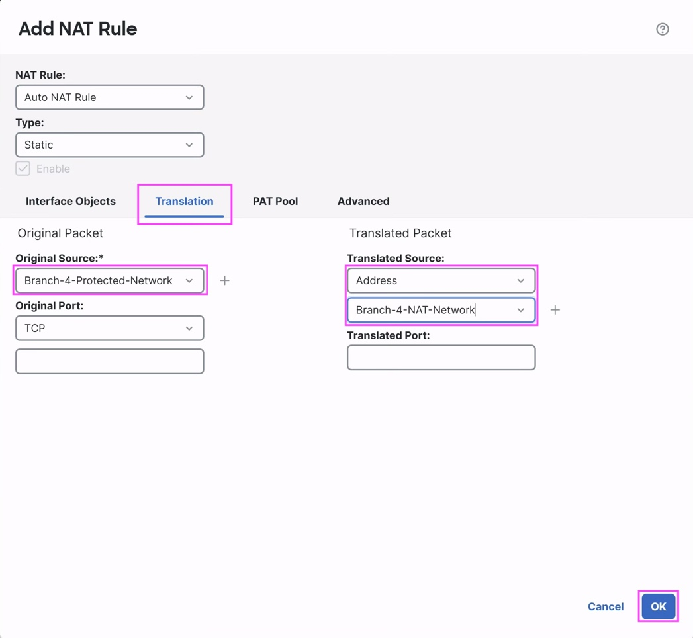{ loading=lazy }
</figure>

5.  You are back to NAT Policies page, Click on **Save** to save the
    policy

<figure markdown style="max-width:16.0cm;">
  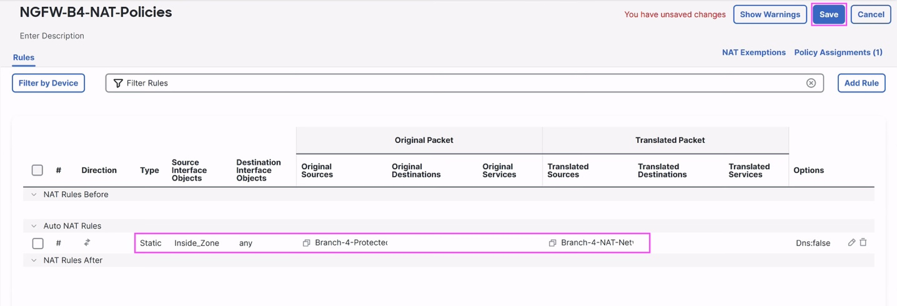{ loading=lazy }
</figure>

## 5.6 Deploy to Spoke Device

In this step, you will review all the configuration changes done on
the Hub and Spoke devices and deploy the configuration to the devices.

1)  Click the Deploy button
    { .inline-icon .off-glb }
    on the top right on FMC.

2)  This brings up the list of devices that are Ready for Deployment.
    Select the { .inline-icon .off-glb }and
    click on **ignore warnings (if any)**
    { .inline-icon .off-glb } button to trigger the
    deployment.

3)  View the progress of the deployment on the devices and **wait till
    the deployment is marked Completed** on the Deploy dialog

<figure markdown style="max-width:12.0cm;">
  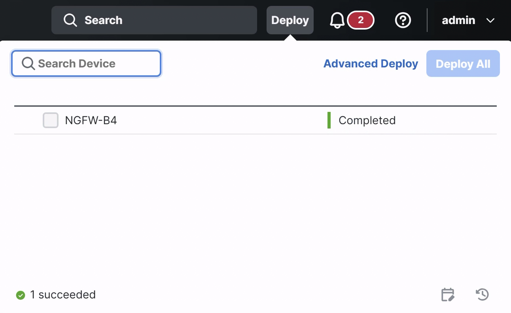{ loading=lazy }
</figure>

## 5.7 Configuring BGP Redistribution of NAT network at Spoke (NGFW-B4) to SD-WAN

### 5.7.1 Enable BGP on Spoke device

In this step, you will enable BGP on Spoke device (**NGFW-B4**) with
same autonomous number as mentioned in SD-WAN Topology.

1.  Edit the device **NGFW-B4** by navigating to **Devices \> Device
    Management \> Edit NGFW-B4**

<figure markdown style="max-width:16.0cm;">
  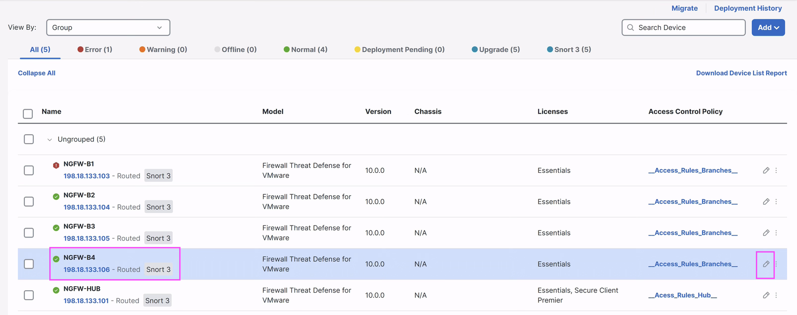{ loading=lazy }
</figure>

2.  Click on the **Routing** tab \> click on the **BGP** button under
    **General Settings**, then fill in:

    1.  **Enable BGP**: Check the checkbox to enable BGP.
    2.  **Autonomous System Number**: `64512` (same as specified in the SD-WAN Topology).

<figure markdown style="max-width:16.0cm;">
  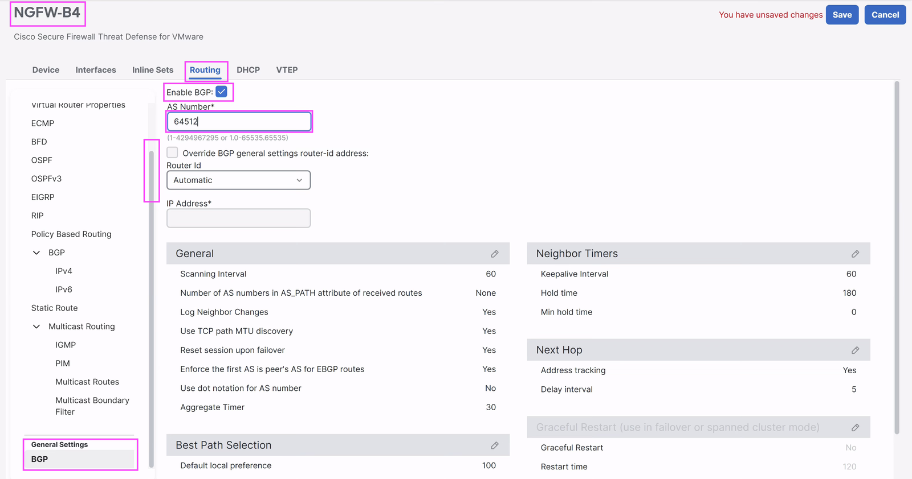{ loading=lazy }
</figure>

3.  Click on the **BGP IPv4** routing option

    1.  **Enable IPv4**, review the AS Number defaults to **64512**

<figure markdown style="max-width:16.0cm;">
  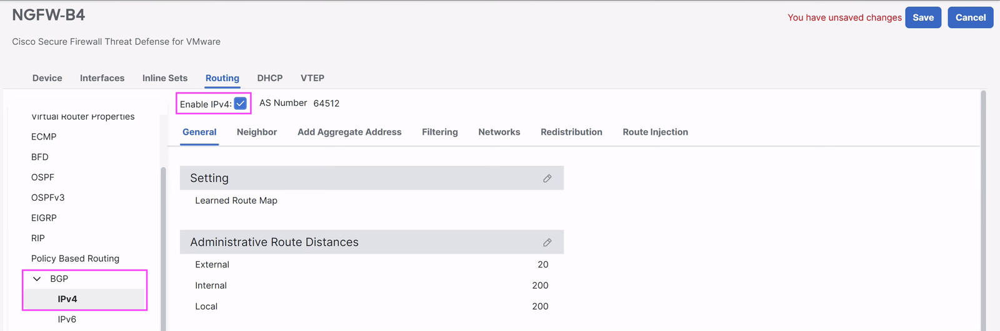{ loading=lazy }
</figure>

### 5.7.2 Configure redistribution of Static (NAT network) routes

In this step, you will enable redistribution of Static routes into
BGP. These routes will then be advertised to the SD-WAN peers.

1.  In **BGP IPv4** settings click on **Redistribution** tab and then
    **Add**

<figure markdown style="max-width:16.0cm;">
  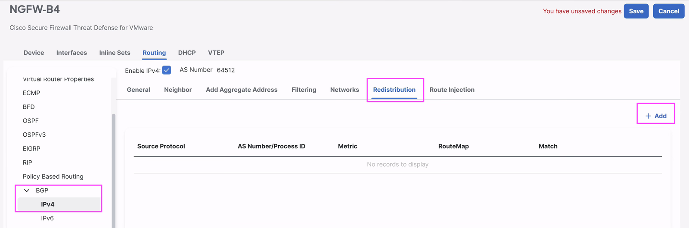{ loading=lazy }
</figure>

2.  This launches the **Add Redistribution** dialog. Fill it in as
    follows:

    1.  **Source Protocol**: Pick **Static** from the drop-down.
    2.  **Route Map**: **Advertise-Branch-Protected-Networks**
    3.  Click **OK** to save the settings.

<figure markdown style="max-width:6.0cm;">
  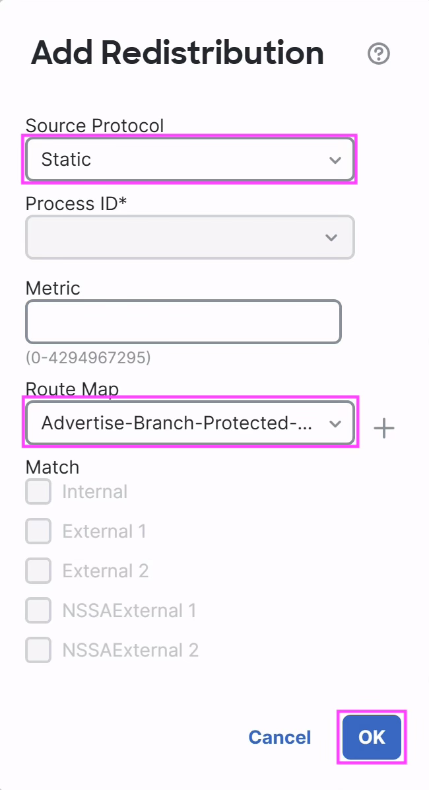{ loading=lazy }
</figure>

3.  Click on **Save** to complete the configuration

<figure markdown style="max-width:16.0cm;">
  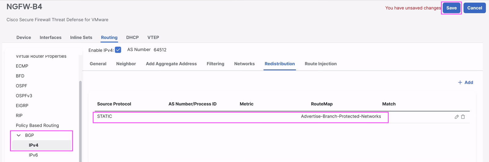{ loading=lazy }
</figure>

## 5.8 Deploy to Spoke Device

In this step, you will review all the configuration changes done on
the Hub and Spoke devices and deploy the configuration to the devices.

1)  Click the Deploy button
    { .inline-icon .off-glb }
    on the top right on FMC.

2)  This brings up the list of devices that are Ready for Deployment.
    Select the { .inline-icon .off-glb }and
    click on **ignore warnings (if any)**
    { .inline-icon .off-glb } button to trigger the
    deployment.

3)  View the progress of the deployment on the devices and **wait till
    the deployment is marked Completed** on the Deploy dialog

<figure markdown style="max-width:10.0cm;">
  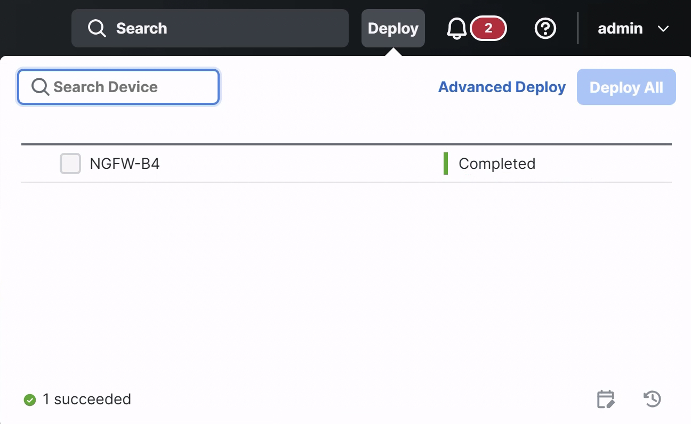{ loading=lazy }
</figure>

## 5.9 Verify the traffic flow over the VPN tunnel from Spoke (NGFW-B4) to Hub (NGFW-HUB)

### 5.9.1 Verify Site-to-Site VPN Tunnels

In this step, you will verify the VTI tunnels between the spokes and
hub devices.

Go to **Insights & Reports -\> VPN dashboards -\> SD-WAN Summary** and
Check that the tunnels are up as shown below. You may use **Refresh**
to reload the tunnels status if tunnel has not come up yet. Wait for
few seconds for tunnel status to be updated fully.

<figure markdown style="max-width:16.0cm;">
  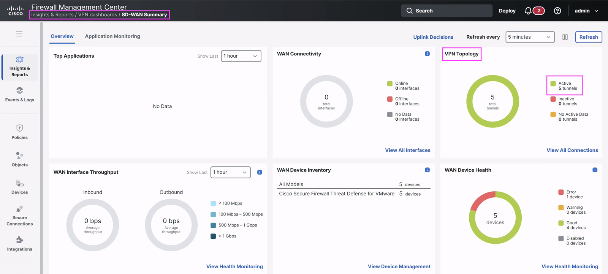{ loading=lazy }
</figure>

Go to **Insights & Reports -\> VPN dashboards -\> Site-to-Site VPN**
and Check that the tunnels are up as shown below.

<figure markdown style="max-width:16.0cm;">
  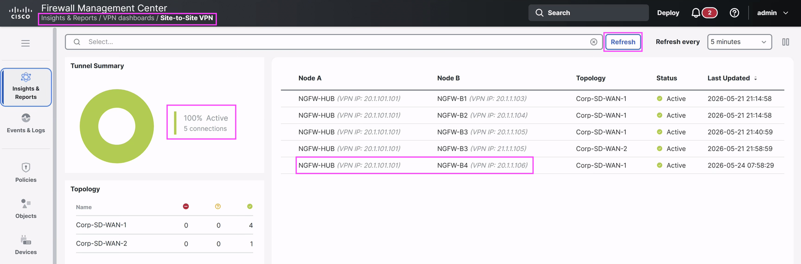{ loading=lazy }
</figure>

### 5.9.2 Verify Routes on Hub (NGFW-HUB)

In this step, you can verify the BGP and other routes at the Hub.

1.  Go to **Troubleshooting \> Tools \> Threat Defense CLI**.

2.  This launches the **CLI Troubleshoot** dialog. Fill it in as
    follows:

    1.  **Device**: **NGFW-HUB**
    2.  **Command**: `show`
    3.  **Parameter**: Enter the argument `route bgp`

3.  Click on **Execute** and review the routes, scroll down output if
    required

4.  Verify the route for 192.168.33.0 from spoke NGFW-B4 that was
    redistributed over BGP

<figure markdown style="max-width:12.0cm;">
  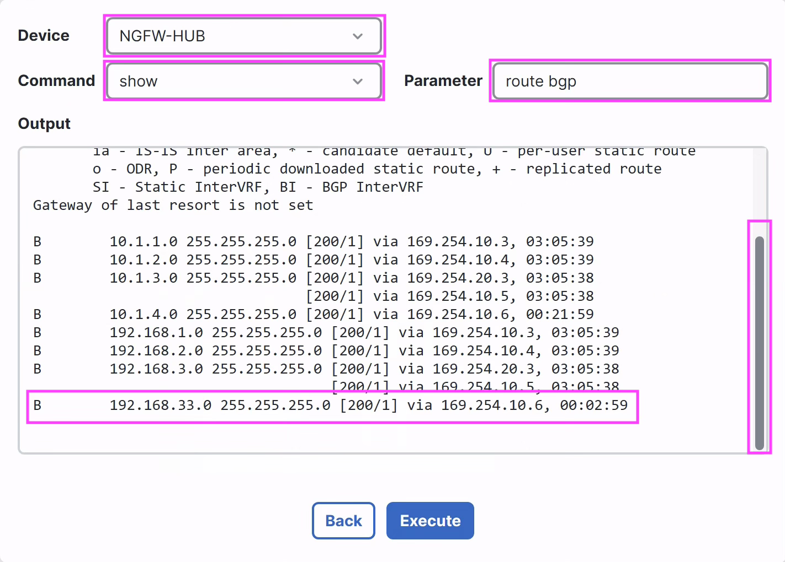{ loading=lazy }
</figure>

### 5.9.3 Verify traffic between protected networks behind spoke (NGFW-B4) and hub (NGFW-HUB)

Network behind spoke (**NGFW-B4**) – 192.168.3.0/24 with a host
**192.168.3.166** (**B4H**)

Network behind hub (**NGFW-HUB**) – 192.168.101.0/24 with a host
**192.168.101.131** (**H1**)

1.  **Connect to B4H:** Open **Cisco Secure Firewall Quick Launch** and
    click on **B4H** which is present under **Linux VM Access.** This
    opens **B4H**'s SSH session.

    <figure markdown style="max-width:16.0cm;">
      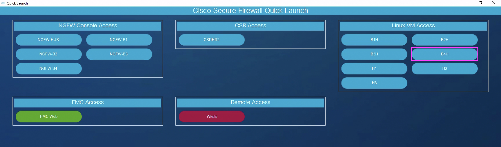{ loading=lazy }
    </figure>

2.  **Verify Ping**

    1.  `ping 192.168.101.131 -c 5` which is the Host behind the
        Hub device NGFW-HUB and verify that you are getting the response

    <figure markdown style="max-width:16.0cm;">
      { loading=lazy }
    </figure>

3.  **Verify SSH Connection**

    1.  **SSH** to **192.168.101.131** using password **C1sco12345** and
        verify SSH access works. After successful connection, you may
        **exit**.

    !!! note
        For any prompt &mdash; *"Are you sure you want to continue
        connecting…?"* &mdash; type `yes`.

    <figure markdown style="max-width:16.0cm;">
      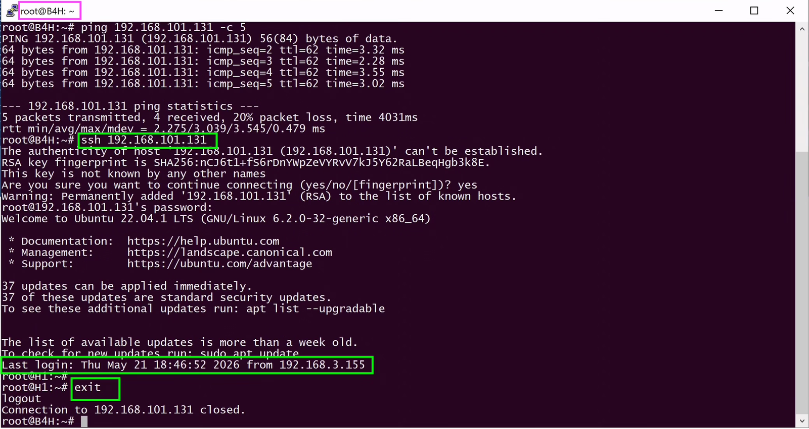{ loading=lazy }
    </figure>

4.  Launch the Unified Events Viewer (UEV) on FMC in a new tab and
    navigate to **Events & Logs \> Analysis \> Unified Events.** Check
    on Unified Events for this SSH connection and verify the Source IP
    i.e 192.168.3.166 (magenta box below) at **NGFW-B4** is NATed as
    an IP in 192.168.33.X/24 (blue box below) subnet as seen at Hub,
    **NGFW-HUB**

    <figure markdown style="max-width:16.0cm;">
      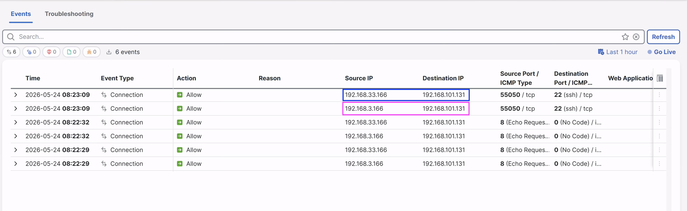{ loading=lazy }
    </figure>

5.  You may close all opened the **PuTTY** sessions

You have successfully onboarded a new branch with overlap network to
existing branch in SD-WAN Topology!!!

