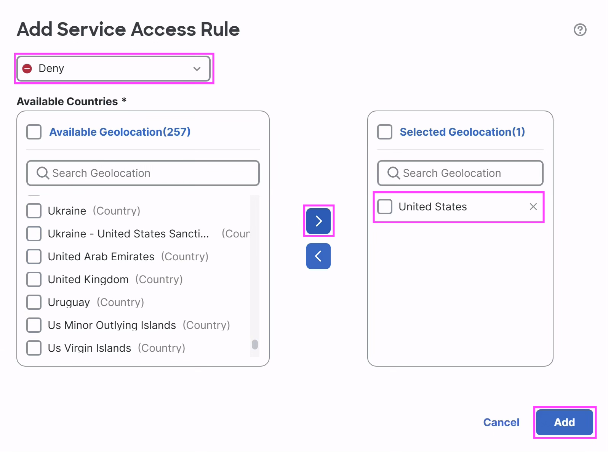
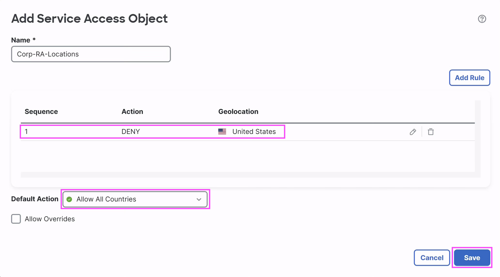
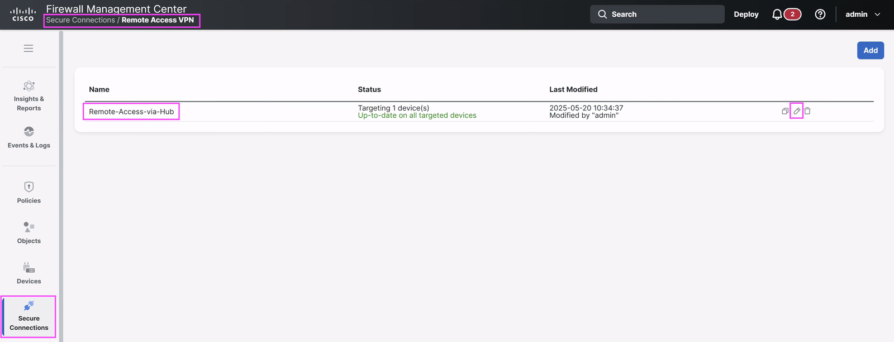
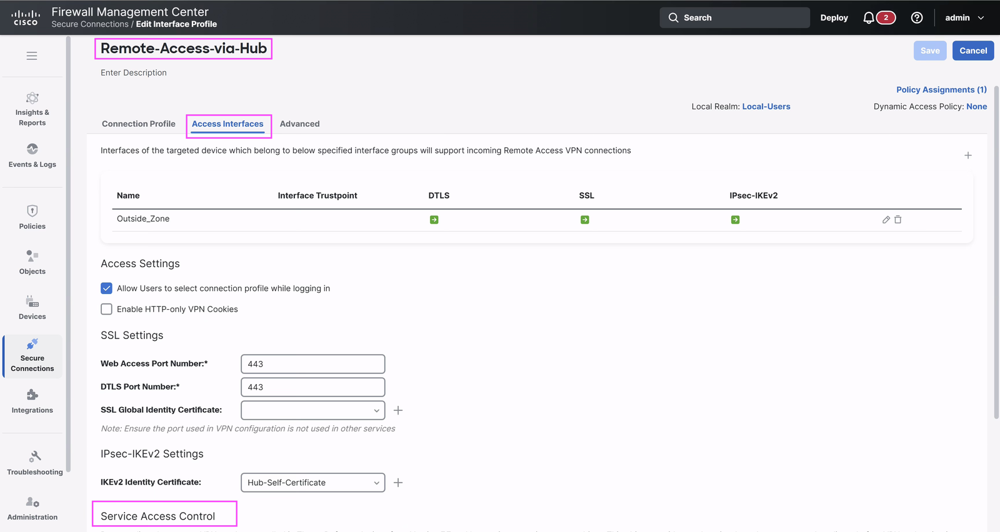
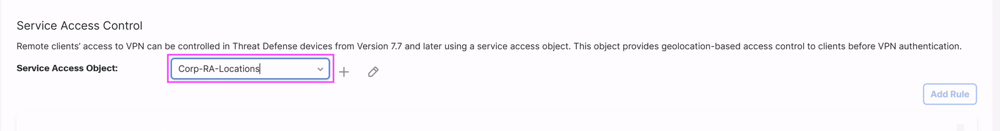
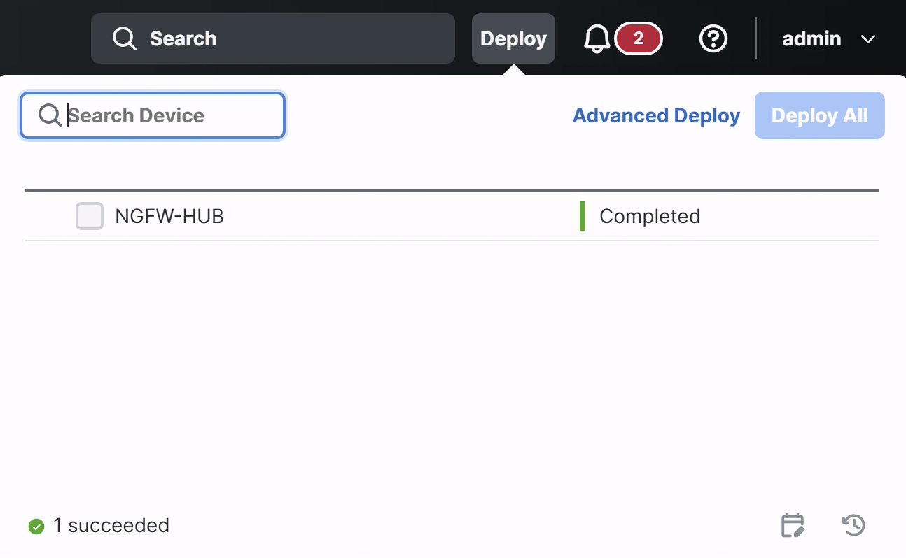
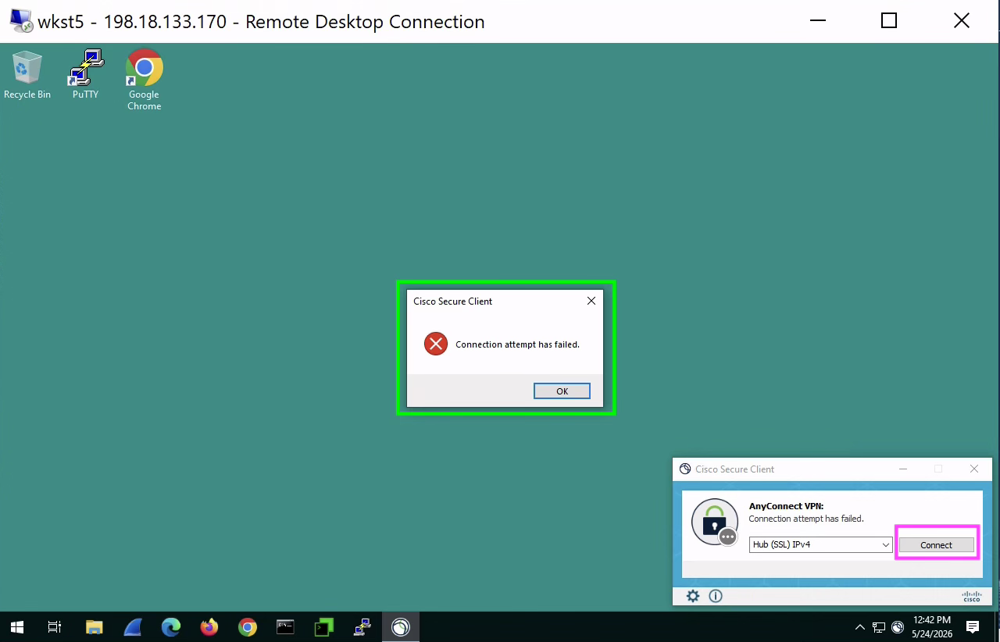

# Scenario 6: Geolocation Service Access Policies for Remote Users (Optional)

Secure Firewall release 7.7 introduced rules to manage VPN access of
remote users based on Geolocation. By setting rules to allow or block
access from specific countries or regions, you can meet compliance
requirements and enhance security. Remote sessions that don’t meet
these location-based criteria are blocked before authentication.

## Network Diagram

<figure markdown style="max-width:16.0cm;">
  { loading=lazy }
</figure>

## Task 1: Configuring Service Access Rules on Hub (NGFW-HUB)

In this activity you will learn to configure service access rules
which define the controls for remote access sessions.  
  
Since the lab pod and the test workstation is setup in the US region,
lab section walks you through steps to restrict the access from the
US. You can use the same steps in your production deployment to block
access from regions and countries of your own choice.

### Step 1: Create Service Access Object

1.  Navigate to **Objects \> Access List \> Service Access** and Click
    **Add Service Access Object**

<figure markdown style="max-width:16.0cm;">
  { loading=lazy }
</figure>

2.  The **Add Service Access Object** dialog opens. Enter the
    **Name** as `Corp-RA-Locations`, then click **Add Rule**.

<figure markdown style="max-width:16.0cm;">
  { loading=lazy }
</figure>

3.  The **Add Service Access Rule** dialog opens. Fill it in as
    follows:

    1.  **Action**: Ensure it is set to **Deny**.
    2.  **Available Countries**: Select **United States** from the list.
    3.  **Selected Geolocation**: Add the country using { .inline-icon .off-glb }.
    4.  Click **Add** to create the rule.

<figure markdown style="max-width:16.0cm;">
  { loading=lazy }
</figure>

4.  Choose the Default Action: **Allow All Countries**. This action
    applies to connections that do not match any of the configured
    service access rules.

5.  Click **Save** to save the Service Access Rule.

<figure markdown style="max-width:16.0cm;">
  { loading=lazy }
</figure>

<figure markdown style="max-width:16.0cm;">
  { loading=lazy }
</figure>

### Step 2: Apply the Service Object Configuration in RAVPN

1.  Navigate to Remote Access VPN configuration in **Secure Connections
    \> Remote Access VPN**

2.  A remote access policy named **Remote-Access-via-Hub** is
    preconfigured

3.  Click **pencil** icon at the middle to edit it

<figure markdown style="max-width:16.0cm;">
  { loading=lazy }
</figure>

4.  Click on **Access Interfaces** tab

5.  In the **Service Access Control** section, Select the service access
    object that was just created **Corp-RA-Locations**

<figure markdown style="max-width:16.0cm;">
  { loading=lazy }
</figure>

<figure markdown style="max-width:16.0cm;">
  { loading=lazy }
</figure>

6.  The service access object now displays the rules summary and default
    action. Ensure this is correct and click **Save** on top right to
    save the configuration.

<figure markdown style="max-width:16.0cm;">
  { loading=lazy }
</figure>

## Task 2: Deploy to Hub Device

In this step, you will review all the configuration changes done on
the Hub and Spoke devices and deploy the configuration to the devices.

1)  Click the Deploy button
    { .inline-icon .off-glb }
    on the top right on FMC.

2)  This brings up the list of devices that are Ready for Deployment.
    Select the { .inline-icon .off-glb }and
    click on **ignore warnings (if any)**
    { .inline-icon .off-glb } button to trigger the
    deployment.

3)  View the progress of the deployment on the devices and **wait till
    the deployment is marked Completed** on the Deploy dialog

<figure markdown style="max-width:10.0cm;">
  { loading=lazy }
</figure>

## Task 3: Verify the Remote Access from Secure Client

### Step 1: Verify remote access client session

1.  **Connect to Workstation:** Open **Cisco Secure Firewall Quick
    Launch** from Desktop and click **Wkst5** which is present under
    **Remote Access.** This opens a Remote Desktop Connection (RDP)
    window of **Wkst5**.  
      
    Login using Credentials **admin/C1sco12345**.

<figure markdown style="max-width:16.0cm;">
  { loading=lazy }
</figure>

2.  Click on Windows Start Button and Open Cisco Secure Client
    application by clicking on pinned Icon.

<figure markdown style="max-width:16.0cm;">
  { loading=lazy }
</figure>

3.  Click on **Connect** with **Hub (SSL) IPv4** Profile. Choose
    **Connect Anyway** on Security Warning dialog. The connection
    attempt must have failed.

<figure markdown style="max-width:16.0cm;">
  { loading=lazy }
</figure>

4.  Verify with Troubleshooting Logs. To validate blocked connections,
    navigate on FMC to **Troubleshooting \> Advanced \>
    Troubleshooting Logs**. Click on **View All**.

<figure markdown style="max-width:16.0cm;">
  { loading=lazy }
</figure>

Observe the Log –

**Denied SSL remote access session for reqType SECURE CLIENT faddr
20.1.1.170 by a geo-based rule (geo="United States", id=840)**

!!! note

    Please wait for few minutes after testing RAVPN in Step 3 to
    ensure the deny events are populated on the FMC.

**Congratulations!! You have successfully completed all the scenarios of
the Lab!**

<figure markdown style="max-width:16.0cm;">
  { loading=lazy }
</figure>

