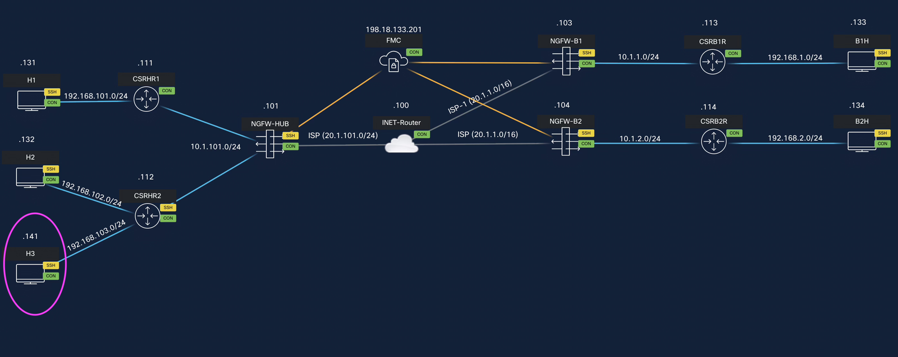
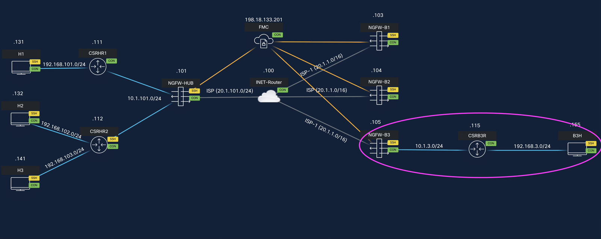
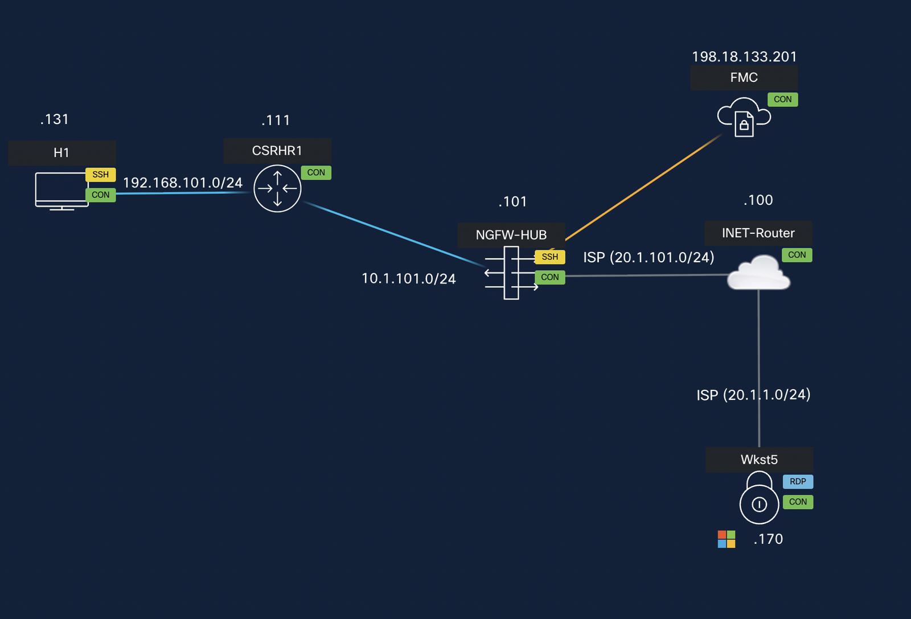

# Lab Topologies

Each scenario in this lab builds on the previous one. The diagrams below
summarise the state of the network as you progress.

## Scenario 1 — Simplifying Branch to Hub Communication

Initial deployment: two spokes (NGFW-B1, NGFW-B2) connected to a single
Hub (NGFW-HUB) through SD-WAN tunnels.

<figure markdown style="max-width:16.0cm;">
  { loading=lazy }
</figure>

## Scenario 2 — Hub Network Expansion

A new protected network is added behind the Hub and redistributed through
BGP to the existing spokes.

<figure markdown style="max-width:16.0cm;">
  { loading=lazy }
</figure>

## Scenario 3 — Branch Expansion

A new branch (NGFW-B3) joins the SD-WAN deployment.

<figure markdown style="max-width:16.0cm;">
  { loading=lazy }
</figure>

## Scenario 4 — Adding a Secondary ISP to Branch (NGFW-B3)

NGFW-B3 gains a second ISP uplink and ECMP balances traffic across both
paths.

<figure markdown style="max-width:16.0cm;">
  { loading=lazy }
</figure>

## Scenario 5 — Branch Expansion with Overlapping Network (Optional)

A new branch (NGFW-B4) is acquired whose protected network overlaps with an
existing branch; the overlap is resolved using Pre-encryption NAT.

<figure markdown style="max-width:16.0cm;">
  { loading=lazy }
</figure>

## Scenario 6 — Geolocation Service Access Policies for Remote Users (Optional)

Remote Access VPN sessions are gated by geolocation rules at the Hub.

<figure markdown style="max-width:16.0cm;">
  { loading=lazy }
</figure>
